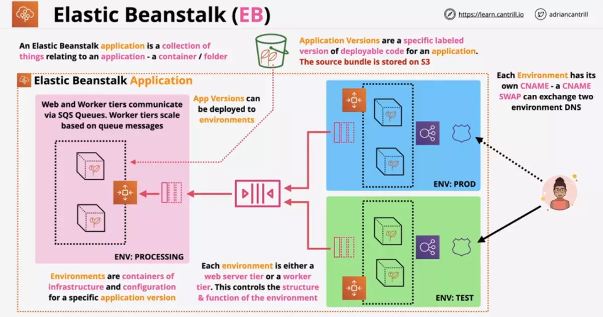
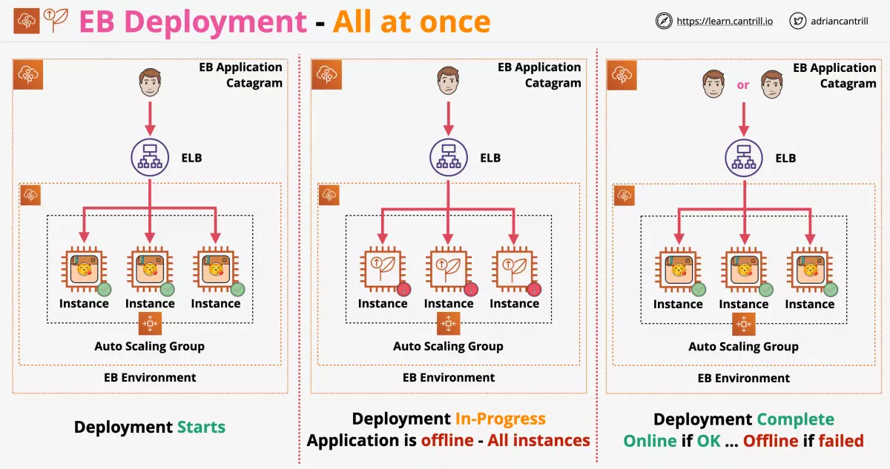
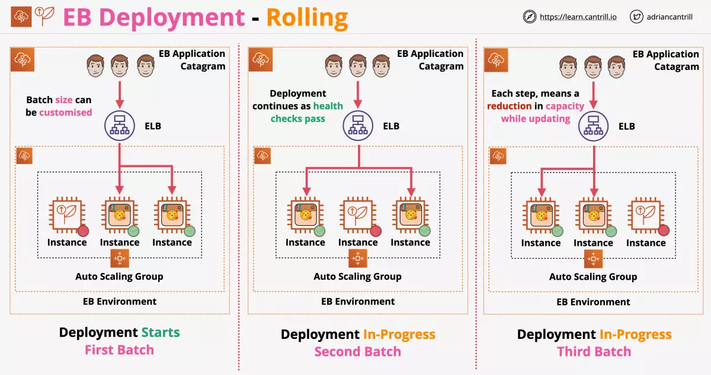
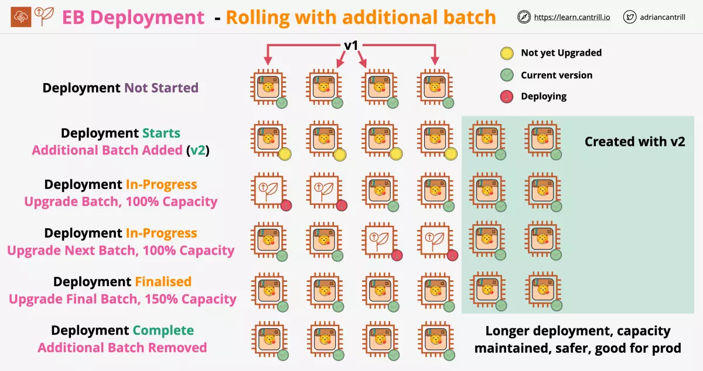
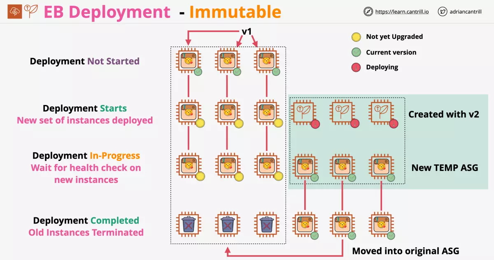
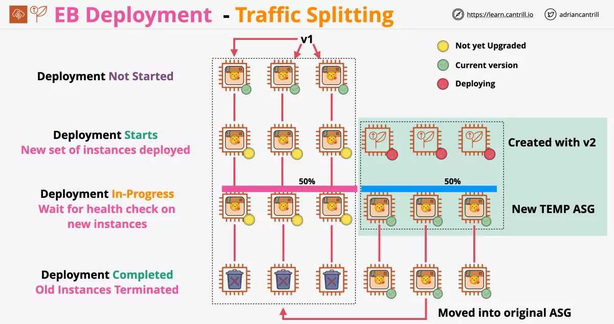
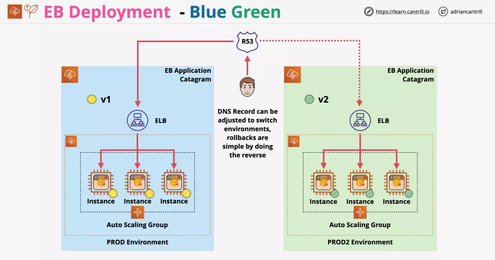
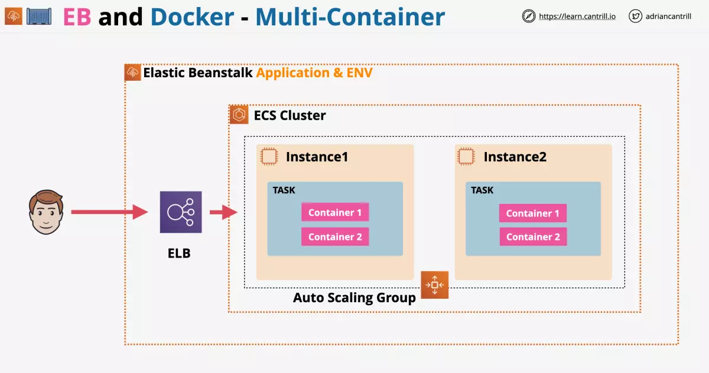

# Elastic Beanstalk (EB)

Elastic Beanstalk is a Platform as a Service environment which can create and manage infrastructure for application code.

- User provides code and EB handles the environment
- EB does create resources behind the scene (you can check for EC2 instances created)
- It also support customization to control how you want the infrastructure
- Any custom defination about the infrastructure can be committed along with the source code as part of `Application Source Bundle`.

CloudFormation instead is Infrastructure as Code.

- It provides full control over the infrastructure
- But you have to design it, write it and manage it

---

## EB Platforms

- EB supports a list of languages natively
- Docker allows to use any unsupported runtime
- Supports custom platforms

Docker can have

- single containers
- multiple containers (Multiple containers are orchestrated using ECS)

Preconfigured docker

- These have platforms that are not yet natively supported

Custom platforms can be created using packer

---

## Architecture

```
application

    |
    |
    V

one or more environment

    |
    |
    V

each environment has one or more application versions

    +

each environment has one or more configuration
```

Application Versions

- These are specific labelled version of deployable code for an application
- The source bundle is stored on S3

Environments are containers of infrastructure and configuration for a specific application version

- Here: PROCESSING, PROD, TEST

### Environment Types

Each environment is either

- Web server tier
- Worker tier

### Flow

Both environment web and worker tier has Auto Scaling Groups within them.

- Web server tier accept connections from customers via ELB
- Any work load generated by Web server tier can then be passed into a SQS queue as messages
- The Worker tier receives the messages from the SQS queue

### Scaling

Web Server Tier scales based on the number of request to the ELB.

Worker Tier scales based on the number of messages in the SQS queue.

### Security

Security group for the web server tier will be configured by EB to accept HTTP connections.

Security group for the worker tier will be configured by EB to accept only connections from ELB.

### CNAME

Each environment has its own CNAME.

User can connect to our application using the CNAME or the DNS name.

- CNAME allows swapping two environment DNS
- This swapping is called `blue-green` deployment



---

## Considerations

- It needs application tweaks
- Use docker for anything unsupported
- Great for small development teams
- Databases are generally OUTSIDE of elastic beanstalk
- Databases within the environment are deleted, when environment is deleted
- valid file formats for providing EB with application: `WAR and ZIP files`

---

## Deployment Policies

### All at once

- deploy all at once, brief outage



### Rolling

- deploy in rolling batches
- you can pick the batch size
- if you have 4 instances, when one instance is being updated, availability takes a 25% hit
- there will be two version running simultaneosly during the update



### Rolling with additional batch

- maintains 100% capacity during the deployment
- there will be two version running simultaneosly during the update



### Immutable

- creates entirely new set of instances
- a temporary autoscaling group is created behind the ELB
- old environment is removed and the autoscaling group is updated
- this is easiest to rollback, as you can commit to new environment only when new environment is tested sucessfully



### Traffic splitting

- its same as immutable deployment
- additionally it allows us to control the split of traffic between the versions
- you can perform AB testing with this before moving completely (pink and blue color )



---

## Blue-Green Deployment

You can also manually switch between environments without using any deployment policy.

This is done using CNAME swap or Route 53.



---

## Elastic Beanstalk and RDS

### RDS with EB environment

To use RDS with Beanstalk you have two options:

- Create an RDS instance within an EB environment
- Create an RDS instance outside an EB environment

#### RDS instance within an EB environment

RDS is linked to the EB environment

If you delete the environment, it deletes the RDS instance. This `results in data loss`.

Also, different environment can have different RDS instance. And they will have different data.

And RDS created within EB environment gets access to the following:

- RDS_HOSTNAME
- RDS_PORT
- RDS_DB_NAME
- RDS_USERNAME
- RDS_PASSWORD

#### RDS instance outside an EB environment

In this case you will have to manually create the following properties:

- RDS_HOSTNAME
- RDS_PORT
- RDS_DB_NAME
- RDS_USERNAME
- RDS_PASSWORD

Environment can be changed without affecting the data within RDS.

### Decoupling existing RDS within EB environment

- Create RDS snapshot of existing RDS instance within EB environment
- Enable delete protection on the existing RDS instance
- Create a new EB environment with the same app version
- Connect the new EB environment to the existing RDS instance
- Swap environments (CNAME or DNS)
- Terminate the old environment (This will delete everything except RDS instance due to delete protection)
- Locate the DELETE_FAILED stack
- Manually delete and pick to retain stuck resources

---

## Advanced Customisation via .ebextensions

You can add AWS Elastic Beanstalk configuration files to your web application's source code to configure your environment and customize the AWS resources that it contains.

- Configuration files are YAML- or JSON-formatted documents with a `.config file extension` that you place in a `.ebextensions` named folder and deploy in your application source bundle.

---

## Elastic Beanstalk and HTTPS

To use HTTPS with Elastic Beanstalk you `need to apply a SSL Certificate to the Load Balancer` directly.

This is done from:

> EB Console => Environment => Load Balancer Configuration

Alternatively this can be done using the `.extensions` feature via:

> .extensions/securelistener-alb.config

or

> .extensions/securelistener-nlb.config

You need to allow port 443 to access ELB.

You need to allow Load Balancer to connect to the instances on the relevant port.

---

## Elastic Beanstalk Environment Cloning

You can use an existing Elastic Beanstalk environment as the basis for a new environment by cloning the existing environment.

For example, you might want to create a clone `so that you can use a newer version of the platform` branch used by the original environment's platform.

By cloning an existing environment instead of creating a new environment, `you don't have to manually configure` option settings, environment variables, and other settings.

- Elastic Beanstalk also creates a copy of any AWS resource associated with the original environment.
- However, during the cloning process, Elastic Beanstalk doesn't copy data from Amazon RDS to the clone.

You cant making any configuration changes (exceptions exist)

- you can change the `environment URL`, `platform version` and `service role`
- any changes done outside EB to the environment is considered as `unmanaged changes`
- unmangaed changes are not included in the cloning process
- after you create the clone environment, you can modify environment configuration settings as needed.

---

## EB and Docker

You can run docker container within EB as

- Single Container Deployment
- Multi Container Deployment

### Single Container Deployment

- In this mode, you can run only one container on the docker host
- This uses provisioned EC2 with docker, managed by Elastic Beanstalk
- It doesnt use an ECS cluster

To use this mode, you can provide:

#### Dockerfile

- EB will build a docker image and use this to run the container
- Used when you want to create a new container image

#### Dockerrun.aws.json

- This file configures which image, ports and other docker attributes to use

#### Docker-compose.yml

- If you use docker compose

### Multi Container Deployment

- Used for multiple container applications
- EB uses ECS which coordinates container deployment within environments
- EB creates a ECS Cluster, within this `EC2 instances` are provisioned `along with an ELB for high availability`

EB manages ECS tasks such as:

- Cluster creation
- Task defination
- Task execution

Any images to be used must be stored in a container registry such as ECR.



---
