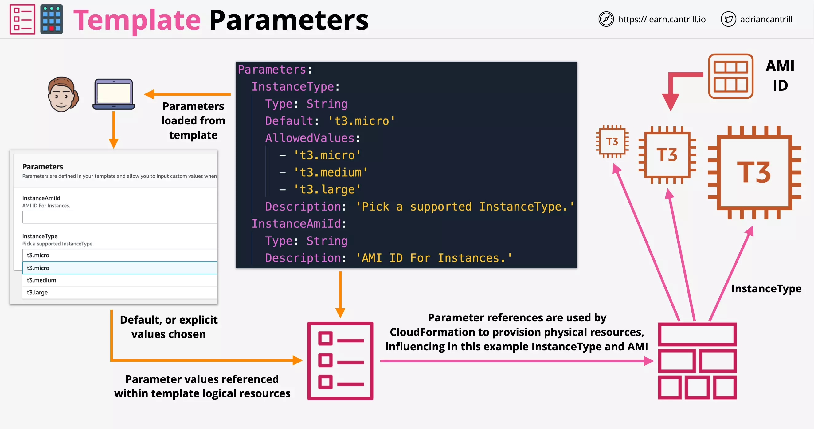
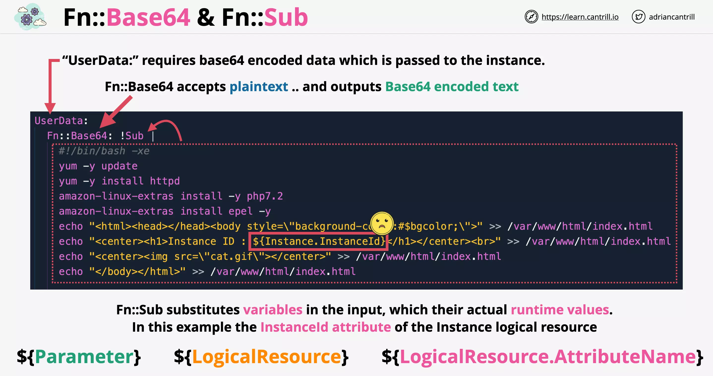
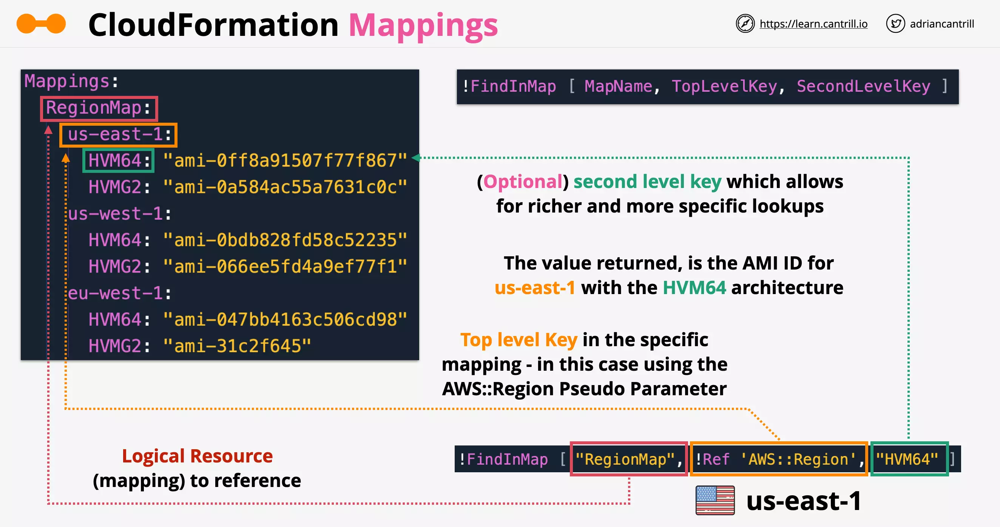
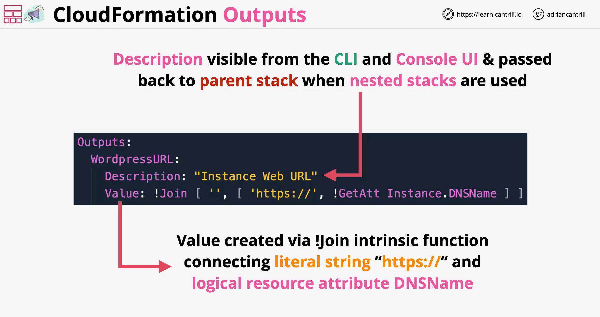
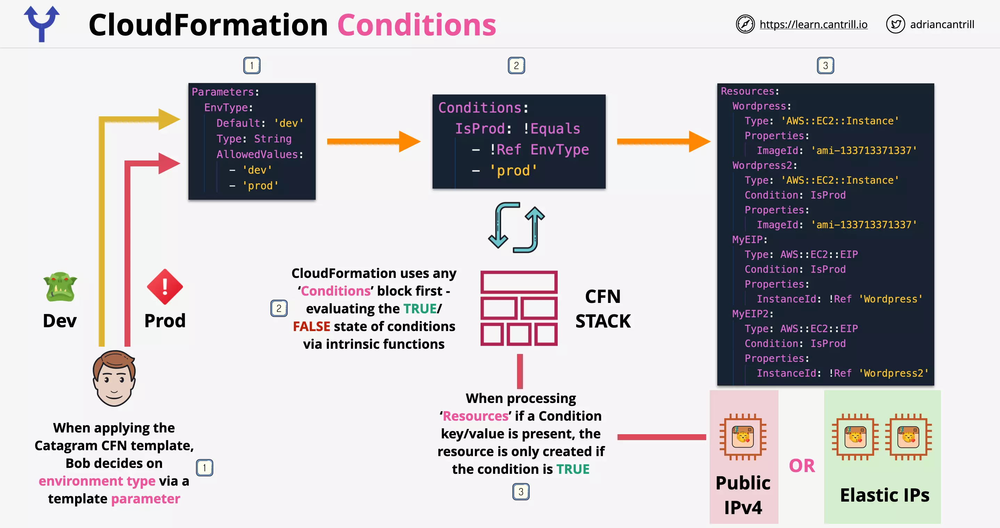
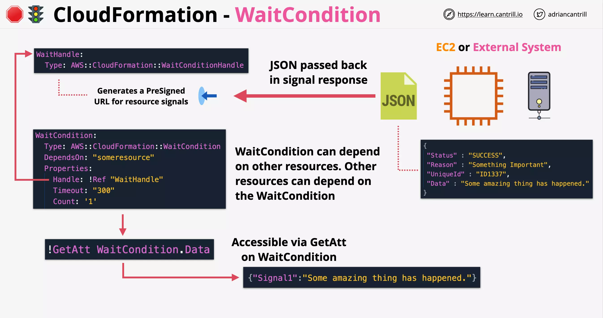

# CloudFormation

CloudFormation defines logical resources within templates (using YAML or JSON).

The logical resource defines the WHAT, and leaves the HOW up to the CFN product. A CFN stack creates a physical resource for every logical resource - updating or deleting them as a template changes.

- Templates are used to create Stacks
- Templates can create 1 stack or multiple stacks
- When the stack is created, physical resources are also created based on the logical resources mentioned in the template
- If a stacks template is changed, physical resources are added, updated or deleted
- If a stack is deleted, normally, the physical resources are deleted
- Once a logical resource moves to create_complete i.e. the physical resource is active, it can be referenced within the template [same or other?]

Following is a snippet of the complete CFN template:

```yaml
Resources:
  Instance:
    Type: "AWS:EC2:Instance"
    Properties:
      ImageId: !Ref LatestAmiId
      InstanceType: "t3.micro"
      KeyName: "A4L"
```

Resources `Properties` are used by CFN when creating the matching Physical Resources.


The following template will create an S3 bucket if name is unique across aws and an instance using AMI specified. This is a `non-portable template` and can be used only once (until your usage is preceded by deletion of stack created by last usage) since the bucket name is hardcoded. Also since AMI id is region specific, this template can only be used in one region.

```yaml
Resources:
  Bucket:
    Type: "AWS::S3::Bucket"
    Properties:
      BucketName: "accatpics13333337"
  Instance:
    Type: "AWS::EC2::Instance"
    Properties:
      KeyName: "A4L"
      InstanceType: "t2.micro"
      ImageId: "ami-04d29b6f966df1537"
```

Portable version of the above CFN template is as follows, which requires us to input the AMI id as a parameter:

```yaml
Parameters:
  KeyName:
    Type: "AWS::EC2::KeyPair::KeyName"
    Description: "Key Pair for EC2"
  AMIID:
    Type: "String"
    Description: "AMI for EC2"
Resources:
  Bucket:
    Type: "AWS::S3::Bucket"
  Instance:
    Type: "AWS::EC2::Instance"
    Properties:
      KeyName: !Ref "KeyName"
      InstanceType: "t2.micro"
      ImageId: !Ref "AMIID"
```

To make this even more portable using SSM we can avoid specifying the Key related details. Also, this uses portable version of AMI referencing which fetches the correct AMI id from the SSM parameter store in each region:

```yaml
Parameters:
  LatestAmiId:
    Description: "AMI for EC2"
    Type: "AWS::SSM::Parameter::Value<AWS::EC2::Image::Id>"
    Default: "/aws/service/ami-amazon-linux-latest/amzn2-ami-hvm-x86_64-gp2"
Resources:
  Bucket:
    Type: "AWS::S3::Bucket"
  Instance:
    Type: "AWS::EC2::Instance"
    Properties:
      InstanceType: "t2.micro"
      ImageId: !Ref "LatestAmiId"
```

---

## Template and Pseudo Parameters

```yaml
Parameters: set of parameters

Resources: set of resources
```

Template and Pseudo Parameters allow input into CloudFormation. They allow input from console, CLI or API.



Pseudo parameters are parameters that are predefined by AWS CloudFormation. You don't declare them in your template. Use them the same way as you would a parameter, as the argument for the Ref function.

```yaml
Outputs:
  MyStacksRegion:
    Value: !Ref "AWS::Region"
```


Following is the list of Pseudo Parameters that are available:

- AWS::AccountId
- AWS::NotificationARNs
- AWS::NoValue
- AWS::Partition
- AWS::Region
- AWS::StackId
- AWS::StackName
- AWS::URLSuffix

---

## Intrinsic Functions

Use intrinsic functions in your templates to assign values to properties that are not available until runtime.

You can use intrinsic functions only in specific parts of a template. Currently, you can use intrinsic functions in `resource properties`, `outputs`, `metadata attributes`, and `update policy attributes`. You can also use intrinsic functions to conditionally create stack resources.

Following are the list of built-in functions:

Reference a value from other one

- Ref
- Fn::GetAtt


Join or split strings

- Fn::Join
- Fn::Split


Get list of AZs and Select one from the list

- Fn::GetAZs
- Fn::Select

**NOTE**: If you have badly configured VPC (say default VPC where you have deleted subnets), then GetAZs might not return all the AZ's.


Provision resources based on conditional check

- Condition functions (Fn::IF, And, Equals, Not & Or)

Encode data such as user data and Substitute information based on runtime information

- Fn::Base64
- Fn::Sub

**NOTE**: Self references is invalid with Sub function. As we cannot pass the reference of the EC2 instance before its created.

Sub function can be passed:

- Parameter value
- Logical Resource name or id
- Logical Resource attribute name



Build CIDR block for networking by automatically building subnet ranges

- Fn::Cidr


Others

- Fn::ImportValue
- Fn::FindInMap
- Fn::Transform

---

## CloudFormation Mappings

```yaml
Parameters: set of parameters

Mappings: use to specify conditional parameter values

Resources: set of resources
```

Following is an example of finding a suitable AMI based on the lookup table provided.



---

## CloudFormation Outputs

```yaml
Outputs:
  - Describes the values that are returned whenever you view your stack's properties. Say, while using "aws cloudformation describe-stacks" AWS CLI command
```

The optional Outputs section declares output values that you can import into other stacks (to `create cross-stack references`), return in response (to describe stack calls), or view on the AWS CloudFormation console.



---

## CloudFormation Conditions

```yaml
Parameters: set of parameters

Mappings: set of mappings

Resources: set of resources

Conditions:
  - Conditions that control whether certain resources are created
  - or whether certain resource properties are assigned a value during stack creation or update.
  - For example, you could conditionally create a resource that depends on whether the stack is for a production or test environment.
```

Conditions are evaluated before any logical resource creation starts. It can be used to decide whether certain resource should be created or not.



---

## CloudFormation DependsOn

CloudFormation decides the order based on which resource references other resource. But to explicitly define the dependency you can use DependsOn attribute.

When you add a DependsOn attribute to a resource, that resource is created only after the creation of the resource specified in theDependsOn attribute.

Consider the following example where we are creating an VPC and an Internet Gateway.

- A VPC can be created without creating Internet Gateway first
- An Internet Gateway can be created without creating an VPC first
- But an Internet Gateway Attachment which connect both VPC and Internet Gateway, will have to wait until both of them are created first. So, this will implicitly depend on a VPC and Internet Gateway

For an elastic IP to successfully be configured through CFN

- It needs to be attached only after an Internet Gateway Attachment is created
- It needs to be deleted before an Internet Gateway Attachment is deleted


---

## CloudFormation CreationPolicy, WaitConditions and cfn-signal

Consider an EC2 instance that bootstraps itself using the user data specified. When this EC2 instance is created through CFN, the EC2 instance creation will succeed long before the bootstraping completes. And even when the bootstraping completes, there is no way to tell CFN that the bootstrap was successful or failed.

CreationPolicy, WaitConditions and cfn-signal can all be used in such case to let CFN know that the bootstraping was success or not.

### CloudFormation Signal

- Configure CFN to hold and wait for given number of signals or wait for a timeout to expire (12 hours max)
- So, in this case the logical resource EC2 will not reach the CREATE_COMPLETE state
- If the number of signals required are received, CFN will go to CREATE_COMPLETE (that means the bootstraping was successful)
- If there is any failure, CFN will go to FAILURE and the stack creation will fail
- If the timeout is reached, CFN will go to FAILURE and the stack creation will fail

To send success or failure signals, we use a utility `cfn-signal` running on the EC2 instance.

### Creation Policy

To signal creation of EC2 or Auto Scaling Groups, you should use CreationPolicy.

- A CreationPolicy is specifically tied to that resource.

In the following example:

- AutoScalingGroup is waiting for 3 signal
- Each EC2 instance will send a signal using `cfn-signal`


### Wait Conditions

Just like CreationPolicy, the allow resource creation to be paused until timeout or signal is received.

WaitCondition can depend of other resources. And other resources can depend of WaitCondition.

- It can be used a progress gate. So that checks cannot be passed until that signals are received.
- WaitCondition will not proceed to CREATE_COMPLETE until the timeout or signal is received.

WaitCondition relies on WaitHandle, which `generates a presigned URL to send signal`.

- Since its presigned, no credentials are required to use it.

Consider you have an EC2 instance or say an external system that is used for licencing.

- They send a JSON response as a signal containing few attributes which can then be referenced else where.
- The attribute of the signal can be accessed using `Fn::GetAtt` function



---

## CloudFormation Nested Stacks

A CFN Stack is isolated, which means it contains all of the AWS resources that the project needs.

Resources in a single stack `share a lifecycle`. In an isolated stack the resources are created together, updated together and deleted together.

- Designing CFN stack this way is fine until you hit the limits.
- There is limit of 500 resources per stack.
- Also, you can't easily resource resources.
- Also, you can't easily reference other stacks.

For complex projects, you are recommended to use Nested Stacks or Cross-Stack references.

### About Nested Stacks

For nested stacks you start with a Root Stack and Parent Stack. In the following example the Root Stack and the Parent Stack are the same.

`Root Stack` is the stack that gets created first.

`Parent Stack` is the parent of the stack that it immediately creates. That is anything that has its own nested stack.

**NOTE**: You can only use `Outputs` with nested stack. You can directly reference the logical resources created in any of the nested stacks.

The `Root Stack` can take the `Outputs` from one nested stack (VPCSTACK) and pass it as parameters to another (ADSTACK).

- Root Stack orchestrates the creation of nested stacks.


- Once the logical resource in the nested stack are created its marked as `CREATE_COMPLTE`. Once all the nested stacks within a Root Stack are created it is also marked as `CREATE_COMPLETE`.

- The advantage of using nested stack is that the for each nested template can be reused in other stacks.

  - In doing so, you are resuing the CloudFormation template code but not the actual resources created by the reuse of the template.
  - This is unlike what happens with the usage of Cross-Stack reference.

- Nested Stacks are usedful when you want to create resources that are `all part of one solution` and are `lifecycle linked`.

### When not to use nested stack

When you need one portion of the stack to stay longer than the other, nested stack is not the ideal choice.

In such case, Cross-Stack reference are better suited.
