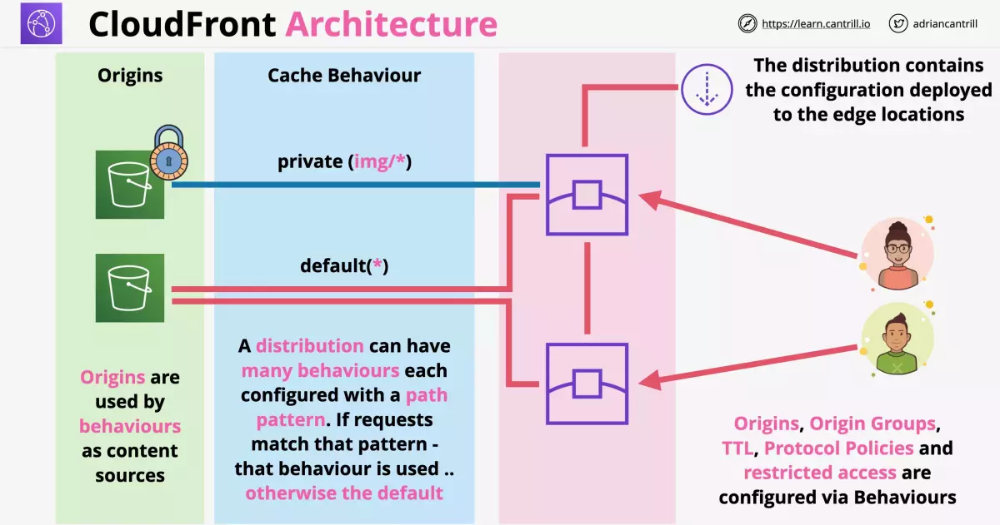
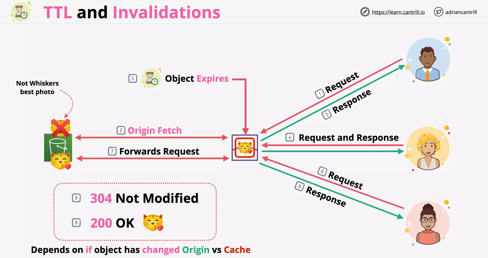

# Cloudfront

## Cloudfront Architecture

**NOTE**: Cloudfront integrates with ACM (AWS Certificate Manager). You can use SSL certificates with Cloudfront.

**NOTE**: Uploads directly go to the origin. Only downloads are served through CloudFront Edge locations.

- Cloudfront does not write caching. Only read requests are cached.

---

## Cloudfront Behaviours

CloudFront Behaviours control much of the TTL, protocol and privacy settings within CloudFront

Each behaviour works based on a precedence value and/or path patttern. Anything that matches will be prioritized over the default behaviour setting.

---

## General (Distribution Settings)

### Price Class

- Use Only US and Europe
- Use Only US, Europe and Asia
- Use All Edge Locations (Best Performance)

### Alternate Domain Names (CNAMEs)

If you have a custom domain, enter it here

### SSL Certificate

- Default Cloudfront Certificate
- Custom SSL Certificate (stored in AWS IAM)

### Default Root Object

### Logging

- On
- Off

Bucket for Logs
Log prefix
Cookie Logging

### Distrubution State

- Enabled
- Disabled

---

## Behaviours (Distribution Settings)

### Path Pattern

By default set as `*`. This cant be modified and forwards all the requests to origin.

### Viewer Protocol

- HTTP and HTTPS
- Redirect HTTP to HTTPS
- HTTPS Only

### Allowed HTTP Methods

- GET, HEAD
- GET, HEAD, OPTIONS
- GET, HEAD, OPTIONS, PUT, POST, PATCH, DELETE

Only GET and HEAD request's responses are cacheable and optionally OPTIONS request as well. Any other method is not cachable.

If you are using any other method other than GET or HEAD and are using S3 bucket, you need to ensure that POST requests are supported in the S3 region.

Some PUT requests may require additional header.

### Foward Headers

- None (Improves Caching)
- Whitelist
- All

Allows to forward the headers, and then cache the objects based onthe header values.

Cloud front doesnt consider headers when caching the objects in edge locations.

With S3, whitelist allows you to forward:

- Access Control Request Headers
- Access Control Request Method
- Origin Headers

With custom origin, we can foward any header except:

- Encoding
- Connection
- Cookie
- Proxy Authorization

### Object Caching

- Origin Cache Headers (We can use this if the origin is adding Cache Control header.)
- Customize (If you want to control how long the object stays in the cache, regardless of the settings in Cache Control header)

### Forward Cookies

- None (Improves Caching)
- Whitelist
- All

### Forward Queries

- Yes
- No (Improves Caching)

If the origin server will return a different version of the object based on the query string in the URL, select Yes.

### Smooth Streaming

- Yes
- No

This uses Microsoft Smooth Streaming format for live streaming.

### Restrict View Access

- Yes (Use Signed URLs or Signed Cookies)
- No

---

## Cloudfront TTL and Invalidations

Note that on the step 4 here, object had been deleted on the origin but was served from cache to User 2.

### TTL

- Default TTL (behaviour) is 24 hours validity
- You can set `Minimum TTL` and `Maximum TTL` values that act as limiter on the per object TTL settings
- TTL per object is set via `Cache-Control max-age`, `Cache-Control s-maxage` and `Expires` origin header

**NOTE**: If the per object TTL is below Minimum TTL, then minimum TTL applies instead. And if its above Maximum TTL, then maximum TTL applies.

For custom origin, headers are supplied by application or web server on the origin.

For S3, headers are specified via object metadata on every object.

### Cache Invalidation

Patterns such as:

- /images/cat.jpg
- /images/cat\*
- /images/\*
- /\*

are used to match objects that needs to be invalidated.

**NOTE**: Irrespective of how many objects are matched, the price for performing invalidation remains the same.

So, cache invalidation should only be used in case you want to correct mistakes. And not perform these invalidations as a regular process.

- versioned filenames can be used to omit invalidation needs

---

## Cloudfront and SSL/TLS

Cloudfront default domain name follows `<subdomain>.cloudfront.net` pattern.

SSL for these by default are applied using `*.cloudfront.net` cert.

### Alternative Domain Names

You can use this to specify different CNAMES you will use to access cloudfront distributions.

- If you use HTTPS you need a certificate applied to the distribution or
- You can verify the ownership using SSL certificate that has matching cloudfront distribution name
- You can either generate or import a SSL certificate from AWS Certificate Manager (ACM)

**NOTE**: ACM is a regional service and you need to add the certificate in the same region as the service you are using.

Say, a load balancer in asia-south-1a need ACM from the same region.

**NOTE**: Cloudfront is a global service and needs the certificate to be always added in **`us-east-1`** (Northern Virginia).

### Two SSL Connections

Viewer => Cloudfront and Cloudfront => Origin

- Both (and intermediate connections) need valid public certificates
- Self signed certificates will not work
- Only publicly trusted certificates are valid

### Certificate Management

- S3 origins doesnt require certificate management. S3 handles certificates natively.
- ALB can use ACM to manage certificate generation and management
- With Custom Origin EC2 or On-Premise servers we need to apply certificate manually

**NOTE**: For all the cases, the certificate needs to match the DNS name of the origin.

From the viewer side, the certificate applied to Cloudfront needs to match the DNS name of whatever your customer are using to access Cloudfront.

On the origin side, the certificate installed on any of your origin needs to match the DNS name of what Cloudfront is using to contact the origin.

---

## Cloudfront and SNI

Encryption start at TCP connection. Which is at a layer below the layer at which HTTP requests are made.

- So before a server knows which site is being requested, that information is provided at the next layer (Application), encryption has to be performed for the connection.
- Historically this was problematic for scenario's where you have two HTTPS domains running on the same IP address.
- Recently SNI has been introduced as a TLS extension, allowing host to be included during TLS handshake before HTTP gets involved (Presentation layer)

With SNI a server hosting multiple domain (at a single IP address where each uses different SSL cert), can respond to each request with right certificate based on the domain being requested.

- different cert for each custom domain is required to prove its identity

**NOTE**: Older browsers don't support SNI. Cloudfront allows us to use dedicated IP's for each custom domain in such cases (at an extra cost. $600 monthly).

---

## Origin Types & Origin Architecture

Note that the origins listed under Cloudfront distributions are what is specified under each behaviour in the Behaviours section.

Origins types:

- S3 bucket
- AWS Media Package Endpoint
- AWS Media Store Container Endpoint
- Web Servers

### S3 Origin

Cloudfront with S3 Origin

- provides option for using `Origin Access Identity` which can be used to restrict access to existing identities or new identities.

- It uses same protocol (HTTP/HTTPS) used on Viewer Side (User to Cloudfront) on Origin Side as well (Cloudfront to User)

- Allows to pass custom header (Used to restrict access to only when this header is passed)

### Custom Origin

Cloudfront with Custom Origin

- provides option to choose Origin Side protocol either as HTTP, HTTPS or same as Viewer Side protocol

- Allows to pass custom header (Used to restrict access to only when this header is passed)
