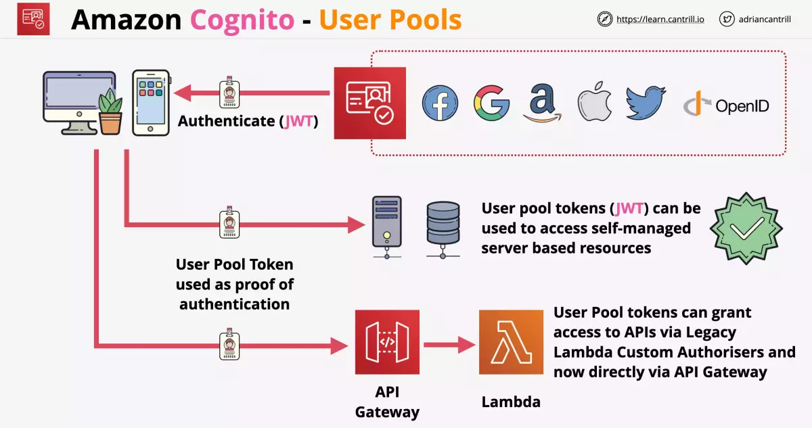
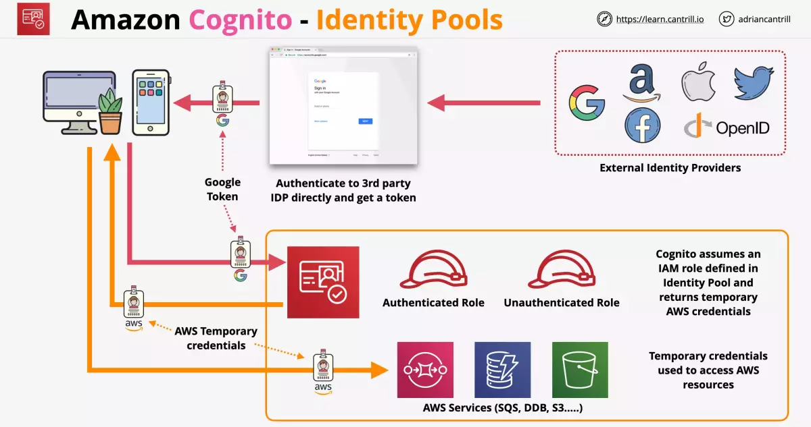
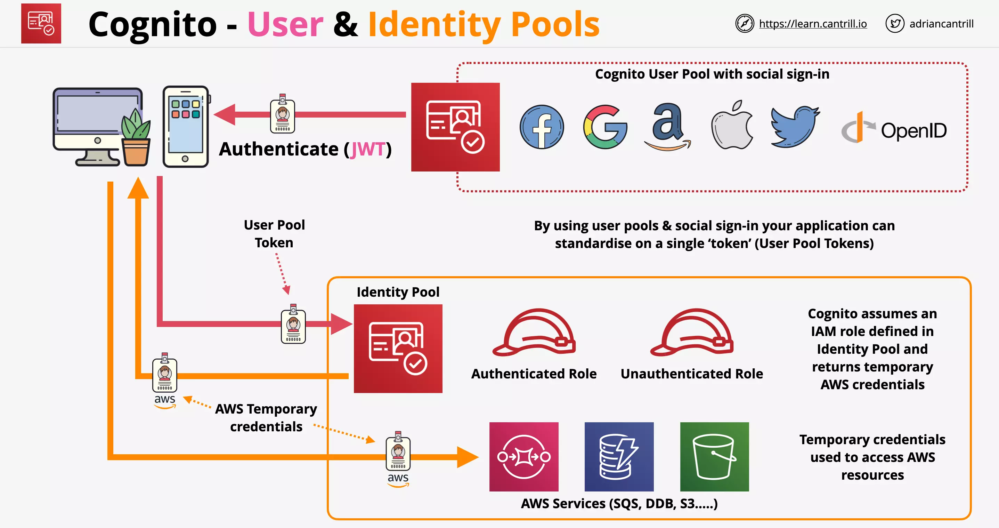

# Amazon Cognito

Cognito provides authentication, authorization and user management for web or mobile apps through

- User Pools
- Identity Pools

## Amazon Cognito User Pools

A user pool is a user directory in Amazon Cognito.

Your users can also sign in through social identity providers like Google, Facebook, Amazon, or Apple, and through SAML identity providers. Whether your users sign in directly or through a third party, all members of the user pool have a directory profile that you can access through a Software Development Kit (SDK).

### Consideration

    User Pools do not grant access to AWS services.
    It only controls sign-in and delivers a JWT.

User Pool provides

- user directory management
- sign-up and sign-in (with customizable UI)
- security features (such as MFA, email verification, compromised credentials check, account takeover protection)
- custom workflow and user migration (using Lambda triggers)
- sign-in can be done using external identities such as facebook, google and receive a JWT token from User Pool

### Flowchart

User does sign-in through User Pool which can provide a sign using internal user or external identities and `gets a JSON Web Token` (JWT).

JWT can be used

- to access self-managed server based resources
- with API Gateway directly
- for authentication with applications
- but most AWS services can't use JWT instead require actual AWS credentials

---

## Amazon Cognito Identity Pools

Identity pools - also known as `Federated Identities`, helps to provide `short term AWS Credentials` for your users or guests that need access to AWS services.

- Can work with Amazon Cognito User Pools
- Can federate with public providers (Google, Facebook, SAML2.0)

The Identity pools help to define two types of identities

- Authenticated identities
- Unauthenticated identities

To gain the authenticated state, a user must be authenticated by a public login provider. This can be:

- Amazon Cognito user pool
- Public ID providers
- Open ID connect provider

### Flowchart

We start with the collection of external identities. Our application allows access using any of those external identities.

Post authentication with the 3rd party IDP, we get a token.

For identity pool to work with these 3 party token, `each 3rd party IDP needs to be configured`.

Cognito assumes an IAM role defined in Identity Pool and returns temporary AWS credentials. This credential is passed back to the application.

The application can use these temporary credentials to access AWS resources.

### CUP Token

Now Cognito does not store the credentials by the IDP or forward this to your mobile app, instead, the IDP token will be normalized into a standard token, called a `Cognito User Pool (CUP) token` and this will be used and stored by Cognito.

**NOTE**: This essentially means that it doesn’t matter if the user authenticated via an account in the User Pool, or federated access, all tokens will be standardized

---

## Amazon Cognito User and Identity Pools

The advantage of this is identity pool needs to be configured only with one identity provider (User Pool).

---

## Demo

This is after s3 bucket for frontend and google auth setup.

https://learn.cantrill.io/courses/1101194/lectures/30290121
