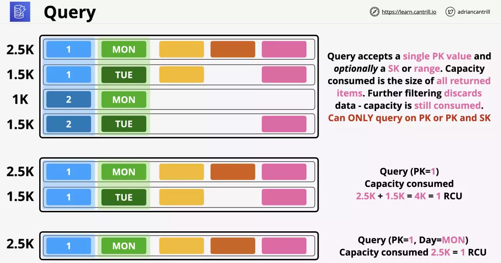
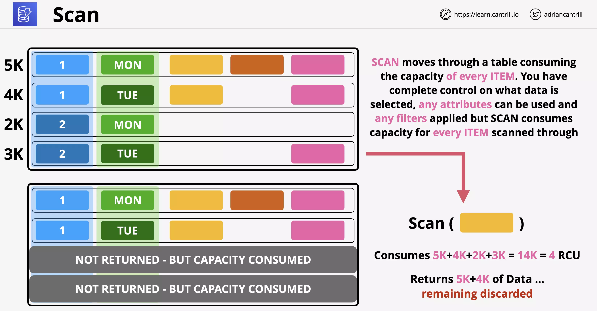
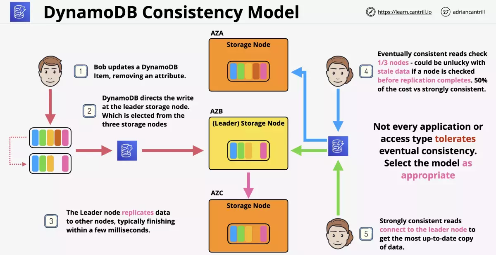
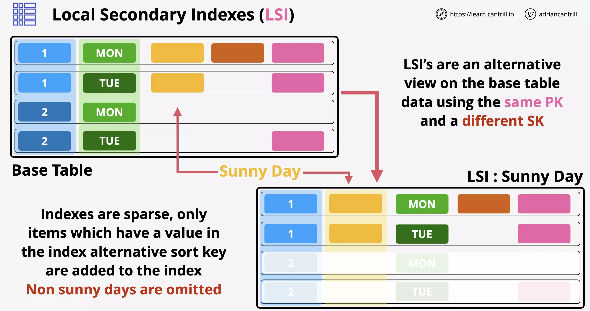
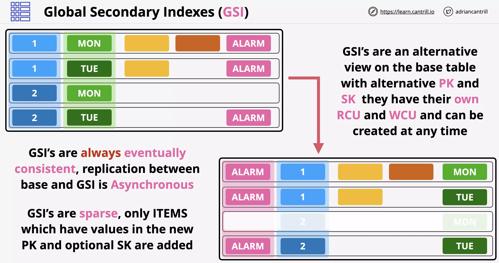
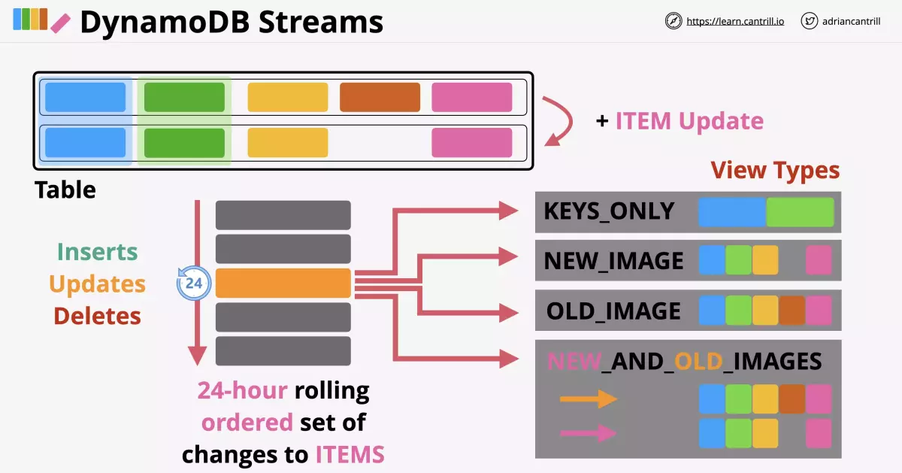
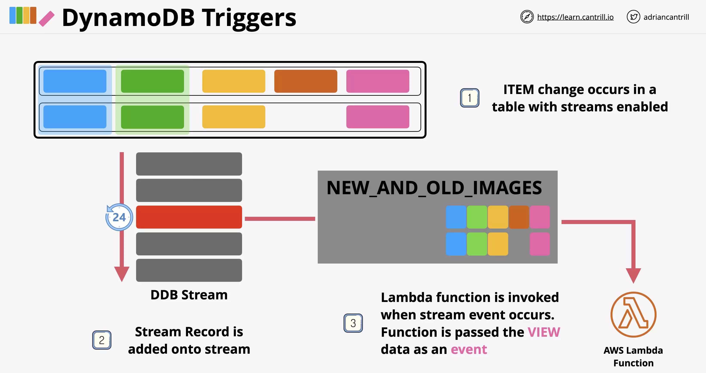
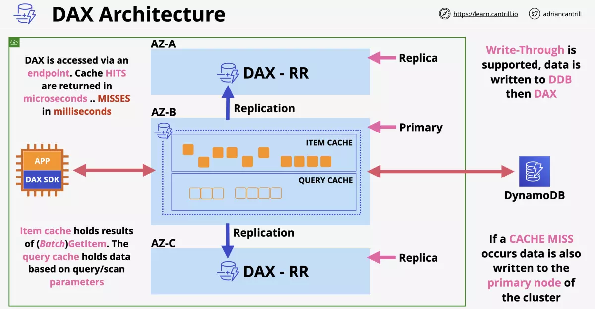

# DynamoDB

## Considerations

NoSQL Public Database as a Service (DBaaS)

Wide column Key/Value database.

Not like RDS which is a Database Server as a Product. This is only the database.

You can take full control and provisioned capacity or use on-demand
mode and set it and forget it.

This is highly resilient, across AZs and optionally globally resilient.

Data is replicated across multiple storage nodes by default so doesn't need to be set up or managed.

Really fast, single digit millisecond access to data (SSD based).

Supports backups and encryption at rest.

It allows event-driven integration. Do things when data changes.

### Dynamo DB Tables

A table is a grouping of items which share the same primary key.
There is no limit to the number of items in a table.

When configuring DynamoDB, you need to pick a primary key from two types

- Simple (Partition)
- Composite (Partition and Sort)

Every item (table row) in the table needs a unique primary key.

Every item (table row) attributes are optional and may or may not have value.

Each item (table row) can be `at most 400KB` in size. This includes the primary key and attributes.

In DynamoDB, capacity means speed.

- If you choose on-demand capacity model you don't have to worry about capacity. You only pay for the operations for the table.
- If you choose provisioned capacity, you must set this on a per table basis.

Capacity is set per WCU or RCU

```
1 WCU means you can write 1KB per second to that table
1 RCU means yTo avoid potential throttling, the provisioned write capacity for a global secondary index should be equal or greater than the write capacity of the base table since new updates will write to both the base table and global secondary index.
ou can read 4KB per second for that table
```


### Backups

On-demand Backups

- Similar to manual RDS snapshots.
- Full backup of the table that is retained until you manually remove that backup.
- This can be used to restore data in the same region or cross-region.
- You can adjust indexes, or adjust encryption settings.

Point-in-time Recovery

- Must be enabled on each table and is off by default.
- This allows continous record of changes for 35 days to allow you to replay any point in that window to a 1 second granularity.

### Billing

Billing based on:

- RCU and WCU
- Storage on that table
- Additional features on that table

Can purchase reserved capacity with a cheaper rate for a longer term commit.

---

## DynamoDB Operations

### Reading and Writing

On-Demand

- unknown or unpredictable load on a table.
- This is also good for as little admin overhead as possible. Pay a price per million Read or Write units.
- This is as much as 5 times the price as provisioned.

Provisioned

- RCU and WCU set on a per table basis.
- `Every operation consumes at least 1 RCU/WCU`

```
1 RCU = 1 x 4KB read operation per second. (Even 1KB read will consume 1RCU).
1 WCU = 1 x 1KB write operation per second.
```

Every single table has a WCU and RCU burst pool.

- This is 300 seconds of RCU or WCU as set by the table.

### Query

Used to retrive data from DynamoDB.

You have to pick one partition key value to start.

The partition key can be the sensor id, the sort key can be the day of the week you want to look at.

Query can accept:

- Simple primary key (just the partition key)
- Composite primary key (uses both the partition key and sort key)

So using just partition key, which will return more rows, might be better than using partition key with sort key



Also, its recommended to keep the size of the item to the minimum. Since all the operation on dynamodb happens on per item basis, even if you have to retrive a single item billing will depend on the per item size.

Capacity consumed is the size of all returned items. You can use filter to choose particular attributes of the items returned. `Filtering discards data, but capacity is still consumed`.

- so its better to collect more data at once than to filter it using dynamodb

A Query operation can only ever search based on one particular partition key value.

> If you want to search the whole table to get items that meet certain condition, you can't do that with Query.

### Scan

Least efficent when pulling data from Dynamo, but the most flexible.

Scan moves through the table item by item consuming the capacity of every item.

- Even if you return less than the whole table, you will be charged for the entire table.
- It adds up all the values scanned and will charge rounding up.



---

## DynamoDB Consistency

Types of consistency options:

- Eventually Consistent: easier to impliment and scales better
- Strongly Consistent (Immediate): more costly to achieve

NOTE: Eventually consistent reads are charged half the price of Strongly consistent reads

DyanamoDB consists of `storage node` in each availability zone. Following example illustrates a scenario where we have 3 AZs containing one storage node each, having same data.

One storage node is chosen as the `Leader`.

    Strongly consistent reads connect to leader node to get the latest data



In the scenario above Bob updates an attribute of an item. DyanamoDB directs the write at the leader storage node, which is elected from the three storage nodes.

- the leader node replicates the data to other nodes, which usually happens within milliseconds

So, in the above scenario a user reads just before the storage node is updated, user would get the stale data.

### WCU Calculation

Say you need to store 10 items per second with 2.5K average size per item. Calculate WCU.

```
1 KB item = 1 WCU

2.5 KB / 1 KB = 3 KB per item (round up)

3KB per item = 3 WCU

10 items per second = 3 WCU x 10 = 30 WCU
```

### RCU Calculation

Need to retrieve 10 items per second with 2.5K average size per item. Calculate RCU.

```
4 KB item = 1 RCU

2.5 KB / 4 KB = 4 KB per item (round up)

10 items per second = 1 RCU x 10 = 10 WCU

Strongly consistent: 10 RCU
Eventually conssitent: 5 RCU
```

---

## DynamoDB Indexes

Great for improving data retrival in DynamoDB.

Query can only work on 1 partition key value at a time.

Indexes are a way to provide an alternative view on table data.

You have the ability to `choose which attributes are projected` to the table.

### Local Secondary Indexes (LSI)

Alternative view on base table data. These must be created with a
table in the beginning.

    LSI cannot be added after the table is created.

Maximum of 5 LSI's per base table.

LSI allows `using alternative sort key` on the table but `the same partition key`.

`Shares the RCU and WCU with the table`, if the main table is using provisioned capacity.

Attributes that can be projected into the LSI has the following options:

- ALL
- KEYS_ONLY
- INCLUDE (lets you choose attributes)

#### Example

As we know scan operation for getting the Sunny Days from the base table is time consuming and costly. We can create LSI during the base table creation instead, using the _sunny day_ attribute as the sort key.



The indexes are sparse. Only items that has value for the attribute used as sort key are included for indexing.

### Global Secondary Indexes (GSI)

Can be created at any time and much more flexible.

There is a default limit of 20 GSIs for each table.

This allows for `alternative sort key` and `as well as partition key`.

GSI will `have their own RCU and WCU allocations`, if the main table is using provisioned capacity.

Attributes that can be projected into the GSI has the following options:

- ALL
- KEYS_ONLY
- INCLUDE (lets you choose attributes)



The indexes are sparse. Only items that has value for the attribute used as sort key are included for indexing.

Replication between base table and GSI is asynchronous

    GSIs are always eventually consistent

### Considerations

If you don't project a specific attribute, but then you require the attribute later. This is really inefficient and should be planned better as

    Queries on attributes NOT projected are expensive

AWS recommends GSI as default and only use LSI when `strong consistency` is required.

---

## DynamoDB Streams

DymanoDB stream is a time ordered list of changes to items in a DynamoDB table. A stream is a 24 hour rolling window of the changes.

It uses Kinesis streams behind the scenes.

This is enabled on a per table basis. This records

- Inserts
- Updates
- Deletes

Different view types influence what is in the stream.

### Example

Consider a table whose item is updated with one of its attribute removed.

If we have enabled streams on this table, it will record any

- Inserts
- Updates
- Deletes



### View Types

There are four view types that a stream can be configured with:

#### KEYS_ONLY

- it will only record the partition key and any sort key for the item that has changed.
- so determine the change, it would require a database read.

#### NEW_IMAGE

- stores entire item, how it was after the change
- can be used to consume the new updated data

#### OLD_IMAGE

- shows the initial item before the change

#### NEW_AND_OLD_IMAGES

- shows both before and after the change
- Pre or post change state might be empty if you use **insert** or **delete**

---

## DynamoDB Triggers

Allow for actions to take place in the event of a change in data.

Item change generates an event which contains the data which was changed. The data contained `depends on the view type`.

When an item is added to a stream, action is taken using that data. The `action is implemeted using stream and lambda`.

- So Lambda can respond to any data change operation that had caused the `Stream Event`.

This is great for reporting and analytics in the event of changes.

- Good for data aggregation
- provide messages or notifications and eliminates the need to poll databases.



---

## DynamoDB Accelerator (DAX)

This is an in memory cache for DynamoDB. It should be considered to `reduce cost and increase performance`, when you have large RCU being used i.e. for read heavy workloads.

    Not ideal if you need strongly consistent reads

> Used if you need really low response time at scale

Traditional Cache

- The application needs to access some data and checks the cache. If there is no data, it is a cache miss and it pulls from the database. This then updates the cache with the new data. Next times there will be a cache hit and it will be faster.
- But a seperate operation is needed to load data from database on cache miss.

DAX

- The application instance has DAX SDK added on.
- If DAX has the data then the data is returned directly. If not, DAX will talk to DynamoDB and get the data. This is one set of API calls and is much easier for the developers.

### DAX Architecture

DAX operates from within a VPC and is designed to be deployed to multiple AZs in that VPC.

There is a `primary node` which is a read and write node which replicates the data on other nodes which are `read replicas`.



So, here the application communicates through DAX SDK. and DAX communicates with DynamoDB.

With DAX you can scale up or scale out.

#### Cache Types

DAX maintains two different caches:

1. Item Cache - This caches individual items retrieved via `GetItem` or `BatchGetItem` operation
2. Query Cache - This caches the `results of Query and Scan operation` including the parameters used.

#### DAX Endpoint

Every DAX cluster, similar to RDS, has an endpoint which is load balanced across the cluster.

- Cache hits are returned in about 400 microseconds
- Cache miss can be returned in single digit milliseconds.

#### DAX Write-Through

When writing data to DAX, it can use write-through. Data is written to the database, then written to DAX.

- If data is being retrived from DyanamoDB during cache miss, it will be written to primary node of the cluster

---

## DynamoDB Global Tables

Global tables provide multi-master cross-region replication.

- no table is considered as master
- no table is considered as replica
- all tables are considered the same

To create a Global Table

- Tables are created in multiple AWS regions.
- In one of the tables, you configure the links between all of the tables.
- DynamoDB will enable replication between all of the tables.
- So tables become table replica of a global table.

During a conflict between the tables

- last writer wins
- its changes are then replicated across

### Considerations

`Reads and Writes can occur to any region`.

Replication is generally sub-second and depends on the region load.

Strongly Consistent reads **only** in the same region as writes.

- **Global eventual consistency** but can have same region strongly consistent

Provides Global HA and disaster recovery easily.

---

## DynamoDB Time-To-Live (TTL)

DynamoDB Time to Live (TTL) allows you to define a per-item timestamp to determine `when an item is no longer needed` or `when lose relevance after certain time`.

- After specified timestamp, DynamoDB deletes the item from your table without consuming any write throughput.
- TTL is provided at no extra cost as a means to reduce stored data volumes by retaining only the items that remain current for your workload’s needs

If you want an item to expire say after one week, you need to put appropriate timestamp in the attribute you select for TTL.

### Scanning

A process periodically run on the partitions for items that have expired based on the TTL attribute.

- Items where the TTL attribute is older than current time, they are set to expired
- These are not deleted immediately

Another process periodically runs on the partitions

- It scans for expired items
- And deletes the items that have expired
- They are also `removed from indexes`

### Streams

    A delete is added to streams if enabled

The stream allows to perform any operation based on the deletions.

### Performance

The delete operations run in the background and dont cause any impact on table performance.

Also, these operations arent chargable.

---

# ElastiCache

Elasticache is a managed in-memory cache which provides a managed implementation of the `redis` or `memcached` engines.

Its useful for

- read heavy workloads
- scaling reads in a cost effective way
- allowing for externally hosted user session state (stateless servers).

To add ElastiCache into the application, `code changes are required`.

- Application needs to use the cache
- Fetch the data from Database on cache miss

## Redis vs MemcacheD

|                      Memcached                       | Redis                                            |
| :--------------------------------------------------: | ------------------------------------------------ |
|           Simple data structures (Strings)           | Advanced Data Structures                         |
|                    No replication                    | Multi AZ                                         |
| Multiple Nodes (Sharding) - split users across nodes | Supports Replication (Scale reads truely)        |
|        No backups - as it has no persistence         | Supports backup and restores                     |
|                    Multi-threaded                    | Transaction (Either all operations work or none) |
|                                                      | Use redis for strong consistency                 |
