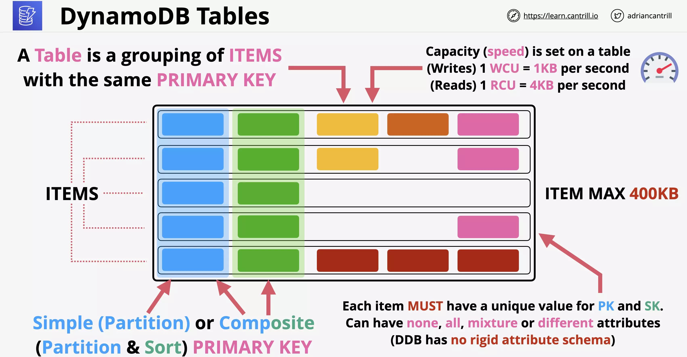

# DynamoDB

## Considerations

NoSQL Public Database as a Service (DBaaS)

Wide column Key/Value database.

Not like RDS which is a Database Server as a Product. This is only the database.

You can take full control and provisioned capacity or use on-demand
mode and set it and forget it.

This is highly resilient, across AZs and optionally globally resilient.

Data is replicated across multiple storage nodes by default so doesn't need to be set up or managed.

Really fast, single digit millisecond access to data (SSD based).

Supports backups and encryption at rest.

It allows event-driven integration. Do things when data changes.

#### Dynamo DB Tables

A table is a grouping of items which share the same primary key.
There is no limit to the number of items in a table.

When configuring DynamoDB, you need to pick a primary key from two types

- Simple (Partition)
- Composite (Partition and Sort)

Every table row in the table needs a unique primary key.

Every table row attributes are optional and may or may not have value.

Each table row can be at most 400KB in size. This includes the primary key and attributes.

In DynamoDB, capacity means speed.

- If you choose on-demand capacity model you don't have to worry about capacity. You only pay for the operations for the table.
- If you choose provisioned capacity, you must set this on a per table basis.

Capacity is set per WCU or RCU

1 WCU means you can write 1KB per second to that table
1 RCU means you can read 4KB per second for that table

