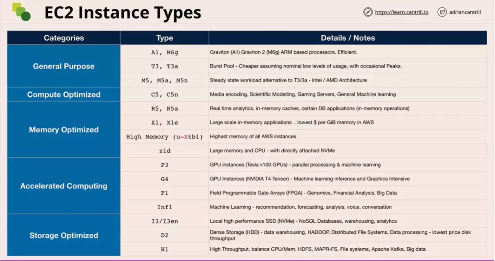

# Virtualization Fundamentals

## SR-IOV

This overcomes the problem with network IO being the bottleneck while a host is running multiple virtual machines all having network intensive work load. It does this by virtualizing the network card. This means less CPU usage for the guest.

In EC2 - This is Enhanced Networking.

https://learn.cantrill.io/courses/1101194/lectures/27026221

# EC2 Architecture and Resilience

EC2 host

- Runs within single AZ

When instances are provisioned within a specific subnet within a VPC, a primary elastic network interface is provisioned in a subnet which maps to the physical hardware on the EC2 host.

- Subnets are also within one specific AZ.
- Instances can have multiple network interfaces even within different subnets, as long as they're within the same AZ.

Elastic Block Store (EBS)

- EC2 can make use of remote storage, Elastic Block Store (EBS).
- EBS also runs within a specific AZ.
- EC2 instance in one AZ cant access EBS volume of another AZ.
- EBS allows you to allocate volumes of persistent storage to instances within the same AZ.

---

## EC2 Categories

**General Purpose** - default steady state workloads with even resources
**Compute Optimized** - Media processing, scientific modeling and gaming
**Memory Optimized** - Processing large in-memory datasets
**Accelerated Computing** - Hardware GPU, FPGAs
**Storage Optimized** - Large amounts of super fast local storage. Massive amounts of IO per second. Elastic search and analytic workloads.

### Naming Scheme

**R5dn.8xlarge** - whole thing is the instance type. When in doubt give the
full instance type

- 1st char: `Instance family`. No expectation to remember all the details
- 2nd char: `Instance generation`. Generally always select the newest generation.
- chars before period: `Additional capabilities`
  - a: amd cpu
  - d: nvme storage
  - n: network optimized
  - e: extra capacity for ram or storage
- char after period: `Instance size`. Memory and CPU considerations.
  - often easier to scale system with a larger number of smaller instance sizes

https://aws.amazon.com/ec2/instance-types/

### EC2 SSH vs EC2 Instance Connect management

https://learn.cantrill.io/courses/1101194/lectures/27806428

---

[Storage Fundamentals](./storage.md)

---

# EC2 Network Interfaces, Instance IPs and DNS

Every EC2 has at least one Elastic Network Interface (ENI) which is the primary ENI.

We can attach secondary ENIs to an EC2 instance which are in seperate subnets, but everything must be within one AZ.

When you launch an instance, the Security Groups are on the network interface and not the instance.

---

## Elastic Network Interface

- Has a MAC address
- Has a Primary IPv4 private address
  - Belongs to, the range of the subnet, the ENI is within.
- 0 or more secondary private IP addresses
- `0 or 1 public IPv4 address` (One per interface)
- `1 elastic IP per private IPv4 address` (One per private IP address)
- 0 or more IPv6 address on the interface (all public IP addresses by default)
- Security groups
  - This applies to the network interfaces and will impact all IP addresses on that interface
  - if you need different IP addresses impacted by different security
    groups, then you need to make multiple interfaces and apply different
    security groups to those interfaces
- Source / destination checks
  - If traffic is on the interface, it will be discarded if it is not from `one of the IP addresses on the interface as source` or going to `one of the IP addresses on the interface as destination`
  - This setting needs to be disabled for an EC2 instance to work as a NAT instance.

## **NOTE**: Secondary interfaces function in all the same ways as primary interfaces except you can detach interfaces and move them to other EC2 instances.

## Primary IPv4 private address

Given a DNS name that is associated with the private IP say `ip-10-16-0-10.ec2.internal`. Its only resolvable inside the VPC and always points to private IP address.

---

## Public IPv4 address

- Instance must manually be set to recieve an IPv4 addr
- Settings into a subnet which automatically allocates an IPv4
- Dynamic IP that is not fixed
- If you stop an instance the address is deallocated.
- When you start up again, it is given a brand new IPv4 address
- Restarting the instance will not change the IP address
- Changing between EC2 hosts will change the address

Public IPv4 address is allocated a public DNS name

- Inside the VPC, Public DNS name will resolve to the primary private IPv4 address of the instance
- Outside the VPC, Public DNS name will resolve to the public IP address

Public IPv4 address is not directly attached to the instance or any of the interface, its associated with it.

- Translation of this address to private IPv4 address is done by AWS Internet Gateway

---

## Elatic IP address

We can have `1 public elastic IP per private IPv4 address` (One per private IP address)

- Allocated to your AWS account
- Can associate with a private IP on the primary interface or on the secondary interface.
- If you are using a public IPv4 and assign an elastic IP to an instance, the original dynamic IPv4 address will be lost.
- If you remove the elastic IP from the instance, it gets a new dynamic IPv4 address.

---

## Considerations

If you provision a secondary ENI's mac address a license, you can move around the license to different EC2 instances by dettaching and attaching the secondary ENI to that instance.

If you need different rules for different IPs, then you need to multiple ENI with different Security Group on each.

The OS never see's the IPv4 public address.

- NAT plays a role here
- You always configure the private IPv4 private address on the interface.
- Never configure an OS with a public IPv4 address.

---

# Amazon Machine Image (AMI)

AMI's can be used to launch EC2 instance.

Also, you can create an AMI from an existing EC2 instance to capture the current config.

- When you launch an EC2 instance, you are using an Amazon provided AMI.
- Can be Amazon or community provided
- Marketplace (can include commercial software)
  - Will charge you for the instance cost and an extra cost for the AMI
- Region wide unique ID (ami-`random set of chars`)
- Controls permissions of who can access the AMI
  - Default to only your account being able to access it
  - Can be set to be public
  - Can be made accessible to specific AWS accounts

---

## AMI Lifecycle

### 1. Launch

You could launch it with instance volume or EBS volume attached.

### 2. Configure

Post launch, you can customize the instance's with certain applications installed, services setup or certain volumes attached of certain sizes.

### 3. Create Image

Once an instance has been customized, an AMI can be created from that.

- AMI will contain the permission of who can use it.
- During image creation, snapshots of any EBS volumes attached will be taken.
- These snapshots will be referenced within the AMI as `Block Device Mapping`.
- Block device mapping links the snapshot IDs and a device ID for each snapshot.

An Amazon Machine Image (AMI) is stored in Amazon S3, but it is not directly accessible. Instead, you must use API calls or the Management Console to use an AMI.

**NOTE**: You can change the EBS volume size during the AMI creation.

### 4. Launch

When the AMI is used to create a new instance, this new instance will have the same EBS configuration as the original instance.

During the launch:

- Snapshots are used to create new EBS volumes in the AZ where you are launching the instance into.
- These new EBS volumes are attached to the new instance using the same device ID contained in the `Block Device Mapping`.

AMI are regional construct:

- The AMI from AZ-1, is stored in the region. Snapshot of EBS volumes are stored in S3, which is already a regional service.
- You can take the AMI and create the new instance in the same AZ or another AZ in the same region.

**NOTE**: AMI's doesnt contain the data.

---

## Consideration

- AMI can only be used in one region.
- `AMI can be copied between regions`
- AMI Baking: creating an AMI from a configured instance.
- An AMI cannot be edited. If you need to update an AMI, launch an instance, make changes and then make new AMI.
- Remember permissions by default are your account only. You can extend that to other account, partner account or make it completely public.
- `Billing` is for the storage capacity for the EBS snapshots the AMI references

---

## Copying

### Cross-account copying

The owner of the source AMI is charged standard Amazon EBS or Amazon S3 transfer fees, and you are charged for the storage of the target AMI in the destination Region.

### Cross-Region copying

AMI once created in a region, can be copied between regions.

---

## Encryption

You can enable `target EBS snapshots encryption` while copying AMI between regions.

- The default master key is used for encryption.
- You can change it to Customer Master Key as well.

Since KMS is regional service, when moving an encrypted AMI it will be encrypted in the new region using the master key (default or CMK) of that region.

### Encryption and copying

The following table shows encryption support for various AMI-copying scenarios.

| Scenario | Description                | Supported |
| -------- | -------------------------- | --------- |
| 1        | Unencrypted-to-unencrypted | Yes       |
| 2        | Encrypted-to-encrypted     | Yes       |
| 3        | Unencrypted-to-encrypted   | Yes       |
| 4        | Encrypted-to-unencrypted   | No        |

**NOTE**: You cannot copy an encrypted snapshot to yield an unencrypted one.

---

# EC2 Purchase Options

- On-Demand Instances (Default)
- Spot Instances
- Reserved Instances
- Dedicated Hosts
- Dedicated Instances

---

## On-Demand Instances

- Per second billing.
- Billed only when instances are in running state.
- No long-term commitments or upfront payments
- No interuption
- No capacity reservation
- Pridictable pricing
- No upfront cost
- No discount
- `Useful short term workload`
- Useful for apps which can be interrupted

---

## Spot Instances

You can set a maximum price you are willing to pay for an EC2 instance.

- You pay only the spot price that is set by AWS, which is lower than the maximum.
- When the spot price changes and is more than the maximum price you had set, your instances will be terminated.

Upto 90% cheaper than on-demand instance pricing.

- Good for cost sensitive workload
- Anything which is stateless
- Anything than can be rerun or resumed
- Or for burst capacity needs

---

## Reserved Instances

Up to 75% off on-demand instance pricing.

- The trade off is commitment.
- You're buying capacity in advance for `1` or `3` years. (NO 2 years option)
- Unused reservations are still billed

Reserved instance can be locked to an AZ or Region.

- If you lock reservation in a AZ, you can only benefit by launching instances in that AZ. But `it also reserves capacity`.
- If you lock reservation for a region, `it doesnt reserves capacity`. But you will benefit from launching an instance in any AZ.

Partial coverage

- If you launch an instance that is larger than you reserved, you will get partial coverage in this case.

### Payment Terms

- No Upfront `(Reduces per second fee)`
- All Upfront `(No per second fee. Offers greatest discount.)`
- Parial Upfront `(Reduces per second fee than no upfront option. Requires less upfront cost than all upfront option.)`

---

## Dedicated Hosts [OOS]

- You pay for the host.
- Only you can launch instances on the host.
- We need to manage the capacity [How???]
- There is no per second pricing.
- You can launch instances of various sizes, consuming all the resource capacity of the host.

This purchase option is suitable when you are licensing certain applications based on sockets/cores used.

Host affinity

- This allows you to link certain EC2 instances to given EC2 hosts
- Even if you stop and start the instance, the EC2 instance remains on the same host

---

## Dedicated Instances [OOS]

In this purchase option

- You DONT pay for the host.
- You pay a PREMIUM for launching the instances.
- Only you can launch instances on the host.

This purchase option is useful when you have strict requirement of not sharing the host.

- And you dont want to manage the hardware.

Extra price consideration

- You pay one off hourly fees for any region you are using dedicated instances (irrespective of how many are you utilizing)
- You pay a PREMIUM for launching dedicated instances.

---

# Instance Status Checks and Autorecovery

Every instance has two high level status checks

## System Status Checks

- Loss of System Power
- Loss of network connectivity
- Host software issues
- Host hardware issues

## Instance Status Checks

- Corrupted file system
- Incorrect Instance Networking
- OS Kernel Issues

## Handling Failed Status Checks

### Manually

- stop and start an instance
- terminate and restart an instance

### Automatically

You can create an Amazon CloudWatch alarm that monitors an Amazon EC2 instance and automatically recovers the instance if it becomes impaired due to an underlying hardware failure or a problem that requires AWS involvement to repair.

To auto recover `Create Alarm`

- Alarm Action: Recover/Reboot/Stop/Terminate

A `terminated instance` cannot be recovered. This option is useful as if a instance is terminated, you can have EC2 configured to reprovision a new instance.

A `recovered instance` is identical to the original instance, including the instance ID, private IP addresses, Elastic IP addresses, and all instance metadata

- This will automatically try to recover the instance
- Recovery will happen in the same AZ
- This wont work if you are using instance store volumes.
- Only works with instances using EBS volumes.

## Termination Protection [OOS]

This is a feature which adds an attribute to EC2 instances meaning they cannot be terminated while the flag is enabled.

It provides protection against unintended termination and also allows role separation, where junior admins can be allowed to terminate but ONLY for instances with no protection attribute set.

## Shutdown Behaviour [OOS]

Set whether shutting down from the OS, stops or terminates the instance.

---

# Horizontal and Vertical Scaling

## Vertical Scaling

- As customer load increases, the server may need to grow to handle more data.
- The server can increase in capacity, but this will require a reboot.
- Larger instances also carry a $ premium compared to smaller instances.
- There is an upper cap on performance - instance size.
- No application modification is needed.
- Works for all applications, even monoliths (all code in one app)

## Horizontal Scaling

- This requires a load balancer.
- When customers try to access an application, the load balancer ensures the servers get equal parts of the load.
- `Sessions are everything`.
  - This requires either application support or off-host sessions.
  - This means the servers are **stateless**, the app stores session data elsewhere.
- No distruption while scaling up or down.

---

# Instance Metadata

Instance metadata is data about your instance that you can use to configure or manage the running instance.

- Instance metadata is way the instance or anything inside instance can get information about the environment.
- Accessible inside all instances.

## URL

Instance metadata is accessed from an EC2 instance using

> http://169.254.169.254/latest/meta-data/

## Environment

Instance metadata is divided into categories, for example, host name, events, and security groups.

- Though the IPv4 public address is not avaiable to the OS, it can be obtained via the instance metadata.

**NOTE**: The only IPv4 addresses an OS has are the private IPv4 address. Public IPv4 address is never configured within the OS. `AWS Internet Gateway translates the private IPv4 address to public IPv4 address`.

## Authentication

You can gain access to authentication information.

- Instances themselves can be given access to AWS resources
- Instance metadata is used to gain access to temporary credentials generated by assuming the role

## User Data

Instance metadata is also used to grant access to User-Data. This can be used by the scripts during configurations.

## Unauthenticated and Unencrypted

Instance Metadata service doesnt require any authentication and its not encrypted.

- Anyone connected the instance cli can gain access to the instance metadata.
- This can be blocked through firewall config for IP `169.254.169.254`.

---

## CLI

> wget http://s3.amazonaws.com/ec2metadata/ec2-metadata
> chmod u+x ec2-metadata
> ./ec2-metadata --help

---
