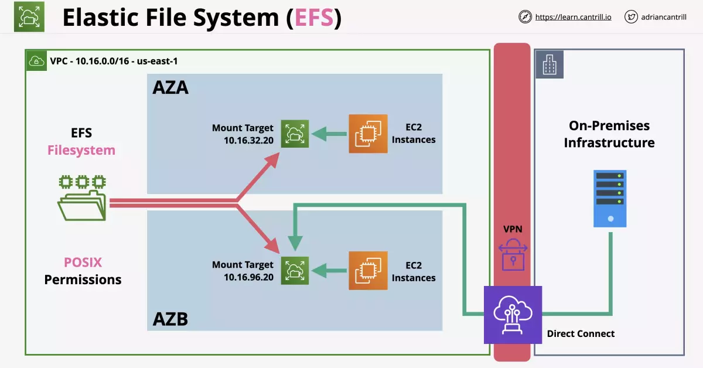
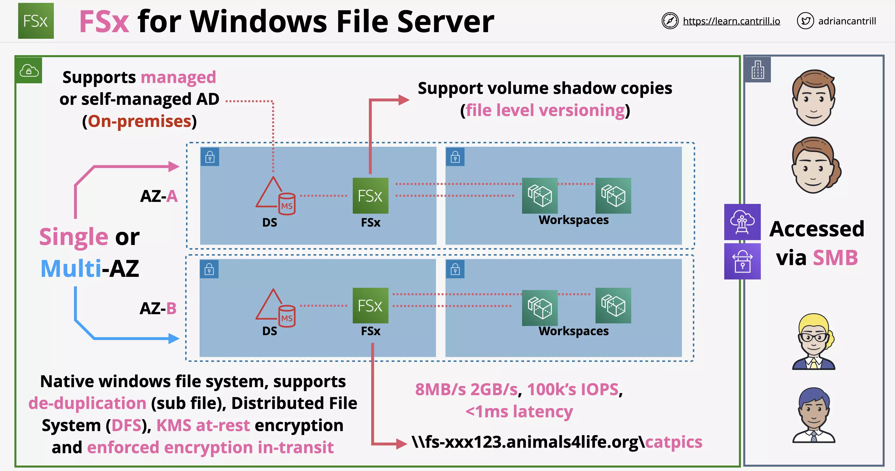
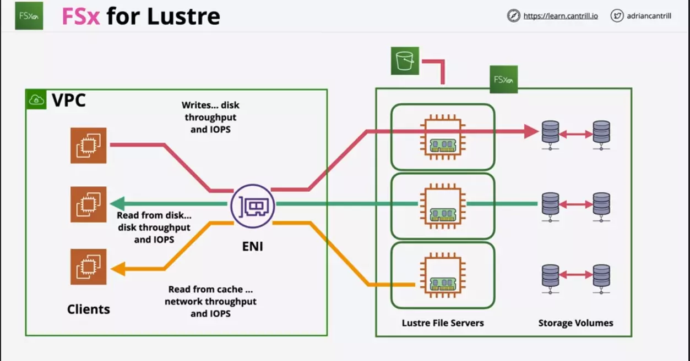

# Network Storage

## EFS Architecture

    EFS can be shared between many EC2 instances.

    This is a private service, access is via mount targets inside a VPC.

- EFS moves the instances closer to a stateless.
- EFS is an implementation of NFSv4
- EFS Filesystems can be mounted in Linux.
- Using Amazon EFS with Microsoft Windows–based Amazon EC2 instances is not supported.
- You can access from on-premises with VPN or Direct Connect so long as access is configured.

### Elastic File System Explained

EFS runs inside a VPC.

EFS includes POSIX permissions (Portable Operating System Interface for maintaining compatibility between different linux distributions).

EFS are made available via `mount targets`. EFS just like any other file system is mounted to a folder on the linux file system of the EC2 instance.

For a fully highly available system you need a mount target for each AZ the system runs in.

You can use hybrid networking to connect to the same mount targets.

### Considerations

EFS is Linux Only.

    Just like S3, we can use lifecycle policies to move data between storage classes

Two performance modes:

- General purpose (default for 99.9% of uses)
- Max I/O performance mode (

Two throughput modes:

- Bursting
- provisioned

Two storage classes:

- standard
- infrequent access

Availability and Durability

- Regional
- One Zone (multiple but within single AZ)

Encryption

- Use KMS for encryption
- With KMS based encryption, we need access permission both on the key used and EFS

---

## FSx for Windows File Server

FSx for Windows Servers provides a `native windows file system` as a service which can be used within AWS, or from on-premises environments via VPN or Direct Connect.

    Its not an emulated file system. Its a native windows file system.

FSx is

- Accessible over `SMB protocol` (standard in windows environment)
- Integrates with Active Directory (either managed, or self-hosted)
- Single or Multi-AZ within a VPC
- Supports scheduled or manual backups
- Supports Distributed File System (DFS)
- Uses windows permission model

It provides advanced features such as VSS, Data de-duplication, backups.

    Supports encryption at rest and forced encryption in transit.

### Considerations

FSx uses active directory for its user store, so we start with connecting it to a managed or self-managed AD.

    The active directory can be within AWS or On-Premise

FSx can be deployed in single or multi-az mode.

Workspaces (similar to citrix which is a virtual desktop service) when deployed within a VPC, can then use these shared windows file systems.

FSx supports volume shadow copies (file level versioning) while connected to Workspaces.

- you can right click a file/folder and view versions
- you can then restore to any version without having to use AWS

A fileshare can be created for example:

> \\\fs-xxx123.domain-name.com\pictures

### Performance

- 8MBps to 2GBps
- 100k IOPS
- Less than 1ms latency

---

## FSx for Lustre

FSx for Lustre is a managed file system which uses designed for high performance computing

It delivers extreme performance for scenarios such as `Big Data`, `Machine Learning` and Financial Modeling

    Provides 100's GB/s throughput and sub millisecond latency

### Deployment Types

- Scratch (Short term, Fast and No replication)
- Persistent (Long term, High Availability (in one AZ) and Auto Recovery)

> Presistent will fail if the whole AZ fails

### With S3

Data when accessed is lazy loaded from S3.

- It is then presisted by FSx for Lustre

Any changes can be updated back to S3 using `hsm_archive` command

### Architecture

VPC here has within 3 client running and connected to FSx using single ENI.

FSx is running Luster File Servers backed by Storage Volumes. FSx runs from single AZ, so single ENI is used.

- Red here indicates write
- Green here indicates read
- Yellow here indicates read from cache post initial read

### Backup

You can backup both Deployment types to S3.

- This can be done automatically or manually
- Retension period is 0-35 days
