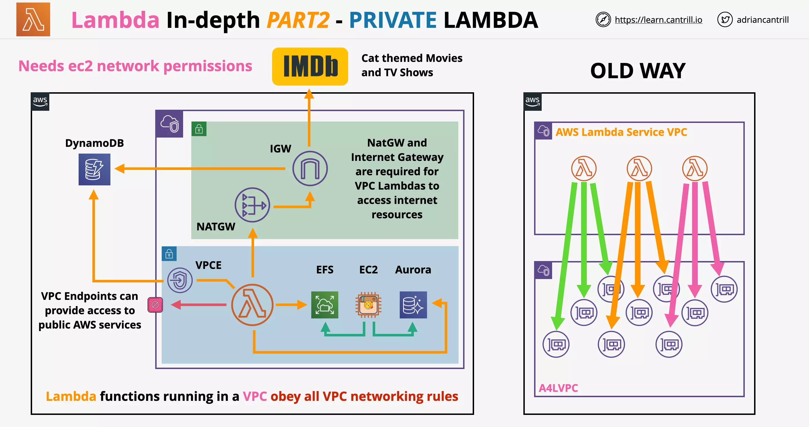
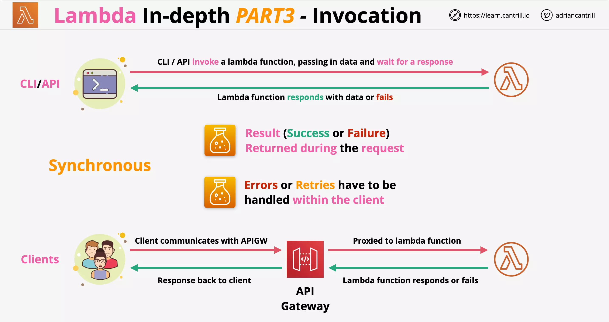
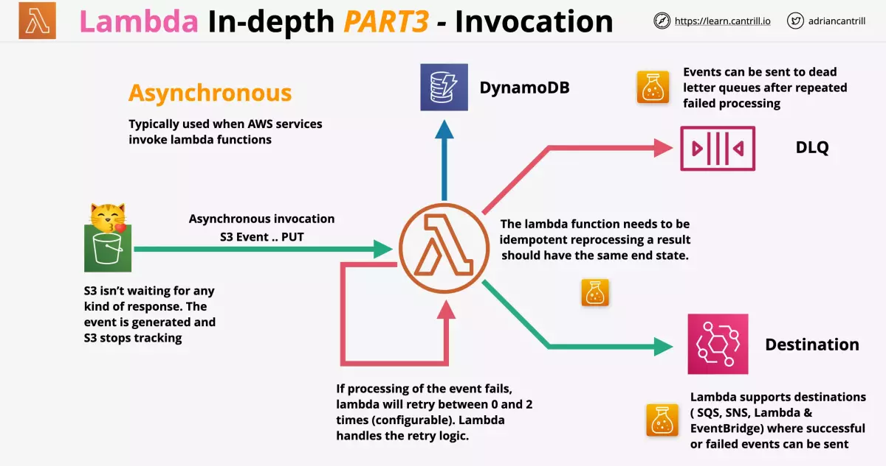
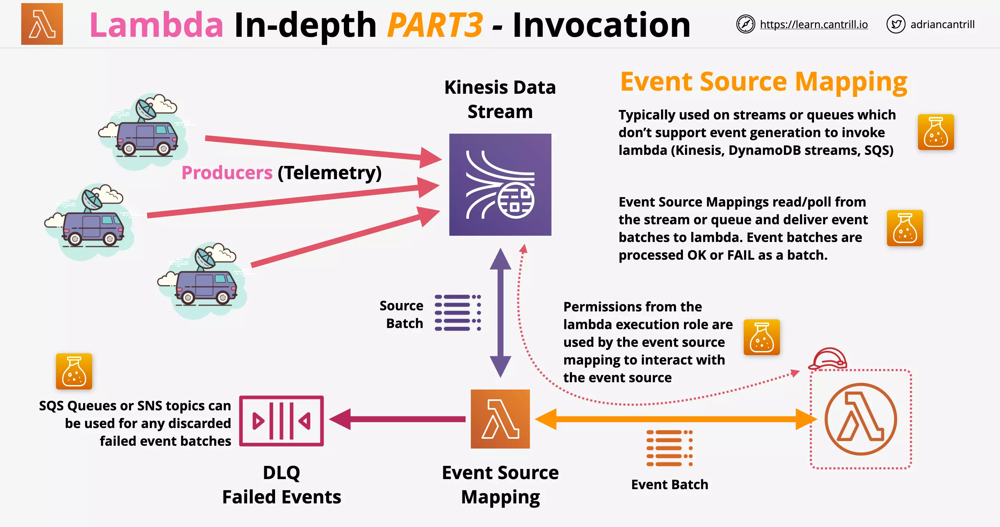

# Architechture Referesher

Monolithic systems even when idle, occupy a lot of resources, so are billed more than needed.

With Tiered application, at least one instance of all the tier should be functional, as each tier is directly connected to each other.

Evolving with Queues, we can have events being placed into a queue for processing irrespective of if processing layer is funtional.

- ASG can look for minimum length of queued items and launch desired number of instances accordingly.

Processing layer can be further broken down using Microservice Architecture.

- Process
- Upload
- Store and Classify

If every component of an application needed a queue between another part of the application, it will be really complex architecture.

- In this case the event driven architecture comes into picture
- Event Router facilitate co-ordination between Event Producer and Event Consumer using Event Bus.
- No constant running or waiting for things
- Producer generate events when something happens
- Events are delivered to consumers of events

Mature event-driven architecture `only consumes resources while handling events (serverless)`.

---

# AWS Lambda

Docker is not supported or is an anti-pattern with Lambda functions.

> Custom runtimes such as `Rust` are possible using `layers`.

While defining a Lambda function you can only define the amount of memory, vCPU is allocated indirectly relative to the memory

- This can be from 128MB to 3GB (64MB steps increment allowed)
- 512 MB storage avaiable as `/tmp`
- 900s (15 minutes) function timeout

An Execution Role is required for Lambda function to work.

    Execution Role is assumed by the Lambda function

    This provides permissions to interact with other AWS services

---

## Use Cases

- Serverless Applications (S3, API Gateway, Lambda)
- File Processing (S3, S3 Events, Lambda)
- Database Triggers (DynamoDB, Streams, Lambda)
- Serverless CRON (EventBridge/CloudWatch Events with Lambda)
- Realtime Stream Data Processing (Kinesis with Lambda)

---

## Public networking

By default, lambda functions are given public networking.

- They can access public AWS services and the public internet.
- But `they cannot access private VPC resources`.
- They can access _public space AWS services such as SQS and DyanamoDB_
- They can access internet based services such as Imdb api.

Lambda running with public networking

    offers best performance because no VPC networking is required

They can access VPC when `public IPs` are provided and `security controls allow external access` to those resources.

---

## Lambda inside VPC

Lambda functions can run inside a VPC and they obey all VPC networking rules.

- Lambda functions running within VPC `can access any resources within the VPC`, if the NACL and Security Groups allow that access.
- But Lambda functions running within VPC `cannot access any external resources outside VPC`, until NACL and Security Groups allow that access.

---

## External access for Lambda inside VPC

You could use a `VPC endpoint such as Gateway Endpoint` to allow access to DynamoDB (public AWS service)

In case the Lambda function within VPC needed access to internet resources

- You can deploy a NAT Gateway in the public subnet
- And then attach a `Internet Gateway` to the VPC

> Lambda inside VPC behaves same as any other VPC service, the same Gateway and Configurations are needed to allow access to AWS public zone and the public internet

Lambda functions need EC2 network permissions via the Execution Role.

- Since the Lambda service needs to create network resources within the VPC, it needs permissions [what permissions?]

---

## Classic Setup for Lambda VPC configuration

Consider the setup on the right, where Lambda in VPC needed access customer VPC.

Each of the Lambda function when invoked, created a ENI in the customer VPC.

- This configuration needed for per function invocation takes time and adds delay
- In addition to this parallel function invocation would require additional ENI posing scaling related challenges

> Earlier it was a bad architecture to use VPC with Lambda

---

## Current Architecture

If all your Lambda used a collection of subnets but the same Security Group, then `only one ENI is required per subnet`.

If all your Lambda used a single subnet and the same Security Group, then `only one ENI is required for all of them`.

With regards to the ENI creation:

- This takes about 90 seconds to create
- But this is done only once when create the lambda function or update the networking configuration

> Now using Lambda with VPC doesnt pose the earlier challenges

---

## AWS Lambda Security

### Execution Role

Consider the below example where the Lambda function is using the pythong runtime environment.

For the runtime environment to access AWS services, the Lambda needs to be provided with an `Execution Role`.

This role is assumed by the Lambda and permission are based on the roles permission policies.

### Resource Policies

Lambda resource policy controls WHAT services and accounts can INVOKE lambda functions.

Resource policy `allows external accounts to access a lambda function` or certain services to use the lambda function such as `SNS and S3`.

You can only change the resource policy using CLI or API [still true?]

---

## Logging

Lambda uses:

- CloudWatch (for metrics: invocation success or failure, retires, latency, etc)
- CloudWatch Logs (logs from exection)
- X-Ray (distributed tracing of session)

for its monitoring and logging.

    CloudWatch Logs require permissions via Execution Role

---

## Versions

Lambda function has version which is a combination of code and configuration of the lambda function.

    Every version of the lambda function is immutable

- Each version is immutable and cannot change once published
- Every lambda function version gets its own ARN (Amazon Resource Name)

`$latest` points to the latest version. (So this is mutable and keeps changing)

`Alias` such as DEV, STAGE, PROD point to a version. (This is mutable and can point to a differnt verion)

---

# AWS Lambda Invocation

Types of invocations

1. Synchronous
2. Asynchronous
3. Event Source Mapping

## Synchronous Invocation

    Used when a user is performing the invocation

Here lambda function is directly invoked via:

- ClI/API or
- Clients communicating with API Gateway

In this type of invocation

- The client waits for the response
- The client needs to handle the errors and retries

---

## Asynchronous Invocation

    Used when an AWS service is performing the invocation

Here is an example where S3 invokes Lambda function, which will perform operations on the object data and then store it in DynamoDB.

- S3 isnt waiting for the Lambda function to complete
- Lambda function will perform retries (re-processing) in case of failures
- Lambda will perform 0 to 2 retries

### Idempotent

Lambda function needs to be idempotent, so that retries doesn't impact the system in incorrect way.

Consider the example of increasing customer balance by $10.

It can be done using adding $10. With every retry you will increase the customer balance by 10, which is incorrect.

Or setting it directly to a value say $110. This is idempotent.

### Dead Letter Queue (DLQ)

Events can be sent to dead letter queue after repeated failed processing.

### Post Processing

Events processed by Lambda, either failed or sucessful, can now be sent to

- SQS
- SNS
- Lambda &
- EventBridge

---

## Event Source Mapping

This is used on streams or queues, which dont support invocation of lambda, produced by

- Kinesis
- DynamoDB streams
- SQS

Event Source Mapping `reads/polls` the stream or queue and deliver `event batches` to lambda.

- Event batches either are processed OK or FAIL as a batch

### Security

Event Source Mapping uses permission from the Lambda Execution Role.

    These permission are required to interact with the event source

### DLQ

SQL Queues and SNS topics can be used for any discarded failed event batches

---
