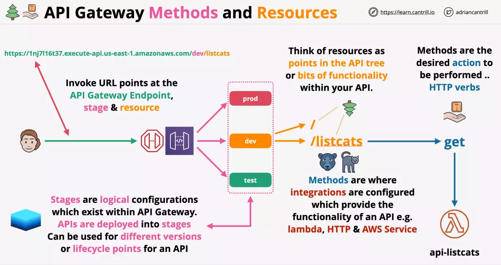
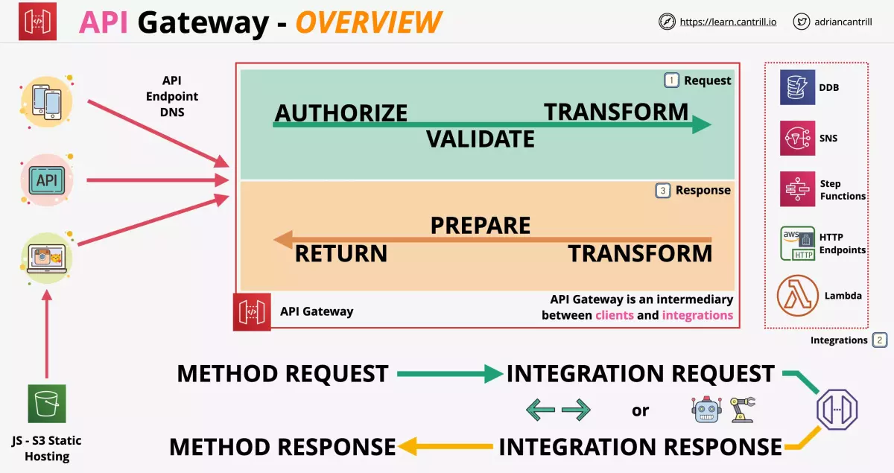
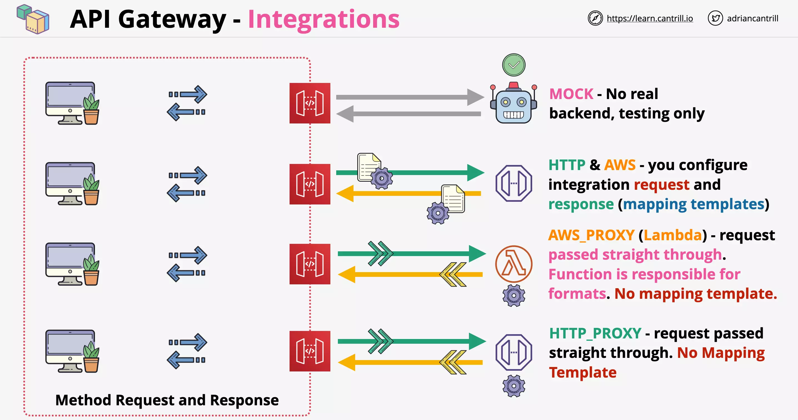
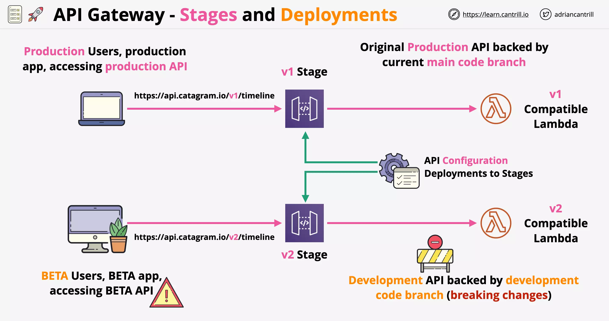
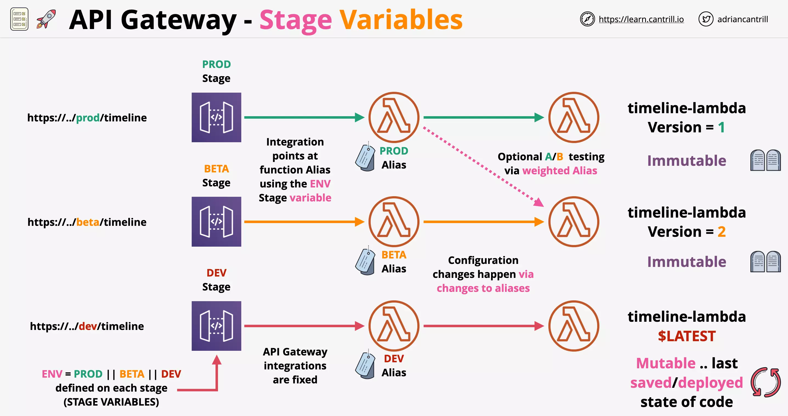

# API Gateway

## Overview

https://learn.cantrill.io/courses/1101194/lectures/27852538

### Considerations

API Gateway acts as an endpoint or entrypoint for your applications.

    It sits between applications that uses API's and backend services

API Gateway features include:

- High availability
- Scalable
- Handles authorisation
- Throttling (can restrict how often users can access API)
- Caching
- CORS (supports cross domain restrictions and configuration)
- Transformations
- OpenAPI spec (makes it easier to create defination files)
- Direct Integration

It can connect to services in AWS or on-premises.

It supports

- HTTP APIs
- REST APIs
- WebSockets APIs

### Architecture

Applications or APIs on the left connect to API Gateway using the API endpoint address.

API gateway acts as a connector of application using the endpoint and the backend services listed on the right.

API gateway goes through three phases:

1. Request
2. Integrations
3. Response

API gateway also integrates with CloudWatch to store logging and metrics based data.

API gateway also provides a cache to reduce the number of calls to backend.

### Authentication

API gateway support a range of authentication methods.

You can make the API complete open access, so no authentication is required.

API gateway can use AWS Cognito User Pools for authentication.

- Client authenticates with Cognito and receives a token
- The token is then passed in the subsequent requests to API gateway
- API gateway validates the token with Cognito

API gateway can also be extended to use Lambda based authorisation (earlier known as custom authoriser).

- Client calls API gateway with a bearer token
- API gateway calls Lambda authorizer to validate the token
- On successful validation, it `returns an IAM policy and principal identifier` to API gateway. Which `handles the request via Lambda integration`.
- On failed validation, it returns `403 ACCESS_DENIED` to the client

### Endpoint Types

Edge-Optimized

- Requests are routed to nearest CloudFront POP (Point of Presense)

Regional Endpoint

- Doesnt uses CloudFront network
- Used when client are in the same region

Private Endpoint

- Accessible only within a VPC `via interface endpoint`

### Error Codes (Client and Server Errors)

A response code of 2xx indicates the operation was successful. Other error codes indicate either a client error (4xx) or a server error (5xx).

Some errors are resolved if you simply retry the same request.

| HTTP Status Code | Error                                                                               | code Retry        |
| ---------------- | ----------------------------------------------------------------------------------- | ----------------- |
| 400              | Bad Request Exception                                                               | No                |
| 403              | Access Denied Exception                                                             | No                |
| 404              | Not Found Exception                                                                 | No                |
| 409              | Conflict Exception                                                                  | No                |
| 429              | Limit Exceeded Exception                                                            | No                |
| 429              | Too Many Requests Exception                                                         | Yes               |
| 502              | Bad Gateway Exception                                                               | Yes if idempotent |
|                  | usually for an incompatible output returned from a Lambda proxy integration backend |                   |
|                  | occasionally for out-of-order invocations due to heavy loads                        |                   |
| 503              | Service Unavailable Exception                                                       | Yes               |
| 504              | Endpoint Request Timed-out Exception                                                | Yes if idempotent |

### Caching

    Cache is defined per stage within API Gateway

---

## Methods and Resources

Note the parts of URL

- API Gateway Endpoint (https://xxx.review-api.us-east-1.amazonaws.com)
- Stage (/dev)
- Resource (/listcats)

\

Within each resource you have methods such as GET, POST.

- you also define the integration with the method such as Lamdba, HTTP or AWS Service

---

## Integrations

You choose an API integration type according to the types of integration endpoint you work with and how you want data to pass to and from the integration endpoint.

- you can sent the request/response data as it is or transform it before passing it.
- with proxy you are sending it as it is.

### Integration Types

MOCK

- Used for testing
- No backend involved

HTTP

- Configure with backend endpoint
- You have to configure both integration request and response
- i.e. transformation before passing through mapping templates

AWS

- Lets an API expose AWS service actions
- i.e. transformation before passing through mapping templates

HTTP_PROXY

- No configuration of integration request and response
- pass data as it is from request to integration and response back to client
- Only uses HTTP rather than Lambda
- No mapping template used

AWS_PROXY

- Low admin overhead
- Request is sent as it is as lambda is responsible for using supported format
- No mapping template used

### Mapping Templates

Mapping template sits between the client and integration endpoint, translating the data to/from the integration endpoint. And this is used only when you aren't using proxing.

A mapping template is used for non-proxy AWS and non-proxy HTTP integrations

- mapping template can modify or rename parameters
- modify the body or headers of the request
- filter whats not required

Mapping templates use Velocity Template Langauge (VTL).

> NOTE: While using SOAP API you need to use mapping template for the transformations.

---

## Stages and Deployments

Changes made in API Gateway are NOT applied directly.

    Any configuration changes within an API Gateway doesnt take effect until it is deployed

Stages can be:

- environments (PROD, DEV, TEST)
- versions (v1, v2, v3)

Each stage has its own configuration.

- unlike Lambda function they are not immutable
- they can be overwritten and can be rolled back

### Considerations

When you deploy API configuration in an API gateway to a stage.

- Each stage has a unique API endpoint and settings
- Each stage can be deployed individually

Following is an example of different version used by each stage backed by its own Lambda functions.

You can also enable canary deployment which will be deployed on the canary part of the stage and not the stage itself.

- Stages enabled for canary deployments can be configured so a certain percentage of traffic is sent to the canary.
- Canary can be later promoted to be the base stage.

### Stage Variables

You could use a stage variable say `ENV` which in case of:

- DEV stage: points to DEV lambda function alias
- BETA stage: points to BETA lambda function alias
- PROD stage: points to PROD lambda function alias

And the alias change point to a newer version over time.

