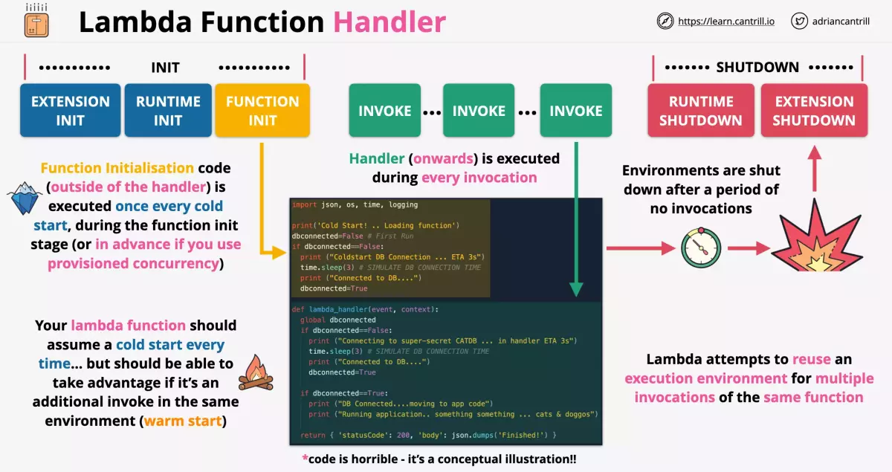
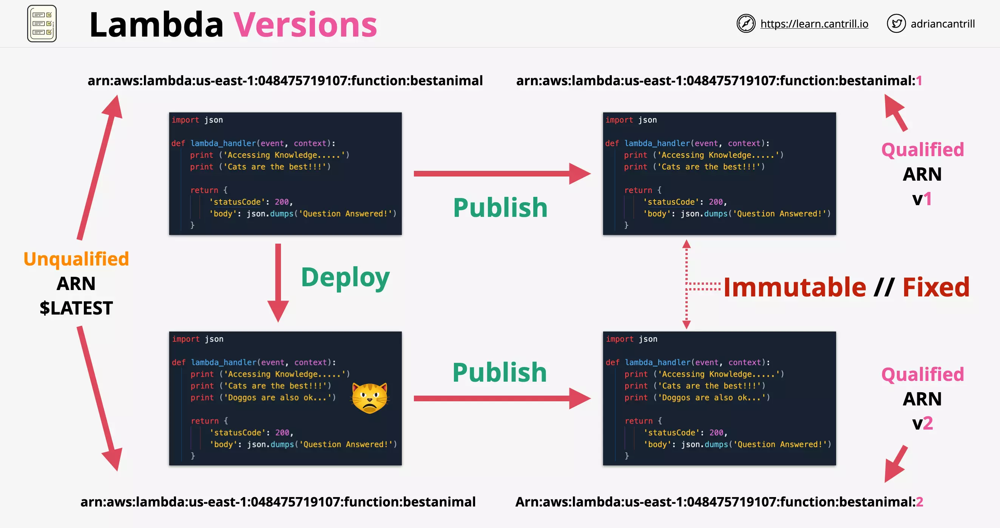
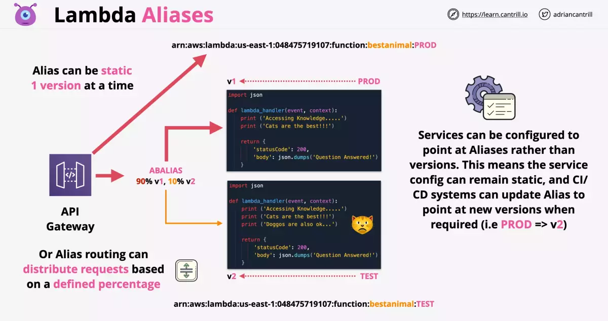
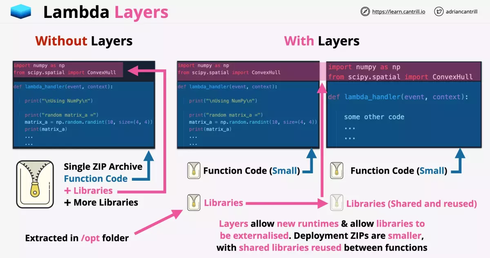
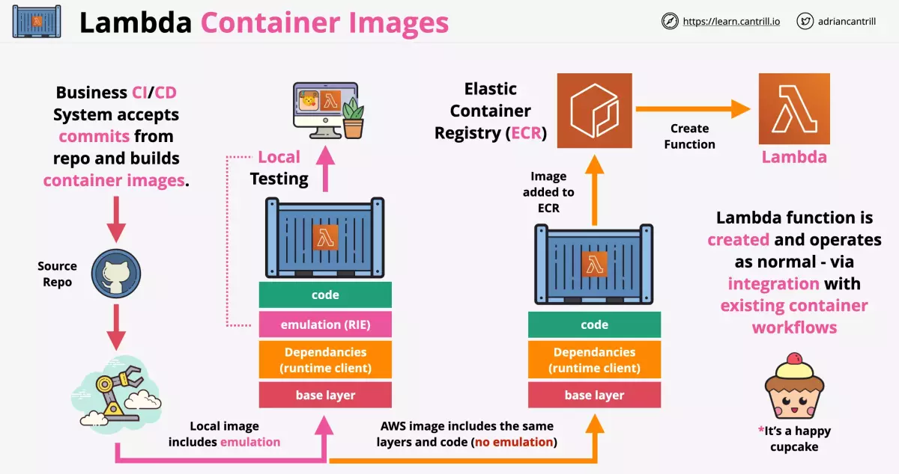
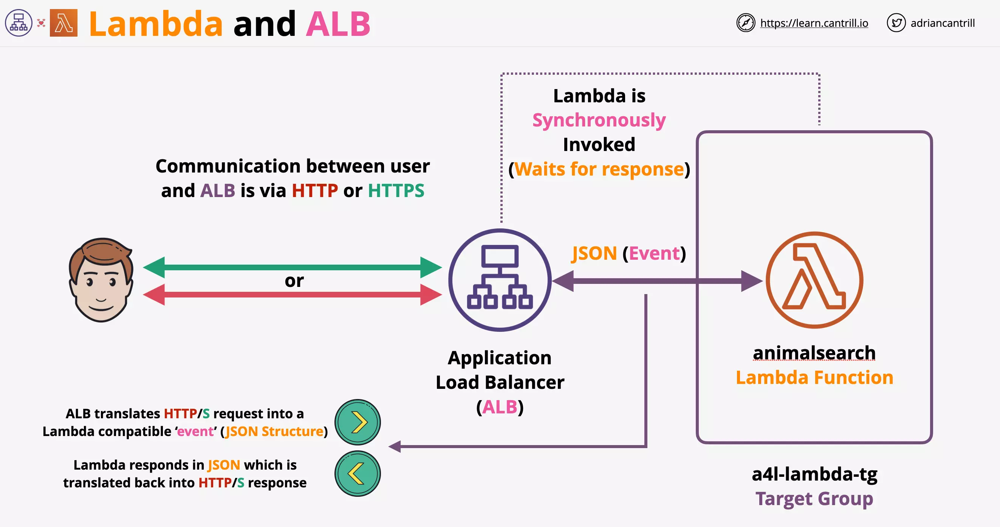
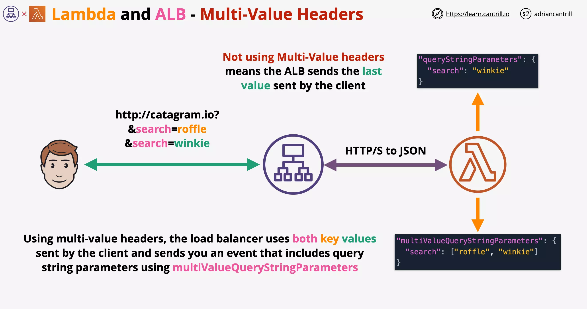

# AWS Lambda

Docker is not supported or is an anti-pattern with Lambda functions.

> Custom runtimes such as `Rust` are possible using `layers`.

While defining a Lambda function you can only define the amount of memory, vCPU is allocated indirectly relative to the memory

- This can be from 128MB to 3GB (64MB steps increment allowed)
- 512 MB storage avaiable as `/tmp`
- 900s (15 minutes) function timeout

An Execution Role is required for Lambda function to work.

    Execution Role is assumed by the Lambda function

    This provides permissions to interact with other AWS services

When lambda is invoked via an event from elsewhere in AWS event data is stored in `event data structure`.

---

## Lambda execution lifecycle

Lambda executions have lifecycles:

`INIT` - Creates or Unfreezes the execution environment.

`INVOKE` - Runs the function handler (Cold start). Subsequent invocation will run in the same execution environment as last time (Warm start).

### Example

Notice the function init part, which is only called once during the initialization (only during cold start). This is `outside the handler`.

Apart from the initial cold start, handler function is executed during every invocation.



    A good lambda function should take advantage of warm start.
    Reuse the existing execution environment.

### Provisioned Concurrency

If you are going to use lots of Lambda function at the same time, you can use provisioned concurrency to pre-warm the execution environments.

---

## Use Cases

- Serverless Applications (S3, API Gateway, Lambda)
- File Processing (S3, S3 Events, Lambda)
- Database Triggers (DynamoDB, Streams, Lambda)
- Serverless CRON (EventBridge/CloudWatch Events with Lambda)
- Realtime Stream Data Processing (Kinesis with Lambda)

---

## Monitoring & Logging & Tracing

Lambda uses:

- CloudWatch (for metrics: invocation success or failure, retires, latency, etc)
- CloudWatch Logs (logs from exection)
- X-Ray (distributed tracing of session)

for its monitoring and logging.

    CloudWatch Logs require permissions via Execution Role

> Default role gives logging permissions

### Lambda Logging

Lambda Execution Logs are sent to CloudWatch Logs.

Log Group is created for every function:

> /aws/lambda/functionname

Within each Log Group you can see multiple Log Stream which follows the format:

> YYYY/MM/DD/[$latest||version] ....

### Lambda Tracing

You can enable `Active Tracing` on a function for X-Ray to show the flow of requests through your application.

Enable active tracing via CLI using:

```
aws lambda update-function-configuration --function-name <function-name> --tracing-config Mode=Active
```

`AWSXrayDaemonWriteAccess` managed policy should be part of the execution role.

- Once this policy is added to the role, X-Ray SDK can be used within your function for tracing

`AWS_XRAY_DAEMON_ADDRESS` provides the X-Ray daemon detail.

---

## Versions

Lambda function has version which is a combination of code and configuration of the lambda function.

    Every version of the lambda function is immutable

- Each version is immutable and cannot change once published
- Every lambda function version gets its own ARN (Amazon Resource Name)

`$latest` points to the latest version. (So this is mutable and keeps changing)

- Lambda points to unqualified ARN `until its published`
- Once published, a Lambda gets qualified ARN



---

## Alias

`Alias` such as DEV, STAGE, PROD point to a version. (This is mutable and can point to a differnt verion)

**Each Alias has a unique ARN**. Aliases can be updated, changing which version they reference.



Weighted Alias under Alias configuration for an Alias can be used to distribute load across versions (useful when you feel the latest/certain version is stable enough for rollout).

---

## Environment Variables

An environment variable is a pair of strings that are stored in a function's version-specific configuration.

- By default they are associated with $latest
- Once you publish a version, environment variables associated with the version become immutable within that version.

The Lambda runtime makes environment variables available to your code and sets additional environment variables that contain information about the function and invocation request.

KMS can be used for encryption.

---

## Lambda Layers

The `import` dependencies for example can be imported as part of a layer. You can choose to import dependencies either bundled as part of the lambda package or choose a layer:

- AWS Layers
- Custom Layers
- Specify an ARN



---

## Lambda Container Images

Historically with Lambda you could not use your existing container image setup and CI/CD process. Also, locally testing lambda function before deployment was a challenge.

With Lambda Container images you can use Lambda as part of your existing container processes.

- This is done by inclusion of `Lambda Runtime API` within the container image
- This package allows interaction between the lambda and the container



You can also include `Lambda Runtime Interface Emulator (RIE)` to emulate lambda interfaces to do the local testing.

---

## Lambda & ALB Integration

You can use a Lambda function to `process requests from an Application Load Balancer`.

Elastic Load Balancing supports Lambda functions as a target for an Application Load Balancer.

- Use load balancer rules to route HTTP requests to a function, based on path or header values.
- Process the request and return an HTTP response from your Lambda function.

Elastic Load Balancing invokes your Lambda function **synchronously** with an event that contains the request body and metadata, and `waits for the response`.



You need to consider ALB translates HTTP(s) request and sends it as JSON event object to Lambda function.

Lambda needs to build a JSON response to be sent back to ALB, which is translated into HTTP(s) response.


### Lambda & ALB Integration - Multi-Value Headers

Note above without using Multi-Value headers only the last duplicate value is sent to the Lambda function.

With Multi-Value Headers, you get the duplicate query params as an array.



---

## Public networking

By default, lambda functions are given public networking.

- They can access public AWS services and the public internet.
- But `they cannot access private VPC resources`.
- They can access _public space AWS services such as SQS and DyanamoDB_
- They can access internet based services such as Imdb api.

Lambda running with public networking

    offers best performance because no VPC networking is required

They can access VPC when `public IPs` are provided and `security controls allow external access` to those resources.

---

## Lambda inside VPC

Lambda functions can run inside a VPC and they obey all VPC networking rules.

- Lambda functions running within VPC `can access any resources within the VPC`, if the NACL and Security Groups allow that access.
- But Lambda functions running within VPC `cannot access any external resources outside VPC`, until NACL and Security Groups allow that access.

---

## External access for Lambda inside VPC

You could use a `VPC endpoint such as Gateway Endpoint` to allow access to DynamoDB (public AWS service)

In case the Lambda function within VPC needed access to internet resources

- You can deploy a NAT Gateway in the public subnet
- And then attach a `Internet Gateway` to the VPC

> Lambda inside VPC behaves same as any other VPC service, the same Gateway and Configurations are needed to allow access to AWS public zone and the public internet

Lambda functions need EC2 network permissions via the Execution Role.

- Since the Lambda service needs to create network resources within the VPC, it needs permissions [what permissions?]


---

## Classic Setup for Lambda VPC configuration

Consider the setup on the right, where Lambda in VPC needed access customer VPC.

Each of the Lambda function when invoked, created a ENI in the customer VPC.

- This configuration needed for per function invocation takes time and adds delay
- In addition to this parallel function invocation would require additional ENI posing scaling related challenges

> Earlier it was a bad architecture to use VPC with Lambda

---

## Current Architecture

If all your Lambda used a collection of subnets but the same Security Group, then `only one ENI is required per subnet`.

If all your Lambda used a single subnet and the same Security Group, then `only one ENI is required for all of them`.

With regards to the ENI creation:

- This takes about 90 seconds to create
- But this is done only once when create the lambda function or update the networking configuration

> Now using Lambda with VPC doesnt pose the earlier challenges

---

## AWS Lambda Security

### Execution Role

Consider the below example where the Lambda function is using the pythong runtime environment.

For the runtime environment to access AWS services, the Lambda needs to be provided with an `Execution Role`.

This role is assumed by the Lambda and permission are based on the roles permission policies.

### Resource Policies

Lambda resource policy controls WHAT services and accounts can INVOKE lambda functions.

Resource policy `allows external accounts to access a lambda function` or certain services to use the lambda function such as `SNS and S3`.

You can only change the resource policy using CLI or API [still true?]

### Questions

Which of the following controls the permissions a lambda function receives?

- Execution Role Permissions Policy

Which of the following controls WHAT can invoke a lambda function

- Lambda Resource Policy

---

## AWS Lambda Invocation

Types of invocations

1. Synchronous
2. Asynchronous
3. Event Source Mapping

### Synchronous Invocation

    Used when a user is performing the invocation

Here lambda function is directly invoked via:

- ClI/API or
- Clients communicating with API Gateway

In this type of invocation

- The client waits for the response
- The client needs to handle the errors and retries


---

### Asynchronous Invocation

    Used when an AWS service is performing the invocation

Here is an example where S3 invokes Lambda function, which will perform operations on the object data and then store it in DynamoDB.

- S3 isnt waiting for the Lambda function to complete
- Lambda function will perform retries (re-processing) in case of failures
- Lambda will perform 0 to 2 retries


#### Idempotent

Lambda function needs to be idempotent, so that retries doesn't impact the system in incorrect way.

Consider the example of increasing customer balance by $10.

It can be done using adding $10. With every retry you will increase the customer balance by 10, which is incorrect.

Or setting it directly to a value say $110. This is idempotent.

#### Dead Letter Queue (DLQ)

Events can be sent to dead letter queue after repeated failed processing.

#### Post Processing

Events processed by Lambda, either failed or sucessful, can now be sent to

- SQS
- SNS
- Lambda &
- EventBridge

---

### Event Source Mapping

This is used on streams or queues, `which dont support invocation of lambda`, produced by

- Kinesis
- DynamoDB streams
- SQS

Event Source Mapping `reads/polls` the stream or queue and deliver `event batches` to lambda.

- Event batches either are processed OK or FAIL as a batch


#### Security

Event Source Mapping uses permission from the Lambda Execution Role.

    These permission are required to interact with the event source

#### DLQ

SQS Queues and SNS topics can be used for any discarded failed event batches

---

## EventBridge

**CloudWatch Events** and **EventBridge** have visibility over events generated by supported AWS services within an account.

They both can monitor the `default account event bus` - and `pattern match events flowing through the event bus` and deliver these events to multiple targets (eg. Lambda).

They are also the source of `scheduled events` which `can perform certain actions at certain times` of day, days of the week, or multiple combinations of both - _using the Unix CRON time_ expression format. Action could be call to a target (eg. Lambda).

Both services are one way how event driven architectures can be implemented within AWS.

### Events as json

Events are JSON data that the target can use.

### Recommendation

EventsBridge will replace CW Events.

EventsBridge can also handle events from third parties. Both share the same underlying architecture. AWS is now encouraging a migration to EB.

### Demo

https://learn.cantrill.io/courses/1101194/lectures/29902954
