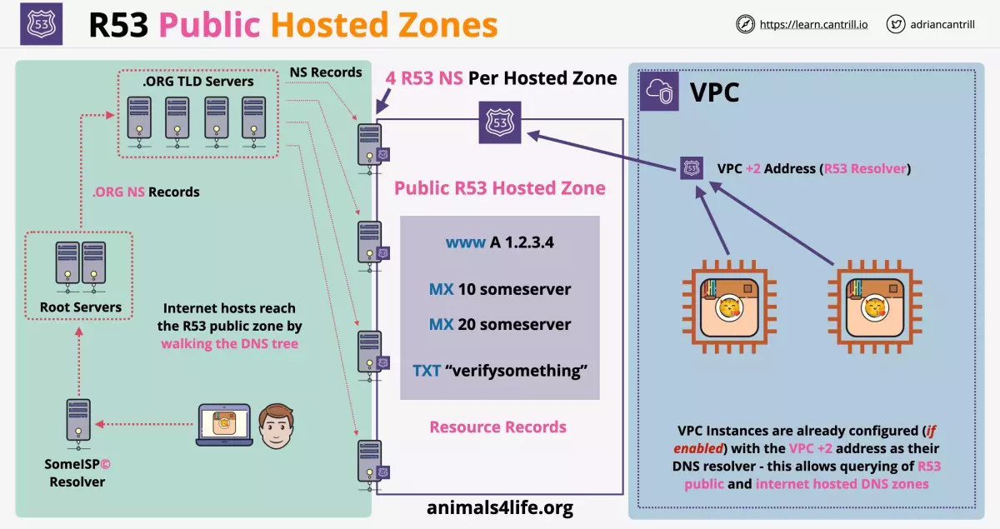
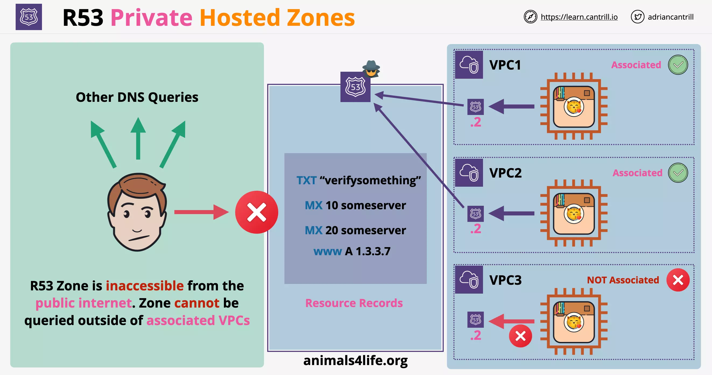
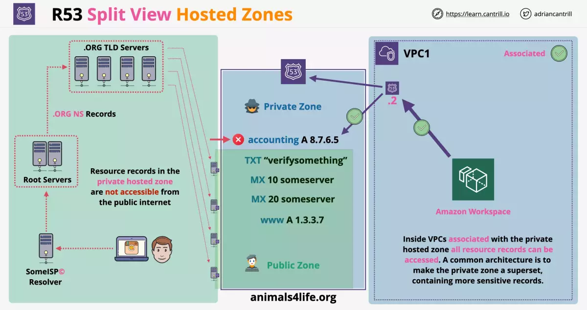

# DNS

https://www.youtube.com/watch?v=JkEYOt08-rU

# Route53

Route53 consists of private and public hosted zones.

When a domain is registered, TLD holds the NS records. NS records point to Name Servers in the hosted zone. Then the Name Server and the zone they host become authoritative for that domain.

- The zone file is hosted on these Name Servers

## Public Hosted Zones

A Public Hosted Zone is a DNS database (`containing zone files`) for a specific domain, hosted by Route53 on Public Name Servers.

A Public Hosted Zone can be created for:

- a domain registered with Route53
- a domain registered with other registrars

This is globally resilient service. So whole region can be affected, but Route53 will still function.

Whenever you create a public hosted zone, Route53 `creates 4 Public Name Servers`, on which the zone file is hosted.

- These Name Servers are accessible from the public internet and VPCs using Route53 resolver.
- The zone file is hosted on these Name Servers

### Updating the Name Servers for a domain

To use the public hosted zone with a domain, you change the "NS Records" for the domain and point it to the Public Name Servers created by Route53.

- This is done by going to the registrar from whom we purchased the website, and making a request to update Name Server records
- Registrar contacts the registry which is responsible for updating the TLD Name Server for that domain

### Resource Records

A public hosted zone of route 53 can contain resource records which contain:

- A record
- AAAA record
- MX record
- TXT record

### Accessing from VPC

The public hosted zone is accessible from within the VPC using the Route53 resolver, if the DNS is enabled for that VPC.

- Route53 resolver is on the VPC IP Address (+2)
- VPC instances are already configured (if enabled) with VPC + 2 address as their DNS resolver
- This allows querying of Route53 public or any internet hosted DNS zones

### Accessing from public DNS

1. Client request to access a domain is received by the DNS resolver of the ISP
2. DNS resolver queries Root Name Servers, which return the information about the TLD Name Server for that domain
3. DNS resolver using this information queries the TLD Name Server of the domain. TLD Name Server records in the TLD point to Name Server, which returns the information about the Authoritative Name Server for that domain..

Since the website's Name Server are in Route53 Public Hosted zone, these are the Authoritative Name Server for the website.

---

## Private Hosted Zone

Its similar to Public Hosted Zone but associated with VPCs and accessible in those VPCs. And it is inaccessible from public internet.

To associate a Private Hosted Zone with a VPC where VPC belongs to:

- own AWS account, you can use console UI, API or CLI.
- other AWS account, you can use API or CLI.

Resource records can be created in the Private Hosted Zone, which are resolvable within the VPCs.

**NOTE**: Create public hosted zone when you want access to resource records from VPC but not from public internet.

### Considerations

A private hosted zone can be made accessible from VPCs.

Any VPC that we associate with the Private Hosted Zone will be able to access it using Route53 resolver (on VPC IP address + 2).

- Any VPC not associated with the private hosted zone, will not have access and behave similar to requests from public internet.
- To be able to access the privates hosted zone, the service needs to be running from within the VPC. And the VPC needs to associated with the private hosted zone.

### Split-View/Spit-Horizon DNS

This allows setting up same website address to behave differently when accessed from outside network or from within own network.

Consider the following example where the VPC1 is running an Amazon Workspace. This VPC is associated with the private hosted zone, so all the resource records are accessible.

Split-View allows us to create a Public Hosted Zone, sharing subset of records ot the Private Hosted Zone.

- So, those records not present in private hosted one are not accessible from the internet.

