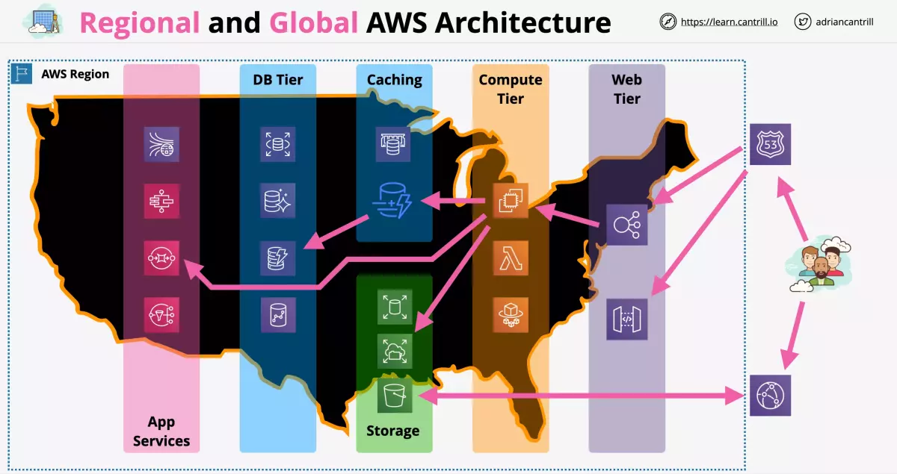
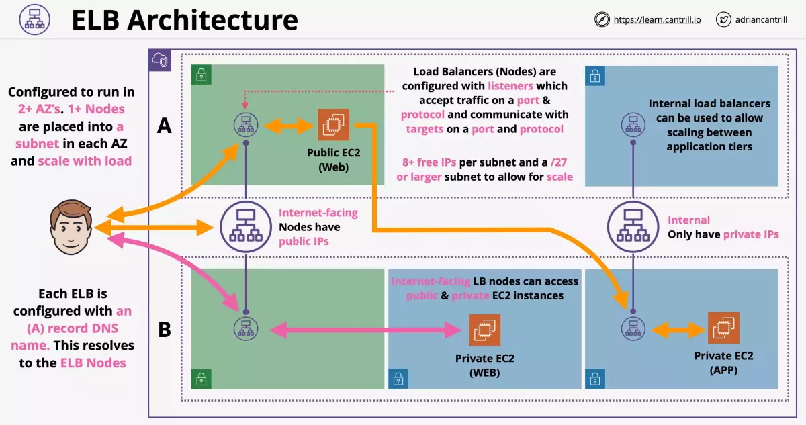
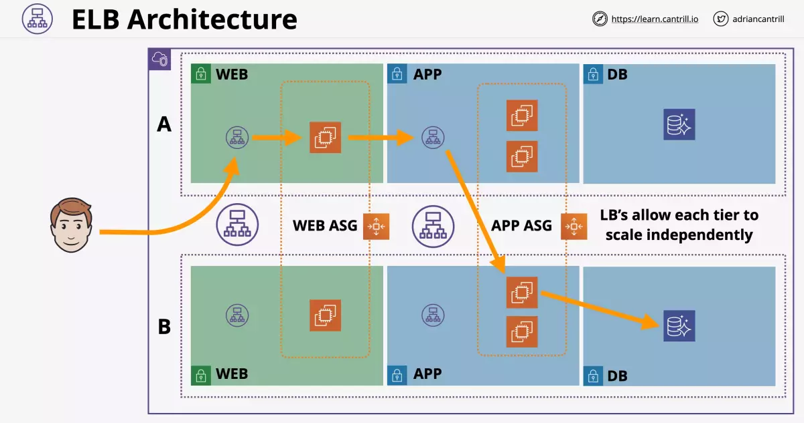
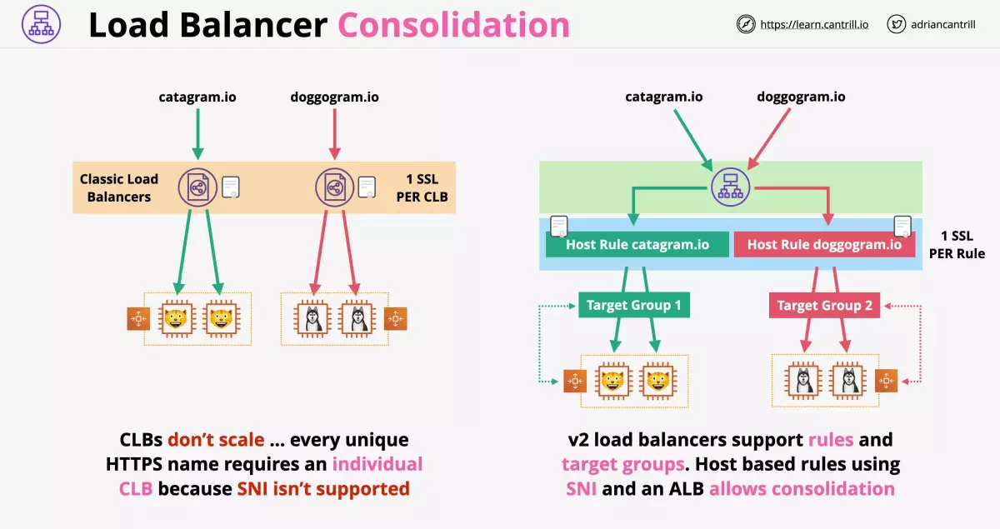
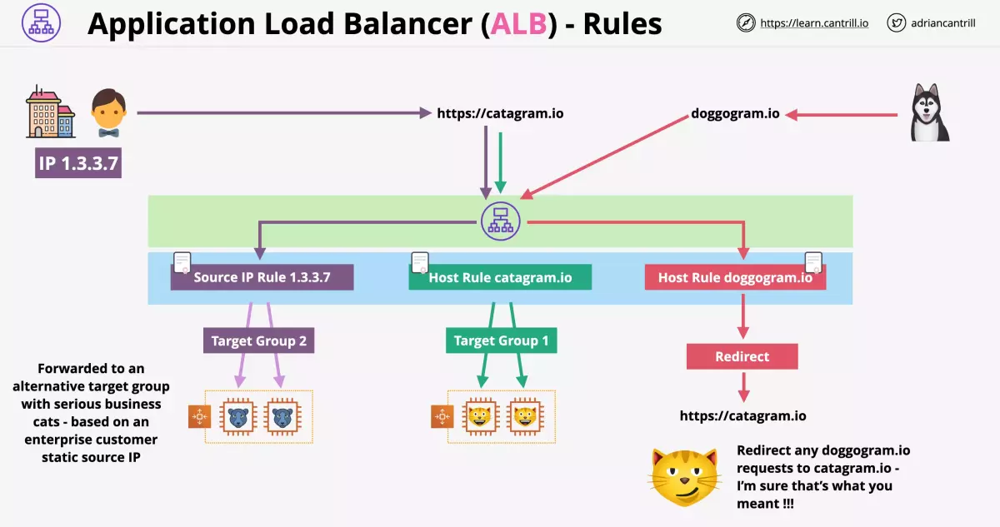
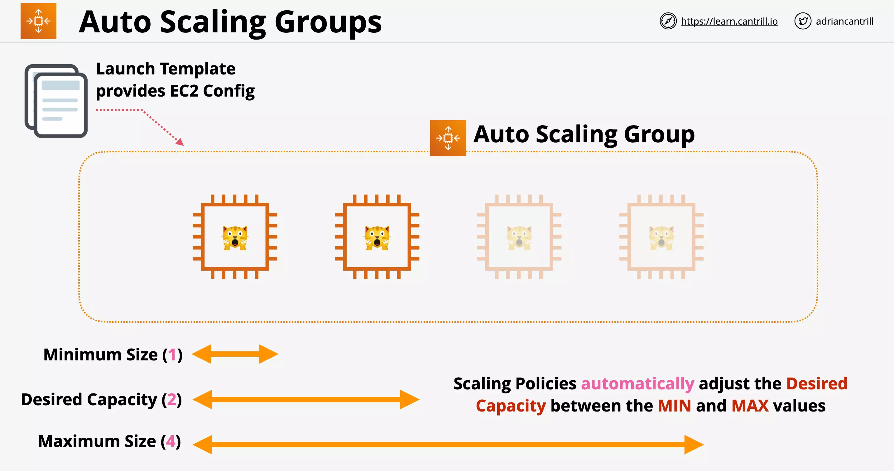
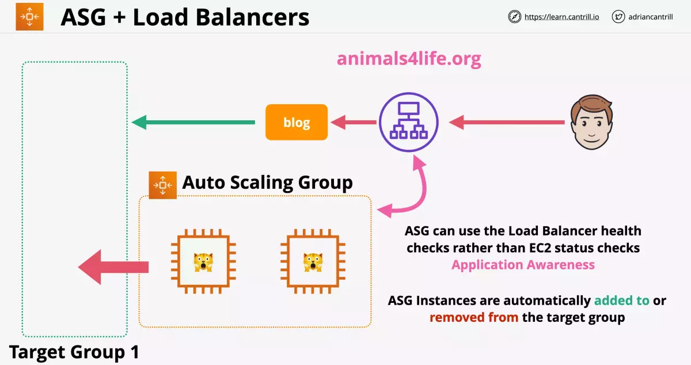
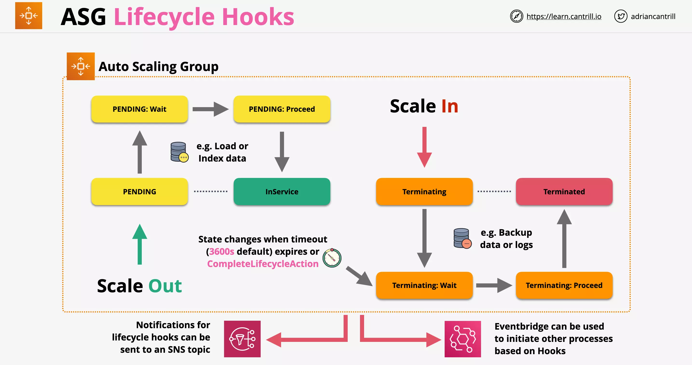

# Regional and Global AWS Architecture

---

# Elastic Load Balancer (ELB)

There are 3 types of ELB available within AWS:

- v1 (Classic Load Balancer - Not Recommended)
- v2 (Application Load Balancer - Recommended)
- v2 (Network Load Balancer - Recommended)

v2 load balancers are faster and `support target groups and rules`.

## Classic Load Balancer

Introduced in 2009. Is not replaced by v2 ELB which is recommended at the moment.

- Classic Load Balancer can load balance between HTTP, HTTPS and other lower level protocols
- Classic Load Balancer is not really layer 7 supporting. It lacks many feature.
- One limitation of Classic Load Balancer is that it only support 1 SSL certificate per load balancer

## Application Load Balancer

Supports layer 7 features. Such as:

- HTTP
- HTTPS
- WebSocket

## Network Load Balancer

Supports:

- TCP
- TLS (Secure form of TCP protocol)
- UDP

In general, this would be used for any application not using HTTP/HTTPS.

---

# Elastic Load Balancer Architecture

Its the job of the load balancer to accept connections from the customer.

- It then distributes these jobs to registered backend compute
- So the infrastructure can scale up or scale down without affecting the customer
- So even if the infrastructure fail and is repaired, user wouldnt be directly affected

Consider the following example where we have a single AWS VPC (region?) with two availability zone A and B. Each of the AZ has one public subnet and few private subnets.

An ELB is placed between these two nodes and which then adds one or more ELB nodes within the subnets that we pick. In our case we have chosen public subnets.

    Each ELB is configured with an A record DNS name.

    This resolves to the ELB nodes.

So any connection made using the DNS name of the ELB are actually made to the nodes of the ELB.

    The DNS name resolves to all of the individual nodes.

Any incoming request is distributed equally among the nodes of the ELB. [How?]

- The nodes are present if different AZ's
- If a node fails, it is replaced
- If the load to ELB increases, more nodes are provisioned inside each of the subnet the ELB is configured to use

## Type of ELB Nodes

The type of ELB node controls the IP addressing of the ELB nodes.

- Internet Facing (given public and private addresses)
- Internal Only (only private addresses)

ELB nodes are `configured with listeners` which `accept traffic on a port and protocol` and `communicate with targets on a port and protocol`.

Once a connection is made to the `Internet Facing ELB node`, it then makes a connection to the instances be it public or private instances.

    ELB requires that the subnet has 8+ free IPs per subnet.

Since 5 IP addresses are reserved by AWS. So we need `/27 or larger subnet` to deploy an ELB which can scale. (/28 also will work in certain scenarios)

    EC2 doesnt need to be public to work with an ELB

## Typical Multi-Tiered Application

Consider the following example of a VPC containing two AZs.

We also have an internet facing ELB. We have an Web Application Scaling Group (ASG), providing frontend capability of the application.

We also have another internal ELB. We have ASG for application instances. These are used by the web servers of the application.

And in the DB subnet, we have aurora instances.

### The Problem

In this case everything is totally dependent on the subsequent layer.

- If the web instance user is connected to scaled or failed, there is an issue.
- If the app instances web layer is connected to scaled or failed, we have a problem.

### The Solution

What we can do is that we can add ELB's between the layers (tiers), to abstract one tier from another.

In this case the user will connect directly to the ELB, which will connect to an application instance.

- So even if a instance fails or scales, user would be unaffected [How? What happens to the current request which was sent to failed instance?]

The web instance will connect to the app instance through an internal ELB. This would abstract away the direct connection between instances of these tiers.

    ELB's allow each tier to scale independently.

    If load on app tier increases, it can scale without affecting any other tier

## Cross-Zone ELB

Note that we use at least one ELB node per AZ. So, in the following example we have a simplified VPC with one ELB in each AZ.

So the user will connect to the DNS name of the application which points to the DNS name of the ELB DNS name.

The DNS name of a ELB will balance load equally between the ELB nodes. [How DNS name can send traffic to any of the ELB node?]

Historically LB nodes could only distribute load within the AZ they are in.

With `Cross-Zone Load Balancing` an ELB node can be distribute load across any of the instance in any AZ.

- This is now enabled by default for an application load balancer.

---

# Load balancing (ALB) vs Network Load Balancing (NLB)

## Comparing Classic LB with v2 LB

## Application Load Balancer

- Layer 7 load balancer
- Listens on HTTP and/or HTTPS
- It cant understand any other Layer 7 protocol (SMTP, SSH, Custom Gaming protocol, etc)
- It cannot be configured to directly listen to TCP/UDP/TLS Listeners

Since its a Layer 7 load balancer, it can understand layer 7:

- content type
- cookies
- custom headers
- user location
- app behaviour

And it can perform `application health check`.

&nbsp;

    HTTP or HTTPS (SSL/TLS) are always terminated on the ALB

A new connection is made from ALB to the origin. Also, `All ALBs must have SSL certs if HTTPS is used`.

> ALBs are slower than NLB since more levels of network stack to be processed.

### ALB Rules

ALB have concept of rules, which direct connections that arrive at a listener.

- Rules are processed in priority order.
- Default rule acts as a catchall rule.

Rules can have conditions which can be used to check:

- host-header
- http-header
- http-request-method
- path-pattern
- query-string
- source-ip

Rules can have actions which can be:

- forward (forward traffic to a target group)
- redirect (can redirect traffic to another domain name)
- fixed-response (respond with a certain success or error code)
- authenticate-oidc (authenticate using open ID)
- authenticate-cognito (authenticate using cognito)

### ALB Rules example

Below is an example of a single ALB is forwarding the request to catagram application based on `host header` (Host Rule).

Same ALB can then forward requests to `alternative target group` that handles enterprise customers based on static source IP (Source IP Rule).

Same ALB can redirect requests coming from _doggogram.io_ to `https://catagram.io`.

---

## Network Load Balancers

- Layer 4 load balancer
- Can work with TCP, TLS, UDP and TCP_UDP (TCP with UDP)
- Doesnt have any understand of HTTP and HTTPS
- They cant see headers, or cookies, or understand session
- Are very very fast (millions of rps, 25% of ALB latency)
- Ideal for apps that use SMTP, SSH, Custom Game protocols, financial apps not using HTTPS

Health check with NLB

- Checks only ICMP/TCP handshake
- Not app aware

Also,

    NLB's can have static IPs, so can be whitelisted

Can Forward TCP to instances.

    Which mean unbroken encryption between client and origin.
    No termination on the ELB.

---

## How to choose

Use Network Load Balancer if:

- your application requires unbroken encryption
- static IP for whitelisting
- the fastest performance (million rps, 4 times of ALB)
- the protocol is not HTTP or HTTPS
- privatelink

Else choose Application Load Balancer

---

# Launch Configuration and Templates

LC and LT lets you define anything that you define while launching a EC2 instance such as

- AMI, Instance Type, Storage, Key Pair
- Networking and Security Groups
- `Userdata` and IAM Role

> Launch Configuration and Templates are not editable

Launch Configuration

    used with Auto Scaling Groups

- doesnt support versions as well

Launch templates

    used with Auto Scaling Groups

    used also to launch EC2 instance directly from console or CLI

- Newer and recommended to use over launch configurations, they include the latest features and improvements.
- Provide T2/T3 Unlimited, placement groups with more.
- Supports versioning of templates.
- Can be used to save time when provisioning EC2 instances from the console UI / CLI.

> If you need to adjust a configuration, you must make a new one and launch it.

## Considerations

If you launching instance using LT, you need to specify the subnet to be used.

If you are using ASG with LT, ASG will choose the subnet automatically.

---

# Auto Scaling Groups (ASG)

ASG is used with ELB and Launch Templates to deliver elatic architectures.

- ASG does automatic scaling and self-healing for EC2.

Key properties defined for an ASG are:

- Minimum
- Desired
- Maximum

Role of an ASG is to keep the number of instances at Desired capacity by provisioning or terminating instances.

---

## Example

ASG is under a VPC and runs across one or more subnets.

It uses either a Launch Template (selected version) or Launch Configuration.

You can manually set the values for the ASG and it will set the number of instances using LT or LC.

---

## Ways to adjust values of ASG

1. Manual Scaling - Manually adjust the desired capacity.
2. Scheduled Scaling - Based on schedule. Eg. sales, off hours.
3. Dynamic Scaling
   - Simple Scaling can be used to automate scaling based on metrics such as:
     - CPU Load
     - Memory
   - Stepped Scaling can be used to add or remove incrementally
   - Target Tracking can be used to scale using aggregate CPU, network, `request count per target`, etc
4. Cooldown Periods is used to wait between scaling actions (Since there is minimum billing period after an instance is provisioned, regardless how long it was used)

---

## ASG Health Checks

By default, ASG also checks the health of instances that they provision. This is done by using the `EC2 status checks`.

If an instance fails, EC2 will let ASG know about this failure. AGS will then terminate the current instance and provision a new EC2 instance in its place. This is called `self healing`.

### Self Healing using LC or LT

[When is the following required?]

If you have a LT or LC which can provision an EC2 instance

- Use it to provision an ASG
- Set the ASG to use multiple subnets in multiple AZs
- Set the ASG to use minimum, desired and maximum as 1 instance.

You get a simple instance recovery.

> Since ASG work across AZs, on failure of EC2, another one can be provisioned in another AZ

### Types of Health Checks

- EC2 (default)
- ELB (Can be enabled on ASG)
- Custom

EC2 health checks considers the following status as UNHEALTHY (anything other than RUNNING state):

- Stopping
- Stopped
- Terminated
- Shutting Down
- Impaired (not passing 2/2 checks)

With ELB health checks option instance is considered HEALTHY

- If its in RUNNING state
- And if it passes ELB health check (like pattern matching, etc)
- With ELB health check integerated with ASG, the checks are more application aware (Layer 7)

Custom health check integrates with external system to mark instances are healthy or unhealthy.

### Health check grace period

    This defaults to 300s

Health check grace period is time between starting an instance and performing health checks.

This allows system to launch, perform bootstrapping and let application start before health check is peformed.

> If you dont have Health check grace period long enough the application might start peforming health check before the application is started

---

## ASG with Load Balancer

Consider a user connected to the website through ELB. ELB has a listener configured with the blog and points at a target group.

Instead of statically adding instances to the target group, we can use an ASG integrated with the target group.

    Instances are provised or terminated within ASG.
    They are automatically added or removed in the target group of the ELB.

ASG can use the `Load Balancer health checks` rather than EC2 status checks.

- Load Balancer health checks are application aware when compared to EC2 status checks.

---

## Scaling Processes within ASG

There are a number of operations performed by ASG. These can be set to either:

- SUSPEND or
- RESUME

### Launch

- If set to `SUSPEND`, the ASG wont scale out if any alarms or scheduled oeprations take place

### Terminate

- If set to `SUSPEND`, the ASG wont terminate any instances

### AddToLoadBalancer

This controls if any instances launched is added to the Load Balancer

### AlarmNotification

This controls if ASG will react to any CloudWatch alarms

### AZRebalance

This balances instances evenly across all the AZs

### HealthCheck

Controls if instance health check is on or off o`n the entire Auto Scaling Group`

### ReplaceUnhealthy

Terminate unhealthy and replace

### ScheduledActions

Whether ASG will perform any scheduled action or not

### Standby

Set one or more EC2 instance as Standby (or InService), during maintainence so that are not affected by ASG actions

---

## ASG Considerations

    ASG defines WHEN are WHERE

    LT defines WHAT configuration instances are created with

- Autoscaling Groups are free, only resources created are billed
- Use cooldowns to avoid rapid scaling
- Use smaller instances to save cost
- Use ASG with ALB's to abstract away instance dependency

---

## ASG Lifecycle Hooks

You can define `custom actions during ASG actions` like instance launch or terminate transitions.

Lifecycle hooks enable you to `perform custom actions by pausing instances` as an Auto Scaling group launches or terminates them.

When an instance is paused, it remains in a wait state either until you complete the lifecycle action using the

- `complete-lifecycle-action command` or
- `CompleteLifecycleAction operation` or
- `until the timeout period ends` (one hour by default).

Lifecycle hooks can also be integrated to

- EventBridge or
- SNS Notifications

### Workflow

During Scale Out, the lifecycle hooks `PENDING: Wait` and `PENDING: Proceed` allows to perform custom actions.

Similarly during Scale In, the lifecycle hook `Terminating: Wait` and `Terminating: Proceed` allows to perform custom actions.

---

# Demos

https://learn.cantrill.io/courses/1101194/lectures/27895184

Stage 1: Manually create wordpress instance (running commands manually)
Stage 2: Create wordpress instance using LT (running commands through user data)
Stage 3: Instead of instance based DB, move it to RDS and `Update the LT` (create subnet group that RDS uses and create RDS database)
Stage 4: Split out the WP filesystem(`wp-content`) into EFS and Update the LT (for ec2 to connect to efs we need to install `amazon-efs-utils`)
Stage 5: [Enable elasticity via a ASG & ALB and fix wordpress - hardcoded WPHOME (Create ELB, `change LT from ip address to ALB dns name`, connect the ALB to public subnet in each AZ)](https://learn.cantrill.io/courses/aws-certified-developer-associate/lectures/27895189)
Stage 6: Move DB to Aurora Cluster with 2 readers (Update wordpress to point to writer endpoint)
Stage 7: Cleanup

NOTE: Even if there are 2 readers created for Aurora, only one reader endpoint will be created. Additional can be created manually using custom endpoint feature.
