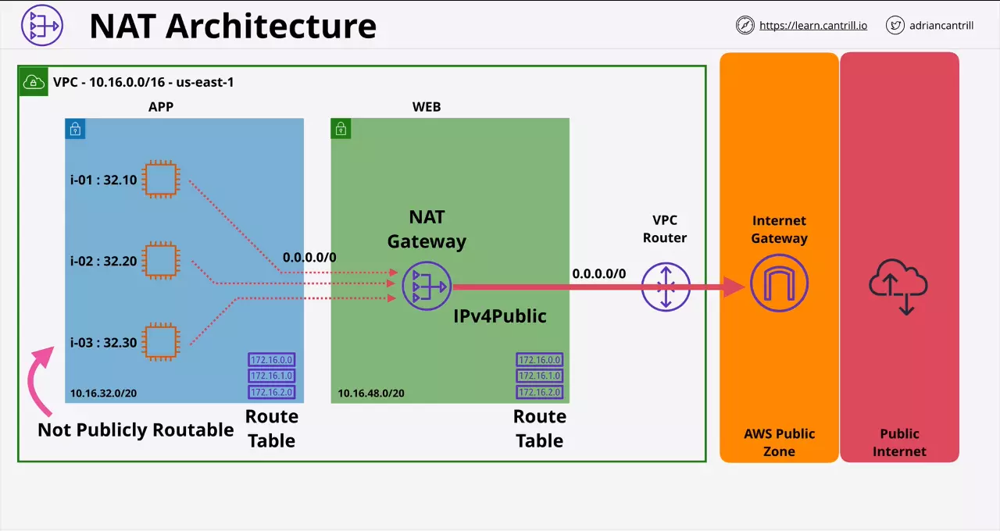

# Todo

CloudFormation revision

RDS Encrytion

EB deployment - Immutable

EC2 http://169.254.169.254/latest/userdata/ endpoint.

EC2 http://169.254.169.254/latest/meta-data/ endpoint.

AWS Fargate

EFS

- You cant connect this to CloudFront unlike S3.

PutTraceSegments API

Desired, Minimum and Maximum capacity

**sam publish** vs sam deploy

AWS ACM

AWS SSO and SAML

Region only services - N. Vergina?

CodeDeploy - Deployment Group

KMS features

Cognito User Pool and Identity Pool

AWS STS

# Misc


Note that the number of duplicates due to producer retries is usually low compared to the number of duplicates due to consumer retries.

- https://docs.aws.amazon.com/streams/latest/dev/kinesis-record-processor-duplicates.html
- https://docs.aws.amazon.com/streams/latest/dev/kinesis-record-processor-scaling.html

AWS CodeStar - makes it easy to centrally monitor application activity and manage day-to-day development tasks such as recent code commits, builds, and deployments for a project.

Amazon CodeGuru - provides intelligent recommendations to improve the quality of your codebase and for identifying an application’s most “expensive” lines of code in terms of resource intensiveness, CPU performance, and code efficiency.

WAF on API Gateway and on the ALB, protects against common internet attacks, including application layer attacks.

Integrate CloudWatch Events with Lambda, which will automatically trigger the function every 30 minutes.

You should retry original requests that receive server (5xx) or throttling errors. However, client errors (4xx) indicate that you need to revise the request to correct the problem before trying again.

The consolidated billing feature in **AWS Organizations** allows you to consolidate payment for multiple AWS accounts.

To avoid security issues, it is of utmost importance to test the impact of service control policies (SCPs) on your IAM policies and resource policies before applying them. The **IAM policy simulator** evaluates the policies that you choose and determines the effective permissions for each of the actions that you specify.

Your sign-in page URL has the following format, by default:

> https://Your_AWS_Account_ID.signin.aws.amazon.com/console/

If you create an AWS account alias for your AWS account ID, your sign-in page URL looks like the following example:

> https://Your_Alias.signin.aws.amazon.com/console/

> iam create-account-alias --account-alias finance-dept

Memcached over Redis if you need to run large nodes with multiple cores or threads.

**Amazon Guard​Duty** is incorrect because this is just a threat detection service that continuously monitors for malicious activity and unauthorized behavior to protect your AWS accounts and workloads.

**AWS Firewall Manager** is incorrect because this just simplifies your AWS WAF and AWS Shield Advanced administration and maintenance tasks across multiple accounts and resources.

# Cloud

In the cloud, resources are elastic, meaning they can instantly grow or shrink to match the requirements of a specific application.

There are two basic types of elasticity:

1. Time-based: Time-based elasticity means turning off resources when they are not being used, such as a development environment that is needed only during business hours.
2. Volume-based: Volume-based elasticity means matching scale to the intensity of demand, whether that’s compute cores, storage sizes, or throughput.

You can also use a combination of ELB and Auto Scaling to maximize the elasticity of your architecture. Beyond Auto Scaling for Amazon EC2, you can use Application Auto Scaling to automatically scale resources for other AWS services, including:

- Amazon ECS
- Amazon EC2 Spot Fleets
- Amazon DynamoDB

# VPC

- Regions can only have 1 default VPC and many custom VPCs
- 1 VPC can contain multiple AZ.
- 1 subnet can only be part of 1 AZ
- By default subnet within a VPC can communicate with other subnets in the same VPC

```
       |----- VPC ----|-----    AZ
       |              |
Region |----- VPC     |-----    AZ
       |              |
       |----- VPC     |-----    AZ  |----- Subnet
                                    |
                                    |----- Subnet
                                    |
                                    |----- Subnet
```

Subnet: Consider a subnet say **10.16.16.0/20**

- Network Address (10.16.16.0)
- Network + 1 (10.16.16.1) `VPC Router`
- Network + 2 (10.16.16.2) `Reserved (DNS)`
- Network + 3 (10.16.16.3) `Reserved Future Use`
- Broadcast Address (10.16.31.255) `Last IP in the subnet`

VPC Router

- Runs in all the AZ
- Router has a network address `network + 1` in every subnet in the VPC.
- Routes traffic between subnets.

DNS

- Provided by Route 53
- Available on the base IP address of the VPC + 2.

Route Table

- `Route table` associated with the subnet defines what the Router will do with traffic when data leaves that subnet.
- All the subnets when created are associated with a `main route table`. If we don't associate a `custom route table` with a subnet, it uses the `main route table` of the VPC.
- If we do associate a `custom route table` we create with a subnet, then the main route table is disassociated.
- `A subnet can only have one route table associated at a time`.

Internet Gateway

- Regional resilient gateway attached to a VPC.
- DO NOT NEED one per AZ.
- `One IGW will cover all AZ's in a region`
- An IGW can be created and can exist without VPC
- `It can only be attached to one VPC at a time`.
- An IGW exists between VPC and AWS public zone.
- A VPC can have no IGW, which makes it private.
- The `IGW creates a record that links the instance's private IP to the public IP`.
- This is why when an EC2 instance is created it `only sees the private IP address`.

# VPC Peering

Can a VPC span across regions?

Yes. Using VPC Peering.

Instances in either VPC can communicate with each other as if they are within the same network. The VPCs can be in different regions (also known as an inter-region VPC peering connection). This is neither a gateway nor a VPN connection, and does not rely on a separate piece of physical hardware.

A VPC peering connection helps you to facilitate the transfer of data. For example, if you have more than one AWS account, you can peer the VPCs across those accounts to create a file sharing network. You can also use a VPC peering connection to allow other VPCs to access resources you have in one of your VPCs.

- In case of cross account peering connection, one account creates the peering connection request and other approves the same

Instances in either VPC can communicate with each other as if they are within the same network. The VPCs can be in different regions (also known as an inter-region VPC peering connection). This is neither a gateway nor a VPN connection, and does not rely on a separate piece of physical hardware.

A VPC peering connection helps you to facilitate the transfer of data. For example, if you have more than one AWS account, you can peer the VPCs across those accounts to create a file sharing network. You can also use a VPC peering connection to allow other VPCs to access resources you have in one of your VPCs.

- In case of cross account peering connection, one account creates the peering connection request and other approves the same

# AWS Direct Connect

Direct Connect provides Amazon Web Services (AWS) customers with a way to transfer data that does not involve using the public Internet.

Say your company uses multiple Amazon VPCs and is setting up a new office.

- Establish a private connection from your new office’s network to your Amazon VPC using AWS Direct Connect
- This option provides predictable network performance, reduces bandwidth costs, and doesn’t require that customers be responsible for implementing high availability solutions for all VPN endpoints.
- The downside of this option (possible requiring additional telecom and hosting provider relationships) is mitigated in this instance because the office is new and would need to provision a whole new network anyway.

AWS Direct Connect uses dedicated, private network connections between your intranet and Amazon VPC. Use AWS Direct connect:

- If you have an immediate need, have low to modest bandwidth requirements, and can tolerate the inherent variability in Internet-based connectivity.
- A VPC VPN Connection utilizes IPSec to establish encrypted network connectivity between your intranet and Amazon VPC over the Internet.

You are uploading large amounts of data overnight, 3 to 5 TB to an S3 bucket. What steps can you take to decrease the amount of time to perform these uploads?

Using AWS Direct Connect, data that would have previously been transported over the Internet can now be delivered through a private network connection between AWS and your datacenter or corporate network. In many circumstances, private network connections can reduce costs, increase bandwidth, and provide a more consistent network experience than Internet-based connections.

# Stateful vs Stateless Firewalls

Stateless firewalls response will be sent on any ephemeral port, as its stateless. So in the firewall config we need to open all the ephemeral ports.

Stateful firewalls for this reason, makes setting firewall easy as the response port will be same as the request port. So, full emphemral port range is not kept open.

# NACL, Security Group

NACL: Stateless

- Every subnet has an associated NACL which filters the data as it crosses the boundry of the subnet.
- Only data coming into and out of subnet is affected by NACL
- Connections within a subnet aren't impacted by NACLs
- Cannot be assigned to AWS resources, but only subnets

```
          |-----    Subnet
          |
1 NACL    |-----    Subnet
          |
          |-----    Subnet
```

| INBOUND |                  |          |            |           |            |
| ------- | ---------------- | -------- | ---------- | --------- | ---------- |
| Rule #  | Type             | Protocol | Port Range | Source    | Allow/Deny |
| 110     | HTTPS(443)       | TCP (6)  | 443        | 0.0.0.0/0 | ALLOW      |
| \*      | All IPv4 traffic | All      | All        | 0.0.0.0/0 | DENY       |

Security Group: Stateful

- Security Groups (SGs) are another security feature of AWS VPC ... only unlike NACLs they are attached to AWS resources, not VPC subnets.
- SGs offer a few advantages vs NACLs in that they can recognize AWS resources and filter based on them, they can reference other SGs and also themselves.
- Security Groups are attached to primary Elastic Network Interfaces (ENIs), not to EC2 instances

App Tier's Security Group might look as follows.

| INBOUND    |          |            |                         |                      |
| ---------- | -------- | ---------- | ----------------------- | -------------------- |
| Type       | Protocol | Port Range | Source                  | Description          |
| Custom TCP | TCP      | 1337       | sg-45670123acbd/a4l-app | inbound from a4l-web |

Logical referencing scales. So any instances having SG `sg-0123acbd4567/a4l-web` attached to them will be able to connect to any instance having SG `sg-45670123acbd/a4l-app` attached to them using port 1337.

# ENI

An elastic network interface is a logical networking component in a VPC that represents a virtual network card.

- Every EC2 has at least one Elastic Network Interface (ENI) which is the primary ENI.
- We can attach secondary ENIs to an EC2 instance which are in seperate subnets, but everything must be within one AZ.
- Secondary interfaces function in all the same ways as primary interfaces except you can detach interfaces and move them to other EC2 instances.
- When you launch an instance, the Security Groups are attached on the network interface and not to the EC2 instance.

Each instance has a default network interface, called the primary network interface. You cannot detach a primary network interface from an instance. You can create and attach additional network interfaces. The maximum number of network interfaces that you can use varies by instance type.

- In a VPC, all subnets have a modifiable attribute that determines whether network interfaces created in that subnet (and therefore instances launched into that subnet) are assigned a public IPv4 address. The public IPv4 address is assigned from Amazon's pool of public IPv4 addresses. When you launch an instance, the IP address is assigned to the primary network interface that's created.

Primary IPv4 private address: Given a DNS name that is associated with the private IP say `ip-10-16-0-10.ec2.internal`. Its only resolvable inside the VPC and always points to private IP address.

Elastic IP address

- We can have `1 public elastic IP per private IPv4 address`
- Can associate with a private IP on the primary interface or on the secondary interface.
- If you need different rules for different IPs, then you need to multiple ENI with different Security Group on each.

Public IPv4 address

- If you stop an instance the address is deallocated.
- When you start up again, it is given a brand new IPv4 address
- Restarting the instance will not change the IP address
- Changing between EC2 hosts will change the address

Public IPv4 address is allocated a public DNS name

- Inside the VPC, Public DNS name will resolve to the primary private IPv4 address of the instance
- Outside the VPC, Public DNS name will resolve to the public IP address

Public IPv4 address is not directly attached to the instance or any of the interface, its associated with it.

- Translation of this address to private IPv4 address is done by AWS Internet Gateway

# NAT

Under the lack of abundant public IPv4 addresses, gives private CIDR range outgoing internet access.

IP masquerading (aka NAT)

- This hides CIDR block behind one IP. This is many private IPs attached to one public IP.
- Under the lack of abundant public IPv4 addresses, gives private CIDR range **outgoing** internet access.
- But note that the public IPs cannot connect to these private IP's when NAT is used.



We instead choose a NAT Gateway to provide private IP based instances access to internet.

So we provision a NAT Gateway in the public subnet, which allows us to use public IP addresses.

- public subnet has a route table attached to it
- the route table provides routing of public IP address to Internet Gateway
- Since NAT gateway is in the pubilc subnet, it can send data out and get a response back

The private instances can also have a route table, which can be different from the public subnet route table.

- we will configure this route table with a default route to point to the NAT gateway
- so any packet not pointing to the IPs within the VPC will be sent to the NAT gateway

Considerations

- needs to run from a public subnet
- Uses Elastic IPs (Static IPv4 Public)
- NAT Gateway only use NACL and dont use Security Group

# Policy Interpretation

For bucket objects under "arn:aws:s3:::holidaygifts/\*"

- Implicit deny (default rule) denies action `s3:DeleteObject`
- Explicit deny denies actions `s3:GetObject` and `s3:GetObjectAcl` during given time period
- Explicit approve allows actions `s3:PutObject`, `s3:PutObjectAcl`

```json
{
  "Version": "2012-10-17",
  "Statement": [
    {
      "Effect": "Allow",
      "Action": [
        "s3:PutObject",
        "s3:PutObjectAcl",
        "s3:GetObject",
        "s3:GetObjectAcl"
      ],
      "Resource": "arn:aws:s3:::holidaygifts/*"
    },
    {
      "Effect": "Deny",
      "Action": ["s3:GetObject", "s3:GetObjectAcl"],
      "Resource": "arn:aws:s3:::holidaygifts/*",
      "Condition": {
        "DateGreaterThan": { "aws:CurrentTime": "2020-12-01T00:00:00Z" },
        "DateLessThan": { "aws:CurrentTime": "2020-12-25T06:00:00Z" }
      }
    }
  ]
}
```

A way of saying deny all the actions that are not part of the `NotAction` list.

```json
{
  "Version": "2012-10-17",
  "Statement": [
    {
      "Sid": "DenyNonApprovedRegions",
      "Effect": "Deny",
      "NotAction": ["cloudfront:*", "iam:*", "route53:*", "support:*"],
      "Resource": "*",
      "Condition": {
        "StringNotEquals": {
          "aws:RequestedRegion": ["ap-southeast-2", "eu-west-1"]
        }
      }
    }
  ]
}
```

Statement 1:

- Allows to list the buckets, but this alone isnt sufficent to look inside the buckets.

Statement 2:

- Allows the list operation on the top level of bucket `cl-animals4life`, home folder and current username folder under home folder

Statement 3:

- Allows all the operations on the S3 bucket `cl-animals4life` folder that are inside the current username folder under home folder and any object within the username folder.

```json
{
  "Version": "2012-10-17",
  "Statement": [
    {
      "Effect": "Allow",
      "Action": ["s3:ListAllMyBuckets", "s3:GetBucketLocation"],
      "Resource": "*"
    },
    {
      "Effect": "Allow",
      "Action": "s3:ListBucket",
      "Resource": "arn:aws:s3:::cl-animals4life",
      "Condition": {
        "StringLike": {
          "s3:prefix": ["", "home/", "home/${aws:username}/*"]
        }
      }
    },
    {
      "Effect": "Allow",
      "Action": "s3:*",
      "Resource": [
        "arn:aws:s3:::cl-animals4life/home/${aws:username}",
        "arn:aws:s3:::cl-animals4life/home/${aws:username}/*"
      ]
    }
  ]
}
```

Cross Account: When access is made from Account A to another Account B containing the resource to be accessed:

| Account A | Account B |         |
| --------- | --------- | ------- |
| allowed   | allowed   | granted |
| allowed   | denied    | denied  |
| denied    | allowed   | denied  |

Permission Evaluation Flow

| Explicit Deny        | Has explicit deny?         | DENY  |
| -------------------- | -------------------------- | ----- |
| SCPs                 | Has any SCP deny?          | DENY  |
| Resource Policies    | Has resource policy allow? | ALLOW |
| Permission Boundries | Any boundry deny?          | DENY  |
| Session Policies     | Any session policy deny?   | DENY  |
| Identity Policy      | Any identity policy allow? | ALLOW |

Where:

- SCPs: define the maximum permissions for account members of an organization or organizational unit.
- Resource Policies: Attach inline policies to resources.
- Permissions Boundary: defines the maximum permissions that the **identity-based policies** can grant to an entity, but does not grant permissions. Also, does not define the maximum permissions that a **resource-based policy** can grant to an entity.
- Session Policies: Session policies limit permissions that the role or user's identity-based policies grant to the session, but do not grant permissions.
- Identity Policy: Identity-based policies (managed and inline policies) grant permissions to an identity (users, groups, or roles).

# IAM

Authentication: There are three ways IAM authenticates a principal - User Name/Password, Access Key and Session Token (Created using STS).

- An Access Key is a combination of an access key ID `(20 characters)` and an access secret key `(40 characters)`.
- When a process operates under an assumed role, the `temporary security token` provides an access key for authentication. In addition to the access key, **the token also includes a session token**.

Authorization is controlled by IAM polices: Customer Managed Policy and AWS Managed Policy.

An IAM user has no permission when its freshly created. Hard Limit of **5000 users** per account. Overcome this using Identity federation and IAM Role.

An IAM Group cant be used for login. Hard Limit of **500 groups** per account. Also, it can be referenced as a principal in a policy.

An IAM Role, unlike an IAM User which is supposed to be used by a single principal, an IAM Role is supposed to be used by many or an unknown number of principles (humans, applications or services) inside or outside your AWS account.

IAM Roles can have two types of policy attached:

- Trust Policy
- Permissions Policy

Trust Policy: controls which identities can assume this given role. A trust policy can reference different things:

- IAM Users, IAM Role and even AWS Services such as EC2
- Can refer to policies in other AWS accounts
- Can even allow anonymous usage of that account
- Can refer types of identity such as facebook, twitter, etc

Permission Policy: AWS Resouces that are specified within the Permission Policy are allowed to be accessed using the Temporary Security Credentials.

- Every time the Temporary Security Credentials are used, the access is checked against the Permission Policy.
- Any change in permission policy implies a change in access allowed using the Temporary Security Credentials.

Temporary Security Credentials: If role gets assumed by something that is allowed to assume it, then AWS creates Temporary Security Credentials.

- These credentials are then made available to the identity that assumed that role.
- Similar to access keys but have an expiry.
- `sts:AssumeRole` operation is used to assume the role.

Following policy allows only a user named PauloSantos, in AWS account number 111122223333, to assume the role if they have also authenticated with an MFA, are logging in from an IP address in the 203.0.113.0 to 203.0.113.24 CIDR range.

```json
{
  "Version": "2012-10-17",
  "Statement": [
    {
      "Effect": "Allow",
      "Principal": {
        "AWS": "arn:aws:iam::111122223333:user/PauloSantos"
      },
      "Action": "sts:AssumeRole",
      "Condition": {
        "BoolIfExists": {
          "aws:MultiFactorAuthPresent": "true"
        },
        "IpAddress": {
          "aws:SourceIp": "203.0.113.0/24"
        }
      }
    }
  ]
}
```

Service Control Policies (SCP): SCP is a policy document. It can be attached to An Organisation (The Root Container), One or more Organisational Unit (OU) or A Member Account.

- Though root user can do everything under a given account. You can never restrict a root user. With SCP we are restricting what is allowed under a given account, in effect we are also restricting the root user.
- SCP inherit down the organisational tree. So, if they are attached to the organisation as a whole, they affect all the accounts within the organisation.
- If they are attached to an organisational unit, they affect all the organisational units and accounts directly under that organisational unit.
- If they are attached to member accounts, they affect only those accounts.
- The Management Account is special and is not affected by the Service Control Policies.

Identity Policies: Things that are both in SCP and Identity policy is allowed.

- Permission only in SCP is allowed but not granted as its not granted by identity policy
- Permission only in Identity Policy but not in SCP, is not allowed as its beyond whats allowed by SCP

Organisation Trail is free for download of the last 90 days data.

- Management Events are free for downloading in every region in each AWS account. Additional copies of these events is charged at $2 per 100,000 events.
- Data Events are chargeable at $0.10 per 100,000 events irrespective of number of trails.
- Insights events logs any unusual activity, errors and user behaviour.

# KMS

KMS is a Regional and a Public Service. Each region is isolated when using KMS. It's a public service and occupies AWS public zone. It can be connected to by anything with permission in the public zone. (Update) Keys can now be replicated into other regions .

KMS can create keys, manage keys, import keys and these keys can be used to perform operations. But keys are locked inside KMS. Primary function of KMS is that keys never leave KMS.

KMS provides `FIPS 140-2 (L2)` complaint service.

Types of KMS Key

- AWS Managed
- Customer Managed Key (CMK)

Both AWS and Customer Managed Key (CMK) support key rotation.

- AWS managed keys are always rotated. This feature can't be disabled for AWS managed keys.
  - Keys are rotated every 1095 days(3 years)
  - When we start using encyprt with KMS for different services, AWS managed keys are created
- Customer Managed Keys support rotation.
  - Disabled by default
  - Keys are rotated once a year
  - Once enabled, this cannot be disabled

CMK's are containers for the actual `physical` master key.

- This physical key material is held by KMS and is used for encryption and decryption
- This physical key material can be generated by KMS
- Or imported into KMS
- This physical key material can be used to encrypt or decrypt data thats upto `4KB` in size.
- CMK will be used for encryption within KMS.

CMK Alias: can be used to specify the CMK. So the underlying CMK can be changed. Just like CMK, aliases are regional too. Every alias in each region has its associated CMK different from other regions.

On CreateKey: a CMK will be created in KMS. This key (material) will be stored into KMS in an encrypted form.

During Encrypt: we send the data to be encrypted. Also specifying the key to be used.

- If all permissions are met, KMS decrypts the CMK.
- Uses the CMK to encrypt the plain text data.
- Returns the encrypted data.

During Decrypt: we send the encrypted data to KMS

- Key to be used doesnt have to be specifed
- KMS gets this information from the cyphertext encoded into the encrypted data
- If permissions are met, KMS will decrypt the CMK and uses that to decrypt the encrypted data

CreateKey, Encrypt and Decrypt are individual operations and require their own permissions.

Data Encryption Key (DEK): DEK is used to encrypt your data outside of AWS KMS. CMK will be used to create encrypted DEK. This process of encrypting one key with another is called **envelope encryption**. Now encrytped DEK and encrypted object is stored without the need of storing the plaintext DEK.

- You pass the DEK back to KMS and you ask it to decrypt it using the CMK that was used to generate the DEK.

GenerateDataKey operation: will indicate KMS which CMK to be used, which will be used to generate Data Encryption Key. **DEK can be used to overcome the 4KB limit over data to be encrypted**. DEK will be linked to a specific CMK that was used to create the DEK.

KMS does not store DEK in any form

- Its returns the DEK to the service requesting the key and then discards it
- Key is discarded as KMS doesn't perform encryption or decryption of data using DEK

S3 uses DEK for every object that is encrypted in it.

- It encrypts the object using plain text DEK and then only stores the encrypted version of DEK

Key Policy is the starting point for security on AWS.

- Its a `resource policy`, similar to bucket policy on S3 bucket, but on a key
- Every CMK has a key policy
- Unlike other AWS services, KMS should be explicitly told the keys trust the AWS account they are in.
- The following policy means that the key having the following key policy, will allow AWS account `111122223333` to manage it.

```json
{
  "Sid": "Enable IAM policies",
  "Effect": "Allow",
  "Principal": { "AWS": "arn:aws:iam::111122223333:root" },
  "Action": "kms:*",
  "Resource": "*"
}
```

So, in order for IAM to work.

- IAM is trusted by the account
- The account must be trusted by the key
- Chain of trust: key - account - IAM - IAM user

IAM Policy gives the holder of the policy the rights to use the key to Encrypt or Decrypt the data.

```json
{
  "Version": "2012-10-17",
  "Statement": {
    "Effect": "Allow",
    "Action": ["kms:Encrypt", "kms:Decrypt"],
    "Resource": "arn:aws:iam:*:111122223333:key/*"
  }
}
```

Using CMK to encrypt and decrypt data via CLI

```sh
echo "find all the doggos, distract them with the yumz" > battleplans.txt

aws kms encrypt \
    --key-id alias/catrobot \
    --plaintext fileb://battleplans.txt \
    --output text \
    --query CiphertextBlob \
    | base64 --decode not_battleplans.enc

aws kms decrypt \
    --ciphertext-blob fileb://not_battleplans.enc \
    --output text \
    --query Plaintext | base64 --decode decryptedplans.txt
```

Buckets aren't encrypted, **objects are**. Each object can use a different encryption method.

SSE-C (Server-side encryption with customer provided keys)

- Customer is responsible for the keys management.
- S3 endpoint performs the encryption of objects.
- Customer needs to pass the key along with the object(unencrypted) to be encrypted to S3 endpoint.
- Hash of the key: Once the key and object arrive, it is encrypted. A hash of the key is taken and attached to the object. The hash can identify if the specific key was used to encrypt the object. The key is then discarded after the hash is taken.
- Post encryption: The key is discarded and is not stored along with the object in S3.
- For decryption: You need to specify the object to be decrypyted with the key that was used to encrypt the object. If the hash of the key specified in the request matches with the hash attached to the requested object, S3 returns the unencrypted object and discards the key.

SSE-S3 AES256 (Server-side encryption using S3 managed keys)

- S3 is responsible for the keys management. S3 generates master key, when you pick SSE-S3 for the first time. This master key is fully managed and rotated by S3.
- For encryption: You just provide the object to be encrypted to S3 endpoint. When an object is added, it generates a key specifically for that object. It uses that key to encrypt the given object. The master key is used to encrypt that key used.
- Post encryption: The original key is discarded. The encrypted key and the encrypted object are stored in S3 post this process.

```
User or App     ---      S3 Endpoint     ---     S3 Storage
                              |
                              |
                              |
                              |
                    Master Key (Handled by S3)
```

Challenges with using SSE-S3

- Regulatory enviromment where the keys and access needs to be controlled.
- No way to control key material rotation.
- No role seperation. A full S3 admin can rotate keys as well as encrypt or decrypt data. (In some domains, these is against the company policy. A clear role seperation on who can manage the keys and who can use the keys needs to be maintained)

SSE-KMS (Server-side encryption using customer master keys stored in AWS KMS)

- S3 generates a customer master key, when you pick SSE-KMS for the first time. Allows control over key rotation
- For encryption: Everytime an object is uploaded, S3 uses a dedicated key to encrypt the given object. This key is called Data Encryption Key (DEK) and is generated using the Customer Master Key (CMK).
- S3 endpoint is passed the given object by the request. KMS provides plain text and encrypted Data Encryption Key to be used to encrypt this object.
- Post encryption: The plain text data encryption key is discarded. The encrypted data encryption key and the encrypted object are stored in S3 post this process.
- You can also use a customer managed key as well instead of the customer master key from KMS.

```
User or App     ---      S3 Endpoint     ---     S3 Storage
                              |
                              |
                              |
                              |
                  Customer Master Key (In KMS)

```

Advantage of using SSE-KMS:

- To decrypt any object, you need access to the CMK that was used to generate the unique key that was used to generate them.
- The CMK is used to decrypt the data encryption key for that object. That decrypted data encryption key is used to decrypt the object itself.
- The best benefit is the role seperation. If you don't have access to KMS, you don't have access to the object.

Enabling Amazon S3 default bucket encryption

- You can set the default encryption behavior on an Amazon S3 bucket so that `all objects are encrypted` when they are stored in the bucket. The objects can be encrypted using server-side encryption with **either Amazon S3-managed keys (SSE-S3) or AWS Key Management Service (AWS KMS) keys**.
- After you enable default encryption for a bucket, there is no change to the encryption of the objects that existed in the bucket before default encryption was enabled.
- Any new file uploaded without any encryption specified will use the default bucket encryption.

When you upload objects **after enabling default encryption**:

- If your PUT request headers don't include encryption information, Amazon S3 uses the bucket’s default encryption settings to encrypt the objects.
- If your PUT request headers include encryption information, Amazon S3 uses the encryption information from the PUT request to encrypt objects before storing them in Amazon S3.

# Encryption


For certificates in a Region supported by AWS Certificate Manager (ACM), it is recommended that you use ACM to provision, manage, and deploy your server certificates. In unsupported Regions, you must use **IAM as a certificate manager**.

- Use IAM as a certificate manager only when you must support HTTPS connections in a Region that is not supported by ACM.

**IAM Role vs Access Keys**: If you have resources that are running inside AWS, that need programmatic access to various AWS services,then the best practice is to always use IAM roles. However, for applications running outside of an AWS environment, these will need access keys for programmatic access to AWS resources.

**Container Instance IAM Role** only applies if you are using the EC2 launch type. Not with a Fargate launch type.

**Service-linked Role** is a unique type of IAM role that is linked directly to Amazon ECS itself and not on the ECS task.

TDE automatically encrypts data before it is written to storage, and automatically decrypts data when the data is read from storage.

- Amazon RDS supports using Transparent Data Encryption (TDE) to encrypt stored data on your DB instances running Microsoft SQL Server.

Take note that SCPs are necessary, but not sufficient, for granting access for the accounts in your organization. You still need to attach IAM policies to users and roles in your organization’s accounts to actually grant permissions to them.

The bucket will use server-side encryption with Amazon S3-Managed encryption keys (SSE-S3) to encrypt the data using 256-bit Advanced Encryption Standard (AES-256) block cipher. **x-amz-server-side-encryption** must be used during the upload.

To upload an object to the S3 bucket which uses _SSE-KMS_, you have to send a request with an **x-amz-server-side-encryption** header with the value of **aws:kms**. When you upload an object, you can specify the KMS key using the **x-amz-server-side-encryption-aws-kms-key-id** header. If the header is not present in the request, Amazon S3 assumes the default KMS key.

S3 when using _SSE-C_ requires **x-amz-server-side​-encryption​-customer-algorithm**, **x-amz-server-side-encryption-customer-key** and **x-amz-server-side-encryption-customer-key-MD5** headers on the upload request headers to be passed during upload request.

**AWS Secrets Manager** is an AWS service that makes it easier for you to manage secrets. Secrets can be database credentials, passwords, third-party API keys, and even arbitrary text. You can store and control access to these secrets centrally by using the Secrets Manager console, the Secrets Manager command line interface (CLI), or the Secrets Manager API and SDKs.

- Also, you can configure Secrets Manager to automatically rotate the secret for you according to a schedule that you specify.
- Systems Manager Parameter Store doesn’t rotate its parameters.

**Encrypt operation** is primarily used to encrypt RSA keys, database passwords, or other sensitive information. This operation can also be used to move encrypted data from one AWS region to another however, this is _not recommended if you want to encrypt your data locally_. You have to use the **GenerateDataKey operation** instead.

Envelope encryption - Encrypt plaintext data with a data key and then encrypt the data key with a top-level plaintext master key.

AWSLambdaDynamoDBExecutionRole includes the following permission:

- dynamodb:DescribeStream
- dynamodb:GetRecords
- dynamodb:GetShardIterator
- dynamodb:ListStreams

**If your identity store is not compatible with SAML 2.0**, then you can build a custom identity broker application to perform a similar function. The broker application authenticates users, requests temporary credentials for users from AWS, and then provides them to the user to access AWS resources.

- The application verifies that employees are signed into the existing corporate network's identity and authentication system, which might use LDAP, Active Directory, or another system.
- The identity broker application then obtains temporary security credentials for the employees.
- To get temporary security credentials, the identity broker application calls either **AssumeRole** or **GetFederationToken** to obtain temporary security credentials, depending on how you want to manage the policies for users and when the temporary credentials should expire.
- The call returns temporary security credentials consisting of an AWS access key ID, a secret access key, and a session token. The identity broker application makes these temporary security credentials available to the internal company application.
- The app can then use the temporary credentials to make calls to AWS directly. The app caches the credentials until they expire, and then requests a new set of temporary credentials.

x-amz-server-side-encryption header can only accept two values: AES256 and aws:kms.

- header should be AES256, which means that the bucket is using Amazon S3-Managed Keys (SSE-S3).
- if this header has a value of aws:kms, then it uses AWS KMS-Managed Keys (SSE-KMS).

# Elastic Load Balancer (ELB)

There are 3 types of ELB available within AWS:

- v1 (Classic Load Balancer - Not Recommended)
- v2 (Application Load Balancer - Recommended)
- v2 (Network Load Balancer - Recommended)

v2 load balancers are faster and `they support target groups and rules`.

Classic Load Balancer: Introduced in 2009. Is now replaced by v2 ELB which is recommended at the moment.

- Classic Load Balancer can load balance between HTTP, HTTPS and other lower level protocols
- Classic Load Balancer is not really layer 7 supporting. It lacks many feature.
- One limitation of Classic Load Balancer is that it only support 1 SSL certificate per load balancer

Application Load Balancer: Supports layer 7 features. Such as HTTP, HTTPS, WebSocket.

Network Load Balancer: Supports TCP, TLS (Secure form of TCP protocol), UDP. In general, this would be used for any application not using HTTP/HTTPS.

Its the job of the load balancer to accept connections from the customer.

- It then distributes these jobs to registered backend compute
- So the infrastructure can scale up or scale down without affecting the customer
- So even if the infrastructure fail and is repaired, user wouldnt be directly affected

Each ELB is configured with an A record DNS name, which resolves to the ELB nodes. The DNS name resolves to all of the individual nodes.

```
                A record
               |----------    ELB Node
               |A record
ELB (DNS Name) |----------    ELB Node
               |A record
               |----------    ELB Node
```

The type of ELB node controls the IP addressing of the ELB nodes: Internet Facing (given public and private addresses) and Internal Only (only private addresses).

ELB nodes are **configured with listeners** which **accept traffic on a port and protocol** and **communicate with targets on a port and protocol**.

Once a connection is made to the `Internet Facing ELB node`, it then makes a connection to the instances be it public or private instances.

Architecture recommendation:

- What we can do is that we can add ELB's between the layers (tiers), to abstract one tier from another.
- In this case the user will connect directly to the ELB, which will connect to an application instance.
- The web instance will connect to the app instance through an internal ELB. This would abstract away the direct connection between instances of these tiers.
- ELB's allow each tier to scale independently.
- If load on app tier increases, it can scale without affecting any other tier

Note that we use at least one ELB node per AZ. So the user will connect to the DNS name of the application which points to the DNS name of the ELB DNS name (Is routing done by Route53?).

Cross-Zone Load Balancing: Historically LB nodes could only distribute load within the AZ they are in. With **Cross-Zone Load Balancing** an ELB node can be distribute load across any of the instance in any AZ. This is now enabled by default for an application load balancer.

Application Load balancing (ALB)

- Layer 7 load balancer
- Listens on HTTP and/or HTTPS
- It cant understand any other Layer 7 protocol (SMTP, SSH, Custom Gaming protocol, etc)
- It **cannot** be configured to directly listen to TCP/UDP/TLS Listeners
- It can perform application health check
- HTTP or HTTPS (SSL/TLS) are always terminated on the ALB. A new connection is made from ALB to the origin
- ALBs are slower than NLB since more levels of network stack to be processed

```
Domain Name -> ELB DNS -> ELB Node
                            |
                            |
                            V
                          Rule
                            |
                            |
                            V
                    condition, action
                            |
                            |
                            V
                        target group
                            |
                            |
                            V
                    Auto Scaling Group
                            |
                            |
                            V
                        instance
```

ALB Rules: ALB have concept of rules, which direct connections that arrive at a listener.

- Rules are processed in priority order.
- Default rule acts as a catchall rule.

Rules can have **conditions** which can be used to check:

- host-header
- http-header
- http-request-method
- path-pattern
- query-string
- source-ip

Rules can have **actions** which can be:

- forward (forward traffic to a target group)
- redirect (can redirect traffic to another domain name)
- fixed-response (respond with a certain success or error code)
- authenticate-oidc (authenticate using open ID)
- authenticate-cognito (authenticate using cognito)

Network Load Balancing (NLB)

- Layer 4 load balancer
- Can work with TCP, TLS, UDP and TCP_UDP (TCP with UDP)
- Doesnt have any understand of HTTP and HTTPS
- They cant see headers, or cookies, or understand session
- Are very very fast (millions of rps, 25% of ALB latency)
- Ideal for apps that use SMTP, SSH, Custom Game protocols, financial apps not using HTTPS
- Health check with NLB checks only ICMP/TCP handshake
- NLB's can have static IPs, so can be whitelisted (!important)
- Can Forward TCP to instances, which mean unbroken encryption between client and origin

Use Network Load Balancer if:

- your application requires unbroken encryption
- static IP for whitelisting
- the fastest performance (million rps, 4 times of ALB)
- the protocol is not HTTP or HTTPS
- privatelink

Else choose Application Load Balancer

Launch Configuration and Templates: LC and LT lets you define anything that you define while launching a EC2 instance such as

- AMI, Instance Type, Storage, Key Pair
- Networking and Security Groups
- Userdata and IAM Role
- **used with Auto Scaling Groups**

Why not use CloudFormation instead?

Launch templates is newer and recommended to use over Launch Configuration, they include the latest features and improvements. Launch templates supports versioning of templates, unlike Launch Configuration.

- If you **launching instance using LT**, you need to specify the subnet to be used.
- If you are **using ASG with LT**, ASG will choose the subnet automatically.

Auto Scaling Groups (ASG): Role of an ASG is to keep the number of instances at Desired capacity by provisioning or terminating instances. ASG is used with ELB and Launch Templates to deliver elatic architectures. Key properties defined for an ASG are Minimum, Desired, Maximum.

1. Manual Scaling - Manually adjust the desired capacity.
2. Scheduled Scaling - Based on schedule. Eg. sales, off hours.
3. Dynamic Scaling
   - Simple Scaling can be used to automate scaling based on metrics such as:
     - CPU Load
     - Memory
   - Stepped Scaling can be used to add or remove incrementally
   - Target Tracking can be used to scale using aggregate CPU, network, `request count per target`, etc
4. Cooldown Periods is used to wait between scaling actions (Since there is minimum billing period after an instance is provisioned, regardless how long it was used)

If you have a LT or LC which can provision an EC2 instance, use it to provision an ASG. Set the ASG to use multiple subnets in multiple AZs. Set the ASG to use minimum, desired and maximum as 1 instance. You get a **simple instance recovery**. Since ASG work across AZs, on failure of EC2, another one can be provisioned in another AZ.

ASG Health Checks

- EC2 (default)
- ELB (Can be enabled on ASG)
- Custom

EC2 health check: considers the following status as UNHEALTHY (anything other than RUNNING state): Stopping, Stopped, Terminated, Shutting Down or Impaired (not passing 2/2 checks).

ELB health check: instance is considered HEALTHY, if its in RUNNING state and if it passes ELB health check (like pattern matching, etc). With ELB health check integerated with ASG, the **checks are more application aware (Layer 7)** unlike EC2 health check.

Custom health check integrates with external system to mark instances are healthy or unhealthy.

Health check grace period: time between starting an instance and performing health checks. This allows system to launch, perform bootstrapping and let application start before health check is peformed. If you dont have Health check grace period long enough the **application might start peforming health check before the application is started**.

ASG with Load Balancer: Instead of statically adding instances to the target group, we can use an ASG integrated with the target group. They are automatically added or removed in the target group of the ELB.

For Amazon EC2 Auto Scaling, there are two primary process types: Launch and Terminate. The **Launch** process adds a new Amazon EC2 instance to an Auto Scaling group, increasing its capacity. The **Terminate** process removes an Amazon EC2 instance from the group, decreasing its capacity.

ASG Considerations

- ASG defines WHEN are WHERE
- LT defines WHAT configuration instances are created with
- Autoscaling Groups are free, only resources created are billed
- Use cooldowns to avoid rapid scaling
- Use smaller instances to save cost
- Use ASG with ALB's to abstract away instance dependency

Lifecycle hooks: You can define `custom actions during ASG actions` like instance launch or terminate transitions.

Lifecycle hooks enable you to `perform custom actions by pausing instances` as an Auto Scaling group launches or terminates them.

When an instance is paused, it remains in a wait state either until you complete the lifecycle action using the

- `complete-lifecycle-action command` or
- `CompleteLifecycleAction operation` or
- `until the timeout period ends` (one hour by default).

During Scale Out, the lifecycle hooks `Pending: Wait` and `Pending: Proceed` allows to perform custom actions.

Similarly during Scale In, the lifecycle hook `Terminating: Wait` and `Terminating: Proceed` allows to perform custom actions.

# Route 53

Route53 consists of private and public hosted zones.

- When a domain is registered, TLD holds the NS records. NS records point to Name Servers in the hosted zone. Then the Name Server and the zone they host become authoritative for that domain.
- The zone file is hosted on these Name Servers
- This is globally resilient service. So whole region can be affected, but Route53 will still function.

Public Hosted Zone: is a DNS database (`containing zone files`) for a specific domain, hosted by Route53 on Public Name Servers. A Public Hosted Zone can be created for a domain registered with Route53 or with other registrars.

```
                      |---> NS --- zone file
                      |---> NS --- zone file
Public Hosted Zone ---|---> NS --- zone file
                      |---> NS --- zone file

```

- Whenever you create a public hosted zone, Route53 `creates 4 Public Name Servers`, on which the zone file is hosted.
- These Name Servers are accessible from the public internet and VPCs using Route53 resolver.
- The zone file is hosted on these Name Servers

Accessing from VPC

- The public hosted zone is accessible from within the VPC using the Route53 resolver, if the DNS is enabled for that VPC.
- Route53 resolver is on the VPC IP Address (+2)
- VPC instances are already configured (if enabled) with VPC + 2 address as their DNS resolver
- This allows querying of Route53 public or any internet hosted DNS zones

Accessing from public DNS

- Client request to access a domain is **received by the DNS resolver of the ISP**
- **DNS resolver of the ISP queries Root Name Servers**, which return the information about the TLD Name Server for that domain
- DNS resolver using this information **queries the TLD Name Server of the domain**. TLD Name Server records in the TLD point to Name Server, which returns the information about the Authoritative Name Server for that domain.
- **Since the website's Name Server are in Route53 Public Hosted zone**, these are the Authoritative Name Server for the website.

Private Hosted Zone: Its similar to Public Hosted Zone but associated with VPCs and accessible in those VPCs. And it is inaccessible from public internet. Resource records can be created in the Private Hosted Zone, which are resolvable within the VPCs.

- This could be used to run interneal application, dns names resolvable only within network.
- To be able to access the privates hosted zone, the service needs to be running from within the VPC. And the VPC needs to associated with the private hosted zone.

Split-View/Spit-Horizon DNS

- This allows setting up same website address to behave differently when accessed from outside network or from within own network.
- Split-View allows us to have a Public Hosted Zone sharing subset of records of the Private Hosted Zone.
- Accessible records kept in public hosted zone.
- Private records kept in private hosted zone.

Route53 CNAME record: CNAME maps a NAME to another NAME.

- Many AWS Services like ELB use a DNS name instead of an IP address.
- Using CNAME for naked/apex like `netflix.com` here wouldn't be supported
- Using CNAME for normal DNS record like `www.netflix.com` is supported

Route53 ALIAS record: ALIAS records maps a NAME to an AWS Resource.

- ALIAS record is **outside DNS standard** and is only implemented within AWS. So alias record can only be used if Route53 is hosting the domain.
- ALIAS needs to match the record type to the type of the record you are pointing to. If the AWS resource provides an A record, then we need to use **A record ALIAS**. If the AWS resource provides an CNAME record, then we need to use **CNAME record ALIAS**.

Health check is seperate from, but used by records within Route53. Health checkers are located globally. Health check can be done on AWS targets as well resources over the internet.

- Checks run every 30 seconds
- Check interval can be reduced to 10 seconds for additonal cost
- **TCP Check**: It can be a TCP check where `the connection needs to be established within 10 seconds`
- **HTTP(S) check**: It can be HTTP check where the `TCP connected must be established within 4 seconds` and it should return a response in 2xx or 3xx range.
- **HTTP(S) check with string matching**: Along with the HTTP check the health checker expects a response within 2 second with response body containing an exact string match (in the first 5120 bytes). `This is the most accurate health check`.

Simple routing: doesnt support `health checks`. All values are returned for a record when queried. It simply chooses one and to connect to.

Failover Routing: If the primary record fails its health check, the secondary value of the same name is returned. Secondary value could be pointing to out of band pages from S3.

Multi Value Routing: This is used over Failover Routing when you have multiple resources that can serve the request

- You can specify multiple values for almost any record, but multivalue answer routing also lets you check the health of each resource, so Route 53 returns only values for healthy resources
- This routing type is used to increase availability
- It is not a replacement for Load Balancer

Weighted Routing: lets you associate multiple resources with a single domain name and choose how much traffic is routed to each resource. If this is combined with health check unhealthy records are skipped. This can be useful for a variety of purposes:

- simple load balancing and
- testing new versions of software

Latency Routing: If your application is hosted in multiple AWS Regions, you can improve performance for your users by serving their requests from the AWS Region that provides the lowest latency. If this is combined with health check it checks if the region provides lowest latency as well as if its healthy.

Geolocation Routing: lets you choose the resources that serve your traffic based on the geographic location of your users, meaning the location that DNS queries originate from.

- Records are tagged with location that can be a "country", "continent" or "default"
- In US records can additionally be tagged by "state"

Geoproximity Routing: Rather than using the actual physical distance, you can also optionally choose to route more traffic or less to a given resource by specifying a value, known as a bias. A bias expands or shrinks the size of the geographic region from which traffic is routed to a resource.

# API Gateway

API gateway support a range of authentication methods.

You can make the API complete open access, so no authentication is required.

API gateway can use AWS Cognito User Pools for authentication.

- Client authenticates with Cognito and receives a token
- The token is then passed in the subsequent requests to API gateway
- API gateway validates the token with Cognito

API gateway can also be extended to use Lambda based authorisation (earlier known as custom authoriser).

- Client calls API gateway with a bearer token
- API gateway calls Lambda authorizer to validate the token
- On successful validation, it `returns an IAM policy and principal identifier` to API gateway. Which `handles the request via Lambda integration`.
- On failed validation, it returns `403 ACCESS_DENIED` to the client

Endpoint Types

- Edge-Optimized: Uses CloudFront. Requests are routed to nearest CloudFront POP (Point of Presense).
- Regional Endpoint: Doesnt uses CloudFront network. Used when client are in the same region.
- Private Endpoint: Accessible only within a VPC via interface endpoint

The base URL for REST APIs is in the following format:

> https://{restapi_id}.execute-api.{region}.amazonaws.com/{stage_name}/{resource}

Parts of the URL (https://xxx.review-api.us-east-1.amazonaws.com/dev/listcats)

- API Gateway Endpoint (https://xxx.review-api.us-east-1.amazonaws.com)
- Stage (/dev)
- Resource (/listcats)
- Within each resource you have methods such as GET, POST.

Integration Types

- MOCK: Used for testing. No backend involved.
- HTTP: Configure with backend endpoint. You have to configure both integration request and response using mapping template.
- AWS: Lets an API expose AWS service actions. You have to configure both integration request and response using mapping template.
- HTTP_PROXY: Pass data as it is from request to integration and response back to client. No configuration of integration request and response.
- AWS_PROXY: Request is sent as it is as lambda is responsible for using supported format. No configuration of integration request and response.

Mapping templates: sits between the client and integration endpoint, translating the data to/from the integration endpoint. And this is used only when you aren't using proxing.

Stages and Deployments: Changes made in API Gateway are NOT applied directly. Any configuration changes within an API Gateway doesnt take effect until it is deployed.

Stages can be named as per:

- environments (PROD, DEV, TEST)
- versions (v1, v2, v3)

Each stage has its own configuration.

- unlike Lambda function they are not immutable
- they can be overwritten and can be rolled back

Stage Variables: You could use a stage variable say `ENV` which in case of:

- DEV stage: points to DEV lambda function alias
- BETA stage: points to BETA lambda function alias
- PROD stage: points to PROD lambda function alias
- And the alias change point to a newer version over time.

API Gateway Lambda Authorizer: When a client makes a request to one of your API’s methods, API Gateway calls your **Lambda authorizer**, which takes the caller’s identity as input and returns an IAM policy as output.

There are two types of Lambda authorizers:

– A **token-based Lambda authorizer** (also called a TOKEN authorizer) receives the caller’s identity in a bearer token, such as a JSON Web Token (JWT) or an OAuth token.
– A **request parameter-based Lambda authorizer** (also called a REQUEST authorizer) receives the caller’s identity in a combination of headers, query string parameters, stageVariables, and $context variables.

Take note that if the scenario uses an application hosted in Lambda, you have to use Lambda integration instead of HTTP proxy or HTTP custom.

For a Lambda function, you can have two types of integration:

– Lambda proxy integration
– Lambda custom integration


The following are the Gateway response types which are associated with the HTTP 504 error in API Gateway:

- INTEGRATION_FAILURE – The gateway response for an integration failed error. If the response type is unspecified, this response defaults to the DEFAULT_5XX type.
- INTEGRATION_TIMEOUT – The gateway response for an integration timed out error. If the response type is unspecified, this response defaults to the DEFAULT_5XX type.

**For the integration timeout**, the range is from 50 milliseconds to 29 seconds for all integration types, including Lambda, Lambda proxy, HTTP, HTTP proxy, and AWS integrations.

For functions with a long timeout, your client might be disconnected during synchronous invocation while it waits for a response and returns an HTTP 504 error.

In this scenario, there is an issue where the users are getting HTTP 504 errors in the serverless application. This means the Lambda function is working fine at times but there are instances when it throws an error. Based on this analysis, the most likely cause of the issue is the INTEGRATION_TIMEOUT error since you will only get an INTEGRATION_FAILURE error if your AWS Lambda integration does not work at all in the first place.

Since the incoming requests are increasing, the API Gateway automatically enabled throttling which caused the HTTP 504 errors. is incorrect because a large number of incoming requests will most likely **produce an HTTP 502 or 429 error but not a 504 error**.

An authorization failure occurred between API Gateway and the Lambda function usually produces HTTP 403 errors and not 504s.

A response code of 2xx indicates the operation was successful. Other error codes indicate either a client error (4xx) or a server error (5xx).

If executing the function would cause you to exceed a concurrency limit at either the account level (ConcurrentInvocationLimitExceeded) or function level (ReservedFunctionConcurrentInvocationLimitExceeded), Lambda may return a TooManyRequestsException as a response.

Amazon API Gateway does not support unencrypted (HTTP) endpoints. By default, Amazon API Gateway assigns an internal domain to the API that automatically uses the Amazon API Gateway certificate. When configuring your APIs to run under a custom domain name, you can provide your own certificate for the domain.

"Effect": "Allow", "Action": ["execute-api:InvalidateCache"] allows any request to invalidate cache results in API Gateway.

You can use the API Gateway Import API feature to import a REST API from an external definition file (on-premise) into API Gateway. Currently, the Import API feature supports OpenAPI v2.0 and OpenAPI v3.0 definition files.

Amazon API Gateway Lambda proxy integration is a simple, powerful, and nimble mechanism to build an API with a setup of a single API method. The Lambda proxy integration allows the client to call a single Lambda function in the backend. In Lambda proxy integration, when a client submits an API request, API Gateway passes to the integrated Lambda function the raw request as-is. Because API Gateway doesn't intervene very much between the client and the backend Lambda function for the Lambda proxy integration, the client and the integrated Lambda function can **adapt to changes in each other without breaking the existing integration setup of the API**.

For API Gateway to pass the Lambda output as the API response to the client, the Lambda function must return the result in the following JSON format:

```json
{
    "isBase64Encoded": true|false,
    "statusCode": httpStatusCode,
    "headers": { "headerName": "headerValue", ... },
    "body": "..."
}
```

Since the Lambda function returns the result in XML format, it will cause the 502 errors in the API Gateway.

# Cloudfront

```
Distribution
   |
   |----> Behaviour
   |----> Behaviour
              |
              |----> Configured with path patterns
```

CloudFront Distribution contains the configuration deployed to the edge locations

- A distribution can have many behaviours, each configured with path pattern
- If request matches the path pattern, assocated behaviour is used else default

CloudFront Behaviours control much of the **TTL**, protocol and privacy settings within CloudFront. By default Origins are used by behaviours.

- Each behaviour works based on a precedence value and/or path patttern. Anything that matches will be prioritized over the default behaviour setting.

TTL

- Default TTL (behaviour) is 24 hours validity
- TTL per object is set via `Cache-Control max-age`, `Cache-Control s-maxage` and `Expires` origin header
- You can set `Minimum TTL` and `Maximum TTL` values that **act as limiter** on the per object TTL settings
- If the per object TTL is below Minimum TTL, then minimum TTL applies instead. And if its above Maximum TTL, then maximum TTL applies.

Cache Invalidation patterns that are used to match objects that needs to be invalidated:

```
/images/cat.jpg
/images/cat*
/images/*
/*
```

- Irrespective of how many objects are matched, the price for performing invalidation remains the same.
- versioned filenames can be used to omit invalidation needs

Cloudfront and SSL/TLS

- If you use HTTPS you need a certificate applied to the distribution
- You can either generate or import a SSL certificate from AWS Certificate Manager (ACM)
- ACM is a regional service and you need to add the certificate in the same region as the service you are using.
- Application load balancer (ALB) in asia-south-1a need ACM from the same region.
- Cloudfront is a global service. The certificate should be added in region `us-east-1` (Northern Virginia) only.
- S3 origins doesnt require certificate management. S3 handles certificates natively.
- Self signed certificates will not work. Only publicly trusted certificates are valid.
- With Custom Origin EC2 or On-Premise servers we need to apply certificate manually

For all the cases, the certificate needs to match the DNS name of the origin.

- From the viewer side, the certificate applied to Cloudfront needs to match the DNS name of, whatever your customer are using, to access Cloudfront.
- On the origin side, the certificate installed on any of your origin needs to match the DNS name of what Cloudfront is using to contact the origin.

Use ACM to apply SSL certificate to your custom domain. You need to be doing this while using `us-east-1` region selected in AWS.

- You need a hosted zone for this domain under **Route53**
- To your Cloudfront distribution, add mapping to your custom domain by adding it as CNAME
- While requesting certificate specify the fully qualified domain name, which needs to match the CNAME you have added in Cloudfront distribution

With SNI a server hosting multiple domain (at a single IP address where each uses different SSL cert), can respond to each request with right certificate based on the domain being requested.

- Historically this was not possible. Recently SNI has been introduced as a TLS extension, allowing host to be included during TLS handshake before HTTP gets involved (Presentation layer)
- Older browsers don't support SNI. Cloudfront allows us to use dedicated IP's for each custom domain in such cases (at an extra cost. $600 monthly).
- Each custom domain requires a different cert to prove its identity

The main ways to secure origins from direct access (bypassing CloudFront)

- Origin Access identities (OAI) - for S3 Origins
- Custom Headers - For Custom Origins
- IP Based FW Blocks - For Custom Origins (Allowing access to only Cloudfront IP range)

Origin Access Identity (OAI): You can configure an S3 bucket as the origin of a CloudFront distribution. OAI prevents users from viewing your S3 files by simply using the direct URL for the file. Instead, they would need to access it through a CloudFront URL. It uses same protocol (HTTP/HTTPS) used on Viewer Side (User to Cloudfront) on Origin Side as well (Cloudfront to User). It allows to pass custom header (Used to restrict access to only when this header is passed).

Cloudfront with Custom Origin: provides option to choose Origin Side protocol either as HTTP, HTTPS or same as Viewer Side protocol. It allows to pass custom header (Used to restrict access to only when this header is passed).

Any content distributed via Cloudfront is PUBLIC by default. Content that is PRIVATE needs to accessed via Signed URL or Signed Cookies. A single Cloudfront distribution behaviour is either PUBLIC or PRIVATE.

- A Cloudfront Key is created by the AWS Account `Root User`.
- Once a key exists in an account, that account can be added as a `TRUSTED SIGNER` in Cloudfront
- After a `TRUSTED SIGNER` is added to a Cloudfront distribution, that distribution becomes a PRIVATE distribution
- An application running on a compute service is required to generate Signed URL or Signed Cookies in this setup

Signed URL and Signed Cookies: Signed URL provides access to an single object, while Signed Cookies can provide access to multiple objects.

- Use a Signed URL if the client that you are using doesnt support Signed Cookies
- Legacy RTMP distributions cannot use Signed Cookies.

Private Distributions: Here every request received on Cloudfront is forwarded to API Gateway which forwards it to a Lambda function. _Direct access to origin (S3) is blocked here_. We can have one private distribution for sensitive content and another public one which is open to all.

- The Lambda examines if the request is for private or public content
- If the application and user accessing the content is validated, a signed cookie is retured to the application

There are two types of geography based restrictions:

- Cloudfront Geo Restriction
- Third-party Geo Location

CloudFront Geo Restriction: allows for White or Black list restrictions based on ONLY Country Code.

- It works using a GeoIP database that claims 99.8% plus accuracy
- `Applies to the entire distribution` to restrict a request only based on geographic location

Third-party Geo Location: requires a compute instance, additionally **cloudfront distribution is private** so any direct access to edge location will return a 403.

- the generation of signed URLs or Cookies is controlled by the compute instance [How?]
- but can restrict based on almost anything (licensing, user login status, user profile fields and much more)

CloudFront Field Level Encryption: HTTPS makes sure that any data being sent over the network is encrypted. But once the data reaches the origin, the data which can contain sensitive data is in unencrypted form and will be stored in the same manner.CloudFront Field Level Encryption allows the use of public key at the Edge Location, so that even after the sensitive data reaches origin, it is encrypted.

- It can then be decrypted only using the private key

Lambda@Edge: allows cloudfront to run lambda function at CloudFront edge locations to modify traffic between the viewer and edge location and edge locations and origins.

AWS Certificate Manager (ACM): a service that lets you easily provision, manage, and deploy **public and private (SSL/TLS) certificates** for use with AWS services and your internal connected resources

- ACM lets you run a public or private certificate authority (CA)
- Private CA: Appliation needs to trust your private CA
- Public CA: Browsers trust a list of providers, which trust other providers

ACM can generate or import certificate

- If its generated, it can be automatically renewed
- If it imported, it needs to manually renewed

Certificates can only be deployed to supported AWS services

- It can be ELBs or Cloudfront
- EC2 is not supported (because a root user will have access to those certificates and they can be misused)

ACM is regional service

- Certificates can only be used in the region they were imported or generated in
- Certificates cannot leave the region they were imported or generated in
- An ELB in `ap-southeast-2` needs to use a certificate from ACM in `ap-southeast-2` only
- Cloudfront is an `EXCEPTOIN`. It runs only from `us-east-1`.
- Certificate generated in any other region cannot be used with Cloudfront

If you’re using the domain name that CloudFront assigned to your distribution, such as dtut0ria1sd0jo.cloudfront.net, you can change the **Viewer Protocol Policy setting** for one or more cache behaviors to **require HTTPS communication** by setting it as either Redirect HTTP to HTTPS, or HTTPS Only.

**If your origin is an Elastic Load Balancing load balancer**, you can use a certificate provided by AWS Certificate Manager (ACM). You can also use a certificate that is signed by a trusted third-party certificate authority and imported into ACM. Note that you can’t use a self-signed certificate for HTTPS communication between CloudFront and your origin.

Configuring the ALB to use its default SSL/TLS certificate is incorrect because **there is no default SSL certificate in ELB**, unlike what we have in CloudFront.

# S3

S3 is private by default. Only the account root user that created the bucket has initial access to the bucket. S3 Security is controlled via a combination of Identity Policies, Bucket Policies (Resource Policies) and Legacy Bucket and Object ACLs.

Default limit of the number of S3 buckets in an AWS account is 100. Object Max is 5TB and No limit on number objects in a bucket.

S3 Bucket Policy: A Type of **Resource policy**. Just like identity policy but are attached to a bucket instead of identities. One bucket can have only one bucket policy. One bucket policy can have multiple statments.

Identity policy limitation: With identity policy you define what that identity can control. Identity policies can only be attached to identities in your own account. So they can control security only inside your account. **There is no way to provide access to identies outside your own account**. In an identity policy **Principal is not defined**, as its implied that this policy applies to the principal its attached to.

With resource policy you define who can access that resource. You can ALLOW/DENY who can access the resource from the same account or from a different account. Resource policy can define access no matter what the source of access is. Resource policy can allow or deny ANONYMOUS principles. Resource policy can allow access without even having authentication from AWS.

Resource policy differ from identity policy based on the presense of **explicit Principal in the bucket policy**. Principal defines which principals are affected by the bucket policy:

```json
{
  "Version": "2012-10-17",
  "Statement": [
    {
      "Sid": "PublicRead",
      "Effect": "Allow",
      "Principal": "*",
      "Action": ["s3:GetObject", "s3:GetObjectVersion"],
      "Resource": ["arn:aws:s3:::DOC-EXAMPLE-BUCKET/*"]
    }
  ]
}
```

Effective Permission

- If an identity is accessing bucket within the same AWS account, then the effective permission is a combination of all the applicable identity policies and bucket policy.
- If access to bucket is by an anonymous identity, then only bucket policy applies. No identity policy applies.
- If an identity in an external AWS account tries to access the bucket in your account, your bucket policy applies as well all the applicable identity policies in their account. Its a two step process. The external identity should be able to access S3 and your bucket. And your bucket should allow access from the external account.

S3 Access Control Lists (ACL): This is another form of S3 security. This is now replaced by bucket policies. ACL are ways to apply security to object and bucket. They are inflexible and support only very simple permissions.

Block Public Access: Recently S3 have started to block public access to anonymous account by default. These settings only **applies to anonymous principals**. These settings can be set when you create the bucket or afterwards. Options:

- Block Public Access `(Blocks any public access, no matter what the bucket policy is)`
  - Block public access to buckets and objects granted through _new_ ACL `(Any existing public access granted by existing ACL is allowed. But blocks access granted by new ACL)`
  - Block public access to buckets and objects granted through any access control lists `(Any public access is denied whether enabled before or after block publich access settings were enabled)`
  - Block public access to buckets and objects granted through new public bucket or access point policies `(Any existing public access granted by existing ACL or bucket policies is allowed. But blocks access granted by new ones)`
  - Block public and cross-account access to buckets and objects through any public bucket or access point policies `(Blocks existing and new bucket policies or ACL from granting public access)`

Choosing between Identity policy, Bucket Policy and ACL

- If you are granting or denying permission on lots of different resources across an AWS account, use Identity Policies `(Not every resource supports resource policy. Also, you would need resource policy for every service if using resource policy instead.)`
- If you prefer to manage all the permission in one single place then that has to be through IAM. Identity policy would make sense here. `(You can use resource policies at time but use identity policy all the time)`
- If you are only working with one single account, IAM will be able to manage the policies. Identity policy would make sense here. `(IAM needs to work with identities that you control in your account.)`

- If you want to directly allow external identies or anonymous identities, the use Resource Policies.

- Never use ACLs, unless you must.

S3 Static Hosting

- Static hosting needs to be enabled while setting the `Index` and `Error` document. Both of them needs to be HTML document.
- When accessing a specific page, it delivers that specific page.
- When you dont specify a page, `Index` page is delivered to you.
- When something goes wrong, `Error` page is delivered.
- AWS creates a `Website Endpoint` from which the assets in the bucket can be accessed using HTTP.
- The endpoint name is choosen based on the bucket name and region name.
- You can use custom domains, only if the bucket name matches with the domain name.

For Static Hosting to work:

- Versioning is not required
- Block Public Access has to be disabled
- The above option alone is not sufficient, as S3 is private by default
- In addition to the above step, you can either select all the objects in the bucket and choose `Make Public`. This would add ACLs to the objects but is not the recommended way
- Instead we can choose to add a Bucket Policy

```json
{
  "Version": "2012-10-17",
  "Statement": [
    {
      "Sid": "PublicRead",
      "Effect": "Allow",
      "Principal": "*",
      "Action": ["s3:GetObject"],
      "Resource": ["arn:aws:s3:::www.example.com/*"]
    }
  ]
}
```

Use S3 for Offloading: Use S3 to deliver any media instead of the compute service.Delivery via S3 is much cheaper when compared to compute service.

Use S3 for Out-of-band pages: If the compute service delivering the HTML pages is under maintainence, it will not let us show any page. So, under such maintainence phases, we use something called out-of-band pages. These pages are generally used to show status page or the support page.

S3 Pricing

- Storage cost: Pricing is based on every GB of data stored. And based on every month its stored under S3.
- Data Transfer cost: Transfer of data into S3 is always free. For every GB of data that you transfer out of S3, there is a cost associated. And price per 1000 requests.
- Static hosting charges: Every PUT, COPY, POST and LIST is charged per 1000 requests.
- As part of the Free Tier: 5GB of standard storage is provided. 20,000 GET requests. 2,000 PUT requests.

S3 Versioning: Versioning is off by default. Once it is turned on, it cannot be turned off. You can only suspend versioning, it cannot go back to disabled state. When suspended, old versions still exist. And you will be still billed for them. So to save cost you can move the latest version to a new bucket or purge the older versions from the existing bucket.

```
Disabled (Default)  --     Enabled --    Suspended
                            ^           |
                            |           |
                            |___________|
```

Without versioning an object is solely identified by its key.

```
key = image.jpg
id  = null
```

Versioning lets you store multiple versions of objects within a bucket. Operations which would modify objects, generate a new version.

```
key = image.jpg        --       key = image.jpg
id  = 111111                    id  = 222222

                                key = image.jpg
                                id  = 111111
```

Latest Version or Current Version will be returned if no id is specified in the request.

Deletion with Versioning: When an object is deleted, AWS puts a delete marker on the object and hides all previous versions. You could delete this marker to enable the item. To delete an object, you must delete all the versions of that object using their version marker.

MFA Delete: MFA is required to change bucket versioning state. MFA is required to delete versions.

Single PUT Upload: By default once an object is uploaded `(s3:PutObject)` to S3, it is sent as a single stream of data. If a stream fails, the whole upload fails. This requires a full restart of the data transfer. While using Single PUT Upload, you are **limited to 5GB data**.

Multipart Upload: We start by breaking down the original blob of data into parts. The minimum size of original data should be at least 100MB, to use multipart upload. Orignal blob can be split into maximum of 10,000 parts. Each part can be between 5MB to 5GB. The last part can be smaller than 5MB. Parts can fail in isolation and be restarted in isolation.

S3 Transfer Acceleration: While transferring data from one region to another (across geographies), the data has to travel on the public internet before it reaches the public part of AWS network. And using the public internet is not the optimal way of transferring data between destinations.

- To solve this issue we can use S3 Transfer Acceleration.
- This uses AWS Edge Locations. It transfers the data from upload location to the nearest best performing AWS Edge Location.
- The data is then transferred on AWS global network.
- S3 Transfer Acceleration is disabled by default for a bucket.
- Transfer acceleration for the S3 bucket needs to be enabled. Once enabled, use the **Accelerated Endpoint** for faster data transfers.

Restrictions:

- Bucketname cannot contain periods
- Must be DNS compatable in the naming

S3 Storage classes comparisons


- S3 Standard-IA is approximately 54% cheaper than S3 standard.
- S3 One Zone-IA is approximately 80% of the base cost of Standard-IA.
- S3 Glacier costs 1/5 of that of S3 Standard.
- S3 Glacier Deep Archive is 1/20th the price of S3 Standard. And 1/4th the price of S3 Glacier.

S3 Glacier: 90 days minimum billable storage duration charge. Objects cannot be made publicly available. Types of retrieval:

- Expedited `(1 - 5 minutes, most expensive)`
- Standard `(3 - 5 hours)`
- Bulk retreivals `(5 - 12 hours, cheapest)`

S3 Glacier Deep Archive: Designed for long term backups and as a **tape-drive** replacement. Objects cannot be made publicly available. Types of retrieval:

- Standard `(12 hours)`
- Bulk retreivals `(Upto 48 hours)`

S3 Intelligent-Tiering Tiers:

- Frequent Access (Similar to S3 Standard)
- Infrequent Access (Similar to S3 Standard-IA)
- Archive (Similar to S3 Glacier)
- Deep Archive (Similar to S3 Glacier Deep Archive)

This monitors and automatically moves any object not accessed for 30 days to a low cost infrequent access tier and eventually to archive or deep archive tiers. Cost remains the same as per the tiers stored items are mapped to. Only an additional monitoring and automation fees per 1000 objects is billable. Only move the data to Archive or Deep Archive if the data isnt required on immediate basis. 30 days minimum billable period.

S3 Lifecycle Configuration: Set of rules and these rules consist of actions. Actions can apply to the whole bucket or groups of objects.

Rules scope can limit the scope of the rule using one or more filters or rule applies to all objects in the bucket. Rules cant be based on access pattern. Only Intelligent Tier is used for this use case.

Types of Actions:

- Transistion (Change the storage class of the bucket or objects)
- Expiration (Delete the items after certain amount of time)

Transitions: Think of lifecycle transitions as `waterfall`. Objects must step down their storage class, they can't step up the storage class.

```
S3 Standard

    S3 Standard-IA

    S3 Intelligent Tiering

    S3 One Zone-IA

        S3 Glacier

        S3 Glacier Deep Archive
```

S3 Replication: allows objects to be replicated between a SOURCE and DESTINATION buckets in the same or different AWS accounts. Replication is done over SSL.

Two types of replication supported by S3:

- Cross-Region Replication (CRR) is the process used when Source and Destination are in different AWS regions
- Same-Region Replication (SRR) is used when the buckets are in the same region.

Role based replication: configuration is applied to the SOURCE bucket which specifies DESTINATION bucket to use. IAM role to be used. Role is defined for the S3 bucket to assume it. Role's permission policy gives it permission to read objects on the source object and replicate that to destination bucket.

Replication with Source and Destination in same account: They both trust the same AWS account they are in, thus they trust the same IAM role. Here the same role will have access to both source and destination as long as the roles permission policy grants access.

Replication with Source and Destination in different account: When replication between different account happens, IAM role configured in source for replication isn't trusted by the destination account.

- In this case, you need to add a bucket policy on the destination bucket to allow the role in source account to replicate objects from destination bucket.
- Bucket policy in this case is defining that the role in diffent account is allowed to replicate the content from this bucket.

S3 Replication Considerations

- Objects existing prior to replication being enabled on the source bucket will not be replicated to destination bucket. Only objects added afterwards will be part of replication.
- **Versioning** should be enabled on both source and destination bucket.
- **One-way replication** from source to destination. If you add any objects on the destination bucket, they will not be replicated to source bucket.
- Replication can handle objects that are unencrypted.
- Replication can also handle objects that are encrypted using SSE-S3 & SSE-KMS (this requires extra config).
- Replication cannot handle objects that were encrypted using SSE-C, as S3 does not store keys for this encryption.
- No deletes are replicated by default. Enable `Delete Marker Replication` to replicate deletions.

Ownership: If you create a bucket in an account and you add the objects to it, the same aws account will own those objects. If you grant cross account access to a bucket, its possible that source account will not own some of those objects. Only objects owned by the source account will be replicated.

Limitation: Any changes made by S3 lifecycle management will not be replicated. Cant be used with Glacier or Glacier Deep Archive. Delete markers created by lifecycle rules will not be replicated even with **Delete Marker Replication** enabled.

Signed URLs: When using the URL it matches the current permissions of the identity using it. If the current identity's iam permissions change, the signed URL will also reflect that change. You can create a URL for an object you have no access to. The object will not allow access because your user does not have it. But when the user gets his access, the same URL will be functional.

```
aws s3 presign <s3-uri>    --expires-in <seconds>
```

S3 Select and Glacier Select: This provides a ways to retrieve parts of objects and not the entire object. S3 and Glacier select lets you use SQL-like statement. The filtering happens at the S3 bucket source.

CORS configurations are run in order. The first matching configuration is used.

```json
[
  {
    "AllowedHeaders": ["*"],
    "AllowedMethods": ["PUT", "POST", "DELETE"],
    "AllowedOrigins": ["http://catagram.io"],
    "ExposeHeaders": []
  },
  {
    "AllowedHeaders": [],
    "AllowedMethods": ["GET"],
    "AllowedOrigins": ["*"],
    "ExposeHeaders": []
  }
]
```

Types of requests

- Simple Requests `(Some requests don't trigger a CORS preflight. Those are called simple requests)`
- Preflight and Preflighted requests `(The browser will make a request using the OPTIONS method to the resource on the other origin, in order to determine if the actual request is safe to send)`

S3 Event Notifications: can be delivered to SNS, SQS and Lambda functions. To enable notifications, you must first add a `event notification configuration` that identifies the events you want Amazon S3 to publish and the destinations where you want Amazon S3 to send the notifications. Since events are generated from S3, we must add resource policy on destination(SNS, SQS or Lambda function) to allow S3 service to interact with them. Events include:

- Object created (Put, Post, Copy, CompleteMultiPartUpload)
- Object delete (Delete, DeleteMarketCreated)
- Object restore (Post Initiated, Post Completed)
- Replication (OperationMissedThreshold, OperationReplicatedAfterThreshold, OperationNotTracked, OperationFailedReplication)

The following notification configuration contains a queue configuration identifying an Amazon SQS queue for Amazon S3 to publish events of the `s3:ObjectCreated:Put` type. The events are published whenever an object that has a prefix of `images/` and a `jpg` suffix is PUT to a bucket.

```xml
<NotificationConfiguration>
  <QueueConfiguration>
      <Id>1</Id>
      <Filter>
          <S3Key>
              <FilterRule>
                  <Name>prefix</Name>
                  <Value>images/</Value>
              </FilterRule>
              <FilterRule>
                  <Name>suffix</Name>
                  <Value>jpg</Value>
              </FilterRule>
          </S3Key>
     </Filter>
     <Queue>arn:aws:sqs:us-west-2:444455556666:s3notificationqueue</Queue>
     <Event>s3:ObjectCreated:Put</Event>
  </QueueConfiguration>
</NotificationConfiguration>
```

EventBridge: an alternative and supports more types of events and more services. And is a recommended option instead of event notification.

S3 access logging provides detailed records for the requests that are made to a bucket. A target bucket is used to capture the access logs.

In general, bucket owners pay for all Amazon S3 storage and data transfer costs associated with their bucket. With Requester Pays buckets, the requester instead of the bucket owner pays the cost of the request and the data download (Transfer OUT of S3). The bucket owner always pays the cost of storing data.

For Requester Pays to work:

- Unauthenticated requests aren't supported
- Authenticated identites are required for billing
- Requesters must add `x-amx-request-payer` header to confirm payment responsibility

**put-bucket-policy** command can only be used to apply policy at the bucket level, not on objects. You can use S3 Access Control Lists (ACLs) instead to manage permissions of S3 objects.

# EBS

After attaching the newly created EBS volume to the Linux EC2 instance, Create a file system on this volume.

- After you attach an Amazon EBS volume to your instance, it is exposed as a block device. You can format the volume with any file system and then mount it.

If an EBS volume is the root device of an instance, you must stop the instance before you can detach the volume.

# EFS

EFS is an implementation of NFSv4. EFS Filesystems can be mounted in Linux. EFS can be accessed from on-premises with VPN or Direct Connect so long as access is configured.

- EFS can be shared between many EC2 instances.
- This is a `private` service, access is via mount targets inside a VPC.
- EFS is Linux Only.
- EFS includes POSIX permissions

EFS performance modes:

- General purpose (default for 99.9% of uses)
- Max I/O performance mode

EFS throughput modes:

- Bursting
- provisioned

EFS storage classes:

- standard
- infrequent access

EFS Availability and Durability

- Regional
- One Zone (multiple but within single AZ)

EFS Encryption

- Use KMS for encryption
- With KMS based encryption, we need access permission both on the key used and EFS

FSx for Windows Servers: provides a `native windows file system` as a service which can be used within AWS, or from on-premises environments via VPN or Direct Connect. Its not an emulated file system. Its a native windows file system.

- Accessible over `SMB protocol` (standard in windows environment)
- Integrates with Active Directory (either managed, or self-hosted)
- Supports Distributed File System (DFS)
- Uses windows permission model
- It provides advanced features such as VSS, Data de-duplication, backups. Also, supports encryption at rest and forced encryption in transit.

FSx for Windows Servers Considerations

- FSx uses active directory for its user store, so we start with connecting it to a managed or self-managed AD.
- The active directory can be within AWS or On-Premise
- FSx can be deployed in single or multi-az mode.
- Workspaces (similar to citrix which is a virtual desktop service) when deployed within a VPC, can then use these shared windows file systems.
- FSx supports volume shadow copies (file level versioning) while connected to Workspaces.

FSx for Lustre: a managed file system which is designed for high performance computing. It delivers extreme performance for scenarios such as `Big Data`, `Machine Learning` and Financial Modeling.

- Deployment Types: Scratch (Short term, Fast and No replication) and Persistent (Long term, High Availability in one AZ and Auto Recovery)
- You can backup both Deployment types to S3. This can be done automatically or manually. Retension period is 0-35 days
- With S3 data when accessed is lazy loaded from S3. It is then presisted by FSx for Lustre. Any changes can be updated back to S3 using `hsm_archive` command.

# Database

Databases on EC2: Use when you want particular version of DB or when you want certain combination of OS and DB.

Relational Database Service (RDS): multiple engines to choose from

- MySQL
- MariaDB
- PostgreSQL
- Oracle
- Microsoft SQL
- Amazon Aurora: Though part of RDS products, but is so different from normal RDS, it is a seperate product.

RDS Database Instance: Runs one of a few types of database engines and can contain multiple user created databases. Create one database when you provision the instance, but multiple can be created after. Database connects with a CNAME. The CNAME will point at the instance.

The database can be optimized for:

- db.m5 general
- db.r5 memory
- db.t3 burst

When you provision an instance, you provision storage that is dedicated to that instance. This is EBS storage located in the same AZ. **RDS is vulnerable to failures in that AZ**. The storage can be allocated with SSD or magnetic similar to EC2 EBS storage options.

- io1 - high IO
- gp2 - same burst pool
- magnetic - compatibility

RDS Multi AZ (High-Availability): When you provision a Multi-AZ DB Instance, Amazon RDS automatically creates a `primary DB Instance` and `synchronously` replicates the data to a `standby instance` in a `different Availability Zone (AZ)`.

- RDS Access ONLY via database CNAME. The standby replica cannot be accesed directly unless a failure occurs.
- The CNAME will point at the primary instance.
- Its a standby replica, not a read replica
- If any error occurs with the primary database, AWS detects this and will failover within 60 to 120 seconds to change to the new database.
- During failover CNAME will be updated to point to standby replica
- Failover is highly available, not fault tolerant.
- Standby replica is in the same region only (other AZ in the VPC).

RDS Multi-AZ uses Synchronous Replication: Database writes happens. Primary database instance commits changes. Same time as the write is happening, standby replication is happening. Standby replica commits writes. This does not provide fault tolerance - there will be some impact during change.

Recovery Point Objective (RPO): Time between last backup and the failure.
Recovery Time Objective (RTO): Time between the failure and fully recovery.

RDS Types of Backups: Automatic Backups, Manual Snapshots. Both type of backup use AWS managed S3 Buckets. The buckets will not be visible in the AWS mgmt console. As S3's data is replicated across regions, **RDS data becomes region resiliant**.

- Similar to EBS snapshots, first snapshot is FULL size of consumed data. Subsequent snapshots are incremental.
- Manual snapshots will remain in your AWS account even after the deletion of the database.
- For single-az, the backup will occur from single instance
- For multi-az, backup occurs from standby replica
- Backups are restored and **transaction logs are replayed to bring DB to desired point in time**.
- When performing a restore, RDS creates a new RDS instance with a `new endpoint address`.

RDS Read-Replicas: Unlike standby replicas the read replicas are used but only for read operations. They have their own database address. **So applications needs to be setup accordingly**. These are kept in sync using **asyncronous replication**.

- With Asynchronous Replication data is written fully to the primary instance. Once its stored on disk, it is then pushed to the replica.
- These can be created in the same region or a different region. i.e. read replicas allow **cross region replication**.
- You can combine this with multi-az. Use multi-az to provide availability benefit and **to remove any backup impacting application performance**.
- Read replicas can have their read replicas. Each nested read replica will have more lag than its source read replica.
- RPO's are near zero for read replicas. RTO's are low because the read replica can be quickly promoted to primary instance.

RDS Security: SSL/TLS is available for RDS in transit. RDS encryption at rest is supported using KMS and EBS Volume encryption.

RDS MySQL and RDS Oracle support TDE

- TDE stands for Transparent Data Encryption
- **Encryption is handled by the DB engine** instead of the host
- This is less trust worthy

RDS Oracle support TDE with CloudHSM

- Allows much stronger control over the keys
- Allows to remove AWS from chain of trust

With KMS based encryption

- Database engine has no encryption awareness
- DEKs are loaded in to the hosts as required
- Database engine perfroms a regular write operation, unaware of any encryption
- Data is encrypted by the host before sending it to EBS volume
- Data is decrypted by the host after reading ti from EBS volume

RDS IAM Authentication is only used for authentication. Authorisation is controlled within RDS (based on permissions on the local DB user). `generate-db-auth-token` is used to create the token thats valid for `15 minutes`

Aurora Provisioned: Aurora architecture is VERY different from RDS. At it's heart it uses a `cluster`. **Provides benefits of RDS multi-AZ and read-replicas**.

- Aurora doesn't use local storage for the compute instances. An Aurora cluster has a shared cluster volume. Provides faster provisioning.
- There is a shared SSD based storage of max 64 TiB. It also has `6 Replicas` in multiple AZs
- By default the primary instance is the only one who can write. The replicas will have read access.
- Aurora automatically detect hardware failures on the shared storage. If there is a failure, it immedietly repairs that area of disk. It automatically recreates that data with no corruption.
- With Aurora you can have `up to 15 replicas` and `any of them can be a failover target`. The failover operation will be quicker because it doesn't have to make any storage modifications.
- Billing - High water mark: Say you have consumed 50GB of storage. So at this point the High water mark for this Aurora cluster will be 50 GB. Even if you clean up and reduce the storage space, you will be still billed for High Water Mark you had reached in the past. To reduce the billing, you might have to **move to a new Aurora cluster**.

Endpoints:

- Cluster endpoint - points at the primary instance.
- Reader endpoint - will load balance over the available replicas. As additional replicas are added, reader endpoint is automatically updated to load balanced over replicas.
- Custom endpoint can be created as well.

Costs:

- No free-tier option
- Aurora doesn't support micro instances
- Beyond RDS singleAZ (micro) Aurora provides best value.

Backups in Aurora work in the same way as RDS. Restores create a new cluster.

- Backtrack allows for you to roll back to a previous point in time. You can roll back in place to a point before that corruption.
- Fast clones make a new database much faster than copying all the data. It references the original storage and **only write the differences between those two**. It only copies the difference and only store changes between the source data and the clone.

Aurora Serverless: uses ACU - Aurora Capacity Units. For a cluster, you can set a min and max ACU based on the load.

- Can go to 0 and be paused. Application needs to tolerate lengthier load time once it goes to 0.
- Same resilience as Aurora (6 copies across AZs)
- ACUs are stateless and shared across many AWS customers and have no local storage.
- There is a shared proxy fleet. When a customer interacts with the data they are actually communicating with the proxy fleet. The proxy fleet brokers an application with the ACU and ensures you can scale in and out without worrying about usage.

Aurora Serverless - Use Cases

- Infrequently used applications. You only pay for resources as you consume them on a per second basis.
- New applications (when you are unsure about the load requirement)
- Great for variable workloads. It can scale in and out based on demand
- It is good for applications with unpredictable workloads.
- It can be used for development and test databases because it can `scale back to 0`, when not needed.
- Great for multi-tenant applications. Aurora fits perfect when you consider increasing reveneue with increasing usage as a metric.

Database Migration Service (DMS): For zero downtime migration, use DMS. We need to `manually define` the source and destination endpoints. These point at the physical source and target databases. At least one endpoint MUST be on AWS.
You cannot run migration on two on-premise databases.

Types of migration

- Full Load (`one off migration of all data`)
- Full load plus change data capture (CDC) (`full migration plus any ongoing changes that happened during migration`)
- CDC Only (`if you want to use alternative method such as native tooling for bulk db data transfer`)
  - i.e. migrate existing data using migration tools provided by the respective database in use
  - post the migration transfer the changes only using DMS
  - useful to transfer bulk changes outside DMS

Schema Conversion Tool (SCT)

- Can assist with Schema conversion. Not used when migrating between DB's using DB engines of same type (Eg. On premise MySQL to RDS MySQL). Used for migrating between on-premise Microsoft SQL to RDS MySQL.
- Used when converting from one database to another
- Useful for larger migration like moving from on premise to aws
- Works with OLTP databases (MySQL, Microsoft SQL, Oracle)
- Works with OLAP databases (Teradata, Oracle, Vertica, Greenplum)

Larger Migration (with snowball): Data of massive size will be moved using snowball instead of over network.

1. Use SCT to extract data locally and move it to snowball device.
2. Ship the snowball device to AWS. And the data from it is loaded onto S3 bucket.
3. DMS migrates data from S3 into target store.
4. (Optionally) You can use CDC to capture changes and move them to target database

Secrets Manager

Shares functionality with SSM Parameter Store - but Secrets manager is specialised for secrets.

- Designed for secrets like passwords, api keys, etc
- Usable via CLI, API, SDK and Console
- Supports key rotation via periodic invocation of Lambda
- Useful to encrypt secrets at rest
- Secrets access is controlled via IAM permissions
- Situations where you are supposed to store hierarchical information, SSM parameter store is better suited.
- But if you need to store secrets that needs to be rotated or product integration, Secrets Manager should be used.

---


# DynamoDB

Every item (table row) in the table needs a unique primary key.

Each item (table row) can be `at most 400KB` in size. This includes the primary key and attributes.

On-demand Backups

- Full backup of the table that is retained until you manually remove that backup.
- This can be used to restore data in the same region or cross-region.

Point-in-time Recovery

- Must be enabled on each table and is off by default.
- This allows continous record of changes for 35 days to allow you to replay any point in that window to a 1 second granularity.

DynamoDB has two read/write capacity modes for processing reads and writes on your tables:

- On-demand: without capacity planning. pay-per-request pricing for read and write requests so that you pay only for what you use.
- Provisioned (default, free-tier eligible)

On-Demand

- unknown or unpredictable load on a table.
- This is also good for as little admin overhead as possible. Pay a price per million Read or Write units.
- This is as much as **5 times the price as provisioned**.

Provisioned

- RCU and WCU set on a per table basis.
- `Every operation consumes at least 1 RCU/WCU`

```
1 RCU = 1 x 4KB read operation per second. (Even 1KB read will consume 1RCU).
1 WCU = 1 x 1KB write operation per second.
```

Every single table has a WCU and RCU burst pool.

- This is 300 seconds of RCU or WCU as set by the table.

Query can accept:

- Simple primary key (just the partition key)
- Composite primary key (uses both the partition key and sort key)

Eventually consistent reads are charged half the price of Strongly consistent reads

- Say we have 3 AZs containing one storage node each, having same data.
- One storage node is chosen as the `Leader`.
- Strongly consistent reads connect to leader node to get the latest data

DyanamoDB directs the write at the leader storage node, which is elected from the three storage nodes.

- the leader node replicates the data to other nodes, which usually happens within milliseconds

About local secondary indexes:

- LSI cannot be added after the table is created.
- Maximum of 5 LSI's per base table.
- LSI allows `using alternative sort key` on the table but `the same partition key`.
  – For each partition key value, the total size of all indexed items must be 10 GB or less.
  – When you query this index, you can choose either eventual consistency or strong consistency.
  – Queries or scans on this index consume read capacity units from the base table

Global secondary indexes:

- Can be created at any time and much more flexible.
- There is a default limit of 20 GSIs for each table.
- This allows for `alternative sort key` and `as well as partition key`.
- Queries on this index support eventual consistency only.
- Replication between base table and GSI is asynchronous

DynamoDB Streams

- It uses Kinesis streams behind the scenes.
- This is enabled on a per table basis. This records

  - Inserts
  - Updates
  - Deletes

- Different view types influence what is in the stream.
- There are four view types that a stream can be configured with:

  - KEYS_ONLY
  - NEW_IMAGE
  - OLD_IMAGE
  - NEW_AND_OLD_IMAGES

DynamoDB Triggers

- Allow for actions to take place in the event of a change in data.
- Item change generates an event which contains the data which was changed. The data contained `depends on the view type`.
- So Lambda can respond to any data change operation that had caused the `Stream Event`.

DynamoDB Accelerator (DAX)

- This is an in memory cache for DynamoDB
- Not ideal if you need strongly consistent reads
- Used if you need really low response time at scale
- Traditional Cache: a seperate operation is needed to load data from database on cache miss.
- DAX: DAX gets the data from cache on hit and from DynamoDB on cache miss. This is one set of API calls and is much easier for the developers.

DAX maintains two different caches:

1. Item Cache - This caches individual items retrieved via `GetItem` or `BatchGetItem` operation
2. Query Cache - This caches the `results of Query and Scan operation` including the parameters used.

Every DAX cluster, similar to RDS, has an endpoint which is load balanced across the cluster.

- Cache hits are returned in about 400 microseconds
- Cache miss can be returned in single digit milliseconds.

Global tables provide multi-master cross-region replication.

- no table is considered as master
- no table is considered as replica
- all tables are considered the same
- During a conflict between the tables, last writer wins, its changes are then replicated across
- **Global eventual consistency** but can have same region strongly consistent

DynamoDB Time-To-Live (TTL)

- A process periodically run on the partitions for items that have expired based on the TTL attribute.
- Items where the TTL attribute is older than current time, they are set to expired
- These are not deleted immediately
- Another process periodically runs on the partitions and deletes the items that have expired
- A delete is added to streams if enabled
- The delete operations run in the background and dont cause any impact on table performance.
- Also, these operations arent chargable.

Elasticache is a managed in-memory cache which provides a managed implementation of the `redis` or `memcached` engines.

- To add ElastiCache into the application, `code changes are required`.
- Use memcached engine for Multi-threaded use cases. Else use redis.
- Use redis for strong consistency

Locking

- pessimistic concurrency: this will just prevent a value from being updated by locking the item or row in the database. This can block users from reading, updating, or deleting an entry depending on the lock type which is **not suitable for the multithreaded application**.
- optimistic locking: Optimistic locking is a strategy to ensure that the client-side item that you are updating (or deleting) is the same as the item in DynamoDB. If you use this strategy, then your database writes are protected from being overwritten by the writes of others — and vice-versa.
- conditional writes: By default, the DynamoDB write operations (PutItem, UpdateItem, DeleteItem) are **unconditional**: each of these operations will overwrite an existing item that has the specified primary key. DynamoDB optionally supports **conditional writes** for these operations. A conditional write will succeed only if the item attributes meet one or more expected conditions. Otherwise, it returns an error.
- atomic counters: You might use an atomic counter to track the number of visitors to a website. In this case, your application would increment a numeric value, regardless of its current value. If an UpdateItem operation fails, the application could simply retry the operation. This would risk updating the counter twice, but you could probably tolerate a slight overcounting or undercounting of website visitors. An atomic counter would **not be appropriate where overcounting or undercounting can't be tolerated**. In such case use conditional write instead.

To avoid potential throttling, the provisioned write capacity for a global secondary index should be equal or greater than the write capacity of the base table since new updates will write to both the base table and global secondary index.

A write capacity unit (WCU) represents one write per second, for an item up to **1KB** in size.

A read capacity unit (RCU) represents one read per second, for an item up to **4KB** in size.

To create, update, or delete an item in a DynamoDB table, use one of the following operations:

- PutItem
- UpdateItem
- DeleteItem

To return the number of write capacity units consumed by any of these operations, set the ReturnConsumedCapacity parameter to one of the following:

- TOTAL — returns the total number of write capacity units consumed.
- INDEXES — returns the total number of write capacity units consumed, with subtotals for the table and any secondary indexes that were affected by the operation.
- NONE — no write capacity details are returned. (This is the default.)

DynamoDB Global Table

- The last writer wins

To avoid potential throttling, the provisioned write capacity for a global secondary index should be equal or greater than the write capacity of the base table since new updates will write to both the base table and global secondary index.

Suppose that each item is 4 KB and you set the page size to 40 items. A Query request would then consume only 20 eventually consistent read operations or 40 strongly consistent read operations.

- A larger number of smaller Query or Scan operations would allow your other critical requests to succeed without throttling, instead of using large page size.

DynamoDB adaptive capacity automatically boosts throughput capacity to high-traffic partitions. However, each partition is still subject to the hard limit. This means that adaptive capacity can’t solve larger issues with your table or partition design. To avoid hot partitions and throttling, optimize your table and partition structure. To solve this issue, consider one or more of the following solutions:

– Increase the amount of read or write capacity for your table to anticipate short-term spikes or bursts in read or write operations. If you decide later you don’t need the additional capacity, decrease it. Take note that Before deciding on how much to increase read or write capacity, consider the best practices in designing your partition keys.

– Implement error retries and exponential backoff. This technique uses progressively longer waits between retries for consecutive error responses to help improve an application’s reliability. If you’re using an AWS SDK, this logic is built‑in. If you’re using another SDK, consider implementing it manually.

– Distribute your read operations and write operations as evenly as possible across your table. A “hot” partition can degrade the overall performance of your table.

– Implement a caching solution, such as DynamoDB Accelerator (DAX) or Amazon ElastiCache. DAX is a DynamoDB-compatible caching service that offers fast in‑memory performance for your application. If your workload is mostly read access to static data, query results can often be served more quickly from a well‑designed cache than from a database.

You may use ElastiCache as your database cache, it will not reduce the DynamoDB response time to microseconds unlike DynamoDB DAX.

Increasing the amount of read or write capacity for your table is incorrect because although it will also solve the throttling issues of your application, adding both RCU and WCU to your table will significantly increase your operating costs.

Implementing **read sharding** to distribute workloads evenly is incorrect because you should implement a **write sharding** in your application instead. One way to better distribute writes across a partition key space in DynamoDB is to expand the space.

- Sharding Using Random Suffixes: You can add a random number to the partition key values to distribute the items among partitions.
- Sharding Using Calculated Suffixes: You can use a number that is calculated based on something that you are querying on.

# RDS

When switching form RDS database to RDS Read Replicas or ElastiCache Cluster, note that ElastiCache Cluster requires more code change than switching to RDS Read Replicas.

RDS - Enable slow query log in RDS, to collect all SQL statements that took longer.

# Cache

Caching strategies

- Lazy loading - Your data store then returns the data to your application. Your application next writes the data received from the store to the cache.
- Write-through
- Russian doll - this strategy configures your cache to have nested records
- Adding TTL

# Lambda

- Docker is not supported or is an anti-pattern with Lambda functions.
- Custom runtimes such as `Rust` are possible using `layers`.
  vCPU is allocated indirectly relative to the memory
- This can be from 128MB to 3GB (64MB steps increment allowed)
- 512 MB storage avaiable as `/tmp`
- 900s (15 minutes) function timeout

An Execution Role is required for Lambda function to work.

- Execution Role is assumed by the Lambda function
- This provides permissions to interact with other AWS services

Lambda executions have lifecycles:

- `INIT` - Creates or Unfreezes the execution environment.
- `INVOKE` - Runs the function handler (Cold start). Subsequent invocation will run in the same execution environment as last time (Warm start).

The function init part, which is only called once during the initialization (only during cold start). This is `outside the handler`.

- Apart from the initial cold start, handler function is executed during every invocation.

Provisioned Concurrency: If you are going to use lots of Lambda function at the same time, you can use provisioned concurrency to pre-warm the execution environments.

Lambda Versions

- Lambda function has version which is a combination of code and configuration of the lambda function.
- Every version of the lambda function is immutable
- Each version is immutable and cannot change once published
- Every lambda function version gets its own ARN (Amazon Resource Name)
- `$latest` points to the latest version. (So this is mutable and keeps changing)
- Lambda points to unqualified ARN `until its published`
- Once published, a Lambda gets qualified ARN

Lambda Alias

- **Each Alias has a unique ARN**. Aliases can be updated, changing which version they reference.
- Alias such as DEV, STAGE, PROD point to a version.
- Weighted Alias under Alias configuration for an Alias can be used to distribute load across versions

Environment Variables

- By default they are associated with $latest
- Once you publish a version, environment variables associated with the version become immutable within that version.
- KMS can be used for encryption.

Encrypting Lambda Environment Variables

- By default, when you create or update Lambda functions that use environment variables, those variables are encrypted using AWS KMS. When your Lambda function is invoked, those values are decrypted and made available to the Lambda code. You have the option to use the default KMS key for Lambda or specify a specific CMK of your choice.
- To further protect your environment variables, you should select the “Enable encryption helpers” checkbox. By selecting this option, your environment variables will also be individually encrypted using a CMK of your choice, and then your Lambda function will have to specifically decrypt each encrypted environment variable that is needed.

Lambda Layers: Layers allow new runtimes and allow libraries to be externailized. Deployment zips are smaller with shared libraries reused between functions through layers. The `import` dependencies for example can be imported as part of a layer. You can choose to import dependencies either bundled as part of the lambda package or choose a layer:

- AWS Layers
- Custom Layers
- Specify an ARN

Lambda Container Images: Historically with Lambda you could not use your existing container image setup and CI/CD process. Also, locally testing lambda function before deployment was a challenge.

- With Lambda Container images you can use Lambda as part of your existing container processes.
- This is done by inclusion of `Lambda Runtime API` within the container image
- This package allows interaction between the lambda and the container
- You can also include `Lambda Runtime Interface Emulator (RIE)` to emulate lambda interfaces to do the local testing.

Lambda & ALB Integration

- You can use a Lambda function to `process requests from an Application Load Balancer`.
- Elastic Load Balancing supports Lambda functions as a target for an Application Load Balancer.
- Elastic Load Balancing invokes your Lambda function **synchronously** with an event that contains the request body and metadata, and `waits for the response`.
- ALB translates the request into Lambda compatible event (JSON) and Lambda responds in JSON that is translated back to HTTP response.
- Without using Multi-Value headers only the last duplicate value is sent to the Lambda function.
- With Multi-Value Headers, you get the duplicate query params as an array.

By default, lambda functions are given public networking.

- They can access public AWS services and the public internet.
- But `they cannot access private VPC resources`.
- They can access _public space AWS services such as S3, SQS and DyanamoDB_
- They can access internet based services such as Imdb api.
- Lambda running with public networking offers best performance because no VPC networking is required

Lambda inside VPC

- Lambda functions running within VPC `can access any resources within the VPC`, if the NACL and Security Groups allow that access.
- But Lambda functions running within VPC `cannot access any external resources outside VPC`, **until NACL and Security Groups allow that access**.
- Lambda inside VPC behaves same as any other VPC service, the same Gateway and Configurations are needed to allow access to AWS public zone and the public internet

In case the Lambda function within VPC needed access to internet resources

- You can deploy a NAT Gateway in the public subnet
- And then attach a `Internet Gateway` to the VPC

ENI

- Earlier each of the Lambda function when invoked, created a ENI in the customer VPC, posing scaling related challenges.
- Now if all your Lambda used a collection of subnets but the same Security Group, then **only one ENI is required per subnet**.

Execution Role Permissions Policy: controls the permissions a lambda function receives

Lambda Resource Policy: controls WHAT can invoke a lambda function

Types of invocations

1. Synchronous: Used when a user is performing the invocation. The client needs to handle the errors and retries.
2. Asynchronous: Used when an AWS service is performing the invocation. Lambda function will perform retries (re-processing) in case of failures. Lambda will perform 0 to 2 retries. Lambda function needs to be idempotent, so that retries doesn't impact the system in incorrect way.
3. Event Source Mapping: Event Source Mapping `reads/polls` the stream or queue and deliver `event batches` to lambda. Event batches either are processed OK or FAIL as a batch. SQS Queues and SNS topics can be used for any discarded failed event batches.

EventBridge (replaces CloudWatch Events)

- **CloudWatch Events** and **EventBridge** have visibility over events generated by supported AWS services within an account.
- They both can monitor the `default account event bus` - and can **pattern match events** flowing through the event bus and deliver these events to multiple targets (eg. Lambda).
- They are also the source of `scheduled events` which `can perform certain actions at certain times` of day, days of the week, or using the Unix CRON time.


Exponential Backoff: In addition to simple retries, each AWS SDK implements exponential backoff algorithm for better flow control. The idea behind exponential backoff is to use progressively longer waits between retries for consecutive error responses. Jitters are used to randomise retry intervals.

Lambda@Edge: Lets you execute functions that customize the content that CloudFront delivers. You can author Node.js or Python functions in one Region, US East (N. Virginia), and then execute them in AWS locations globally that are closer to the viewer.

Using Signed URLs and Signed Cookies in CloudFront to distribute th firmware update file is incorrect because although this solution provides a way to authenticate the premium users for the private content, the process of authentication has a significant latency in comparison to the Lambda@Edge solution. In this option, you have to refactor your application (which is deployed to a specific AWS region) to either create and distribute signed URLs to authenticated users or to send Set-Cookie headers that set signed cookies on the viewers for authenticated users. This will cause the latency, which could have been improved if the authentication logic resides on CloudFront edge locations using Lambda@Edge.

You can use Lambda functions to change CloudFront requests and responses at the following points:

– After CloudFront receives a request from a viewer (viewer request)
– Before CloudFront forwards the request to the origin (origin request)
– After CloudFront receives the response from the origin (origin response)
– Before CloudFront forwards the response to the viewer (viewer response)

Errors for Lambda creation

- CodeStorageExceededException - You have exceeded your maximum total code size per account.
- InvalidParameterValueException - One of the parameters in the request is invalid.
- ResourceConflictException - The resource already exists, or another operation is in progress.
- ResourceNotFoundException - The resource specified in the request does not exist.
- ServiceException - The AWS Lambda service encountered an internal error.
- TooManyRequestsException - The request throughput limit was exceeded.

There are two types of concurrency controls available:

Reserved concurrency – Reserved concurrency guarantees the maximum number of concurrent instances for the function. When a **function has reserved concurrency, no other function can use that concurrency**. There is **no charge for configuring reserved concurrency for a function**.

Provisioned concurrency – Provisioned concurrency initializes a requested number of execution environments so that they are prepared to respond immediately to your function's invocations. Note that configuring **provisioned concurrency incurs charges to your AWS account**.

For some applications this risk of rejection is not acceptable. In these cases the engineer can reserve a set number of executions for any given lambda, guaranteeing that they will always be available, using the Reserved Concurrency parameter.

Reserved executions can be set on any or all of the lambdas, in any combination. However, AWS reserves 100 executions to the common pool at all times. So, if the account has a limit of 1000, the maximum number of combined Reserved Concurrency would be 900.


With this setup, the reserved concurrency (aka reserved executions) will always remain untouched by the other lambdas even if the lambda for which they were reserved is not using them.

If concurrent execution limit has been reached, the function will be throttled but not terminated. That means additional invocation lambda will not be created, but existing lambda in running state wont be affected by this.

For Lambda functions that process Kinesis or DynamoDB streams, the number of shards is the unit of concurrency. If your stream has 100 active shards, there will be at most 100 Lambda function invocations running concurrently. This is because Lambda processes each shard’s events in sequence.

You invoke your Lambda function using the Invoke operation, and you can specify the invocation type as synchronous or asynchronous. In the Invoke API, you have 3 options to choose from for the InvocationType:

- `RequestResponse` (default) – Invoke the function synchronously. Keep the connection open until the function returns a response or times out. The API response includes the function response and additional data.
- `Event` – Invoke the function asynchronously. Send events that fail multiple times to the function’s dead-letter queue (if it’s configured). The API response only includes a status code.
- `DryRun`

NAT Gateway and Security group is required by Lambda to connect to internet.

ENI's will be used by Lambda to connect to resources within the AWS network. (This would also require making Lambda private)

You can enable `Active Tracing` on a function for X-Ray to show the flow of requests through your application.

- `AWSXrayDaemonWriteAccess` managed policy should be part of the execution role.
- Once this policy is added to the role, X-Ray SDK can be used within your function for tracing
- Enable active tracing via CLI using:

```
aws lambda update-function-configuration --function-name <function-name> --tracing-config Mode=Active
```

# EC2

Bootstrapping is done using user data - accessed via the meta data service. The following gives the user data part of the instance meta data. It logs the user data that was passed to the instance.

    http://169.254.169.254/latest/user-data

Anything you pass in is executed by the instance OS. `It is excecuted only once on launch`!

- User data is limited to 16 KB in size
- Can be modified when instance is in stopped state
- Its not secure and shouldnt be used for passwords or long term credentials
- The scripts are run as `root` user

Instance metadata is data about your instance that you can use to configure or manage the running instance.

- Instance metadata is way the instance or anything inside instance can get information about the environment.
- Accessible inside all instances.

Instance metadata is accessed from an EC2 instance using

    http://169.254.169.254/latest/meta-data/

An EC2 instance needs to have access to the Internet, via the Internet Gateway or a NAT Instance/Gateway in order to access S3.

- S3 is not part of your VPC, unlike your EC2 instances, EBS volumes, ELBs, and other services that typically reside within your private network. An EC2 instance needs to have access to the Internet, via the Internet Gateway or a NAT Instance/Gateway in order to access S3. Alternatively, you can also create a VPC endpoint so your private subnet would be able to connect to S3.


You can scale the size of your group **manually** by adjusting your desired capacity, or you can automate the process through the use of scheduled scaling or a scaling policy. The **desired capacity** must be less than or equal to the maximum size of the group. If your new value for Desired capacity is greater than Maximum capacity, you must update Maximum capacity.

By default, your instance is enabled for basic monitoring. You can optionally enable detailed monitoring.

- Basic – Data is available automatically in 5-minute periods at no charge.
- Detailed – Data is available in 1-minute periods for an additional cost.

EC2 is incorrect because although you can run Docker in your EC2 instances, it does not provide a highly scalable, fast, container management service in comparison to ECS. Take note that in itself, EC2 is not scalable and should be paired with Auto Scaling and ELB.

Instance profile

- Using roles to grant permissions to applications that run on EC2 instances requires a bit of extra configuration. An application running on an EC2 instance is abstracted from AWS by the virtualized operating system. Because of this extra separation, an additional step is needed to assign an AWS role and its associated permissions to an EC2 instance and make them available to its applications.
- This extra step is the **creation of an instance profile that is attached to the instance**. The **instance profile contains the role** and can provide the role's temporary credentials to an application that runs on the instance. Those temporary credentials can then be used in the application's API calls to access resources and to limit access to only those resources that the role specifies.
- Note that only one role can be assigned to an EC2 instance at a time, and all applications on the instance share the same role and permissions.
- Instance profile is just a container for an IAM role that you can use to pass role information to an EC2 instance when the instance starts. This is different from an AWS CLI profile, which you can use for switching to various profiles, _after the instances has started with instance profile_. In addition, an instance profile is associated with the instance and not configured in the AWS CLI.


The instance profile is the item that allows the permissions inside the instance.

- When you create an Instance Role from the management console, InstanceProfile is automatically created with the same name used for Instance Role (eg. ExampleInstanceRole).
- From CLI both Instance Role and InstanceProfile need to be created individually.
- When using an Instance Role with EC2 instance, you are not attaching the Instance Role instead its the InstanceProfile thats attached

To check the security credentails in use for a given EC2 instance:

    http://169.254.169.254/latest/meta-data/iam/security-credentials/ExampleInstanceRole

- `Container credentials` – You can associate an IAM role with each of your Amazon Elastic Container Service (Amazon ECS) _task definitions_. Temporary credentials for that role are then available to that task's containers.

- `Instance profile credentials` – You can associate an IAM role with each of your Amazon Elastic Compute Cloud (Amazon EC2) instances. Temporary credentials for that role are then available to code running in the instance. The credentials are delivered through the Amazon EC2 metadata service. **Credentials are delivered through EC2 metadata service**.

EC2 Placement Groups

- Cluster (PERFORMANCE): Close together, Same AZ. If the hardware fails, the entire cluster might fail.
- Spread (Hardware Failure): Across distinct underlying hardware, Can be multi-AZ. Limits 7 instances per AZ.
- Partition (Resilience): Groups of instances, no shared hardware b/w groups. Useful when you require more than 7 instances.

The following table shows encryption support for various AMI-copying scenarios.

| Scenario | Description                | Supported |
| -------- | -------------------------- | --------- |
| 1        | Unencrypted-to-unencrypted | Yes       |
| 2        | Encrypted-to-encrypted     | Yes       |
| 3        | Unencrypted-to-encrypted   | Yes       |
| 4        | Encrypted-to-unencrypted   | No        |

    You cannot copy an encrypted snapshot to yield an unencrypted one.

EC2 Purchase Options

- On-Demand Instances (Default)
- Spot Instances
- Reserved Instances
- Dedicated Hosts
- Dedicated Instances

AMI

- AMI can only be used in one region.
- AMI can be copied between regions
- An AMI cannot be edited. If you need to update an AMI, launch an instance, make changes and then make new AMI.

# ECS

ECS Cluster

- Clusters is where your containers run from. You provide ECS with an image, and it run that as container inside the cluster.
- You create a cluster and then either deploy a `Task` or a `Service` within that.

Container definition

- This is used to let ECS know where the container image is located.
- Also defines the port to be used for creating the container.

Task definition: Task in ECS defines a self contained application. A task can have `one or more` application defined.

```
TASK

    --- Container Defination

    --- Container Defination

    --- Container Defination

```

Task definition stores the resources used by the task like

- Container definations
- CPU and Memory
- Networking mode the task uses
- Compatibility mode (EC2 vs Fargate mode)
- Task role

Task role: an IAM role that the task assumes. The task gains temporary credentials that allow access to AWS products and services.

Service defination: defines how we want a task to scale. This allows us to have multiple independent copies of our task to run.

- You can deploy a load balancer in front of the service so that incoming load is distributed across all the tasks.
- So for tasks running within ECS that are long running, we use a service to provide scalability and high availability.
- Service lets you replace failed tasks, distribute loads across copies of the task.

ECS users clusters which run in two mode:

- EC2 mode (uses EC2 instances as container hosts, can be seen to be running ECS software)
- Fargate mode (serverless way of running docker containers where AWS manages the container host part, leaving you to architect your environment using containers)

EC2 mode: The number of containers to be maintained in a cluster is controlled by Auto Scaling Group

- Note that while using EC2 mode, even though the containers are not running on the EC2 instances we will still be billed for them.
- In EC2 mode, we are responsible for managing the capacity of the cluster
- ECS will manage the number of task that are deployed if you use service and service defination.

Fargate mode: Removes the management overhead from ECS, no need to manage EC2.

- It differs from EC2 mode in terms of using a `shared fargate infrastructure`, which allows all customers to access from the same pool of resources.
- Fargate deployment still uses a cluster with a VPC where AZs are specified.
- Tasks and services are actually running from shared infrastructure, then they are injected into your VPC setup.
- Each task is given an elastic network interface which has an IP address within the VPC. They then run like an VPC resource.

EC2 vs ECS(EC2) vs Fargate

- If you already are using containers, use **ECS**.
- **EC2 mode** is good for a large workload with price conscious. This allows for spot pricing and prepayment. But you need to manage the scaling, failing instances, etc.
- Large workload but overhead conscious **Fargate**.
- Small or burst style workloads **Fargate** makes sense.
- Batch or periodic workloads **Fargate**.

Tasks and Services use images on container registry (ECR). Via the task and service defination container images are deployed onto the EC2 host.


The Amazon ECS container agent is included in the Amazon ECS-optimized AMIs, but you can also install it on any Amazon EC2 instance that supports the Amazon ECS specification.

Amazon ECS supports the following task placement strategies:

- binpack – Place tasks based on the least available amount of CPU or memory. This minimizes the number of instances in use.
- random
- spread

When using the spread strategy, you must also indicate a field parameter. It is used to indicate the bins that you are considering. The accepted values are **instanceID**, **host**, or a **custom attribute key:value** pairs such as attribute:ecs.availability-zone to balance tasks across zones.

Placement strategy sample:

```json
"placementStrategy": [
  {
    "field": "attribute:ecs.availability-zone",
    "type": "spread"
  }
]
```

Cluster Query Language: Cluster queries are expressions that enable you to group objects. For example, you can group container instances by attributes such as Availability Zone, instance type, or custom metadata. You can add custom metadata to your container instances, known as attributes. You can use the built-in attributes provided by Amazon ECS or define custom attributes.

Task Group: A set of related tasks. All tasks with the same task group name are considered as a set when performing spread placement.

Task Placement Constraint: A rule that is considered during task placement. Although it uses cluster queries **when you are placing tasks on container instances based on a specific expression**, it does not provide the actual expressions which are used to group those container instances.

Task Placement Strategy: An algorithm for selecting instances for task placement or tasks for termination.

Unlike Elastic Beanstalk, take note that even though you can use Service Auto Scaling in ECS, you still have to enable and configure it.

# Elastic BeanStalk

Elastic Beanstalk is a Platform as a Service environment which can create and manage infrastructure for application code.

- User provides code and EB handles the environment

CloudFormation instead is Infrastructure as Code.

- It provides full control over the infrastructure
- But you have to design it, write it and manage it

EB Platforms

- EB supports a list of languages natively
- **Docker allows to use any unsupported runtime**
- Supports custom platforms

Any images to be used must be stored in a container registry such as ECR.

Architecture

```
application

    |
    |
    V

one or more environment

    |
    |
    V

each environment has one or more application versions

    +

each environment has one or more configuration
```

Environments: are containers of infrastructure and configuration for a specific application version such as PPE, PROD, TEST.

Application Versions: These are specific labelled version of deployable code for an application. The source bundle is stored on S3.

Environment Types

- Web server tier: Security group for the web server tier will be configured by EB to accept HTTP connections. Web Server Tier scales based on the number of request to the ELB.

- Worker tier: Security group for the worker tier will be configured by EB to accept only connections from ELB. Worker Tier scales based on the number of messages in the SQS queue.

Both environment web and worker tier has Auto Scaling Groups within them.

- Web server tier accept connections from customers via ELB
- Any work load generated by Web server tier can then be passed into a SQS queue as messages
- The Worker tier receives the messages from the SQS queue

Each environment has its own CNAME.

- User can connect to our application using the CNAME or the DNS name.
- CNAME allows swapping two environment DNS
- This swapping is called `blue-green` deployment

Deployment Policies

- All at once
- Rolling: If you have 4 instances, when one instance is being updated, availability takes a 25% hit. You can choose batch size for the update.
- Rolling with additional batch: Maintains 100% capacity during the deployment. there will be two version running simultaneosly during the update.
- Immutable: Creates entirely new set of instances, within a temporary ASG behind the ELB. This is **easiest to rollback**, as you can commit to new environment only when new environment is tested sucessfully. Deployment in temp ASG wait for health check on new instances, once all pass, it moves them to original ASG and terminates the old instances.
- Traffic splitting: Same as immutable deployment. Additionally it allows us to control the split of traffic between the versions.
- Blue-Green Deployment: You can also manually switch between environments using CNAME swap or Route 53.

RDS instance within an EB environment: If you delete the environment, it deletes the RDS instance. This `results in data loss`.

RDS instance outside an EB environment: Environment can be changed without affecting the data within RDS. In this case you will have to manually create the following properties:

- RDS_HOSTNAME
- RDS_PORT
- RDS_DB_NAME
- RDS_USERNAME
- RDS_PASSWORD

Decoupling existing RDS within EB environment

- Create RDS snapshot of existing RDS instance within EB environment
- Enable delete protection on the existing RDS instance
- Create a new EB environment with the same app version
- Connect the new EB environment to the existing RDS instance
- Swap environments (CNAME or DNS)
- Terminate the old environment (This will delete everything except RDS instance due to delete protection)
- Locate the DELETE_FAILED stack
- Manually delete and pick to retain stuck resources

Customisation via .ebextensions: Configuration files are YAML- or JSON-formatted documents with a **.config file extension** that you place in a **.ebextensions** named folder and deploy in your application source bundle.

To use HTTPS with Elastic Beanstalk you `need to apply a SSL Certificate to the Load Balancer` directly.

Elastic Beanstalk Environment Cloning

- use an existing Elastic Beanstalk environment as the basis for a new environment by cloning the existing environment.
- Elastic Beanstalk also creates a copy of any AWS resource associated with the original environment.
- However, during the cloning process, Elastic Beanstalk doesn't copy data from Amazon RDS to the clone.
- you can change the `environment URL`, `platform version` and `service role`
- any changes done outside EB to the environment is considered as `unmanaged changes`
- unmangaed changes are not included in the cloning process

You can run docker container within EB as

- Single Container Deployment: This uses provisioned EC2 with docker managed by Elastic Beanstalk. You can run only one container on the docker host.
- Multi Container Deployment: This creates a ECS Cluster, within this `EC2 instances` are provisioned `along with an ELB for high availability`. EB manages ECS tasks such as cluster creation, task defination, task execution.

Elastic Beanstalk recommends one of two methods for performing platform updates.

- Method 1 – Update your Environment’s Platform Version – This is the recommended method when you’re updating to the latest platform version, **without a change in runtime, web server, or application server versions**, and **without a change in the major platform** version. This is the most common and routine platform update.

- Method 2 – Perform a Blue/Green Deployment – This is the recommended method when you’re updating to a different runtime, web server, or application server versions, or **to a different major platform version**.

Package your application as a **zip** file and deploy it using the **eb deploy** command.

# SNS

This is a public AWS service which needs access to the public AWS endpoint. This allows anyone from the public internet to access it. If a VPC is configured to access public AWS endpoints, it can connect to SNS as well.

Messages are under 256KB in size. So messages are `not designed for large binary files`.

SNS topics are the base entity of SNS.

- SNS permission are defined on the SNS topic
- SNS configurations are defined on the SNS topic

# SQS

SQS is a public, fully managed, highly-available queues. Replication happens within a region by default.

- Messages can live on SQS Queue for up to 15 days. They offer `KMS encryption at rest`.
- Access is based on `identity policies` or a `queue policy`.

visibility timeout: the amount of time that a client can wait to work on the messages.

- If a client recieves messages on the queue and finishes on that workload it can delete the message.
- If the client doesn't delete the message, then it will reappear on the queue.
- A different client can retry processing that message
- Visibility defaults 30 seconds, can be between 0 to 12 hours `on the queue or per message`

SQS Queue with ASG: **ASG Web Pool** scales based on High CPU. **ASG Worker Pool** scaled based on Queue Length.

SQS Fanout with SNS: even though upload of video produces a single event (sent to SQS), we use SQS Fanout to send message to multiple SNS queues. Different ASG pool is used for each SNS queue (for each video resolution).

Standard

- multi-lane HW
- doesnt guarantee the order
- at least once delivery
- near unlimited throughput

FIFO

- `need a .fifo suffix` to be a valid FIFO queue
- single lane road with no way to overtake
- guarantee the order
- at exactly once delivery
- throughput of 3,000 messages per second with batching or up to 300 messages second without

Types of polling in SQS

- short (immediate) : uses 1 request and can return 0 or more messages. If the queue is empty, it will return 0 and try again. This hurts queues that stay short

- long (waitTimeSeconds) : it will wait for up to 20 seconds for messages to arrive on the queue. It will sit and wait if none currently exist.

Amazon SQS FIFO queues follow exactly-once processing. It introduces a parameter called Message Deduplication ID, which is the token used for deduplication of sent messages. Add a MessageDeduplicationId parameter to the SendMessage API request. Ensure that the messages are sent at least 5 minutes apart.

Specify the Amazon Resource Name of the SQS Queue in the Lambda function’s **DeadLetterConfig** parameter.

SQS Extended Client Library: This is used to handle large payloads with SQS & S3. Specify whether messages are always stored in Amazon S3 or only when the size of a message exceeds 256 KB. This is especially useful for storing and consuming messages up to 2 GB.

SQS Delay Queues: provides an initial period of invisibility for messages. Predefine periods can ensure that **processing of messages doesn't begin until this period has expired**. Message timers allow a **per-message** invisibility to be set, overriding any queue setting. Delay can be between **0 to 15 minutes**. During this period, ReceiveMessage will not retrive these messages. **FIFO queues are not supported**.

Dead Letter Queue (DLQ): If a message is processed multiple times but is not being processed, it can be moved to Dead-letter queue.

- If the retention period of DLQ is less than source queue, the message will be dropped and not added to DLQ
- Enqueue timestamp is used to indicate when the message was first added to source queue
- The expiration of a message is always based on its original enqueue timestamp. When a message is moved to a dead-letter queue, the enqueue timestamp is unchanged.

SQS vs SNS

SQS is distributed queuing system. Messages are not pushed to receivers. Receivers have to poll SQS to receive messages. Messages can be stored in SQS for short duration of time.

SNS is a distributed publish-subscribe system. **Messages are pushed to subscribers as and when they are sent by publishers to SNS**.

In SQS the message delivery is guaranteed but in SNS it is not.

**Message consumption**

- SQS : Pull Mechanism — Consumers poll messages from SQS.
- SNS : Push Mechanism — SNS pushes messages to consumers.

**Persistence**

- SQS : Messages are persisted for some duration is no consumer available. The retention period value is from 1 minute to 14 days. The default is 4 days.
- SNS : No persistence. Whichever consumer is present at the time of message arrival, get the message and the message is deleted. If no consumers available then the message is lost.

**Consumer Type**

- SQS : All the consumers are supposed to be identical and hence process the messages in exact same way.
- SNS : All the consumers are (supposed to be) processing the messages in different ways.

# Kinesis

Kinesis Data Stream: This is a scalable streaming service. It is designed to inject data from lots of devices or lots of applications. Kinesis streams is a **realtime service (~200 ms)**.

Streams store a **24-hour moving window of data**. **Can be increased to 7 days**. Data that is 24 hours and a second more is replaced by new data entering the stream.

Kinesis includes the storage within it for the amount of data that can be ingested during a 24 hour period. However much you ingest during 24 hours, that's included.

Multiple consumers can access data from that moving window.

- One might look at data points once per hour
- Another looks at data in real time.

Kinesis Data Firehose: allows the **long term persistent storage** of kinesis data onto services _like_ S3 ahd provides **near realtime delivery** (~60 seconds).

- Data from producers into Kinesis Data Stream can be integrated into Kinesis Data Firehose.
- If you arent using any feature of Kinesis Data Stream, you can send the data directly into Kinesis Data Firehose.
- The data can be sent to `Lambda for transformation` as well as `source records` can be sent to S3 for storage.
- Transformed records can be sent to **HTTP, Splunk, Elastic Search or a Destination Bucket**.

SQS vs Kinesis: Kinesis is desiged for huge scale ingestion with multiple consumers. Rolling window for multiple consumers is offered by Kinesis, not by SQS. SQS is not built for persistence. Once message is processed, it is deleted.

Kinesis Analytics Application: uses SQL using Source Stream data with Reference Data as input and produces output stream data. The data from Source Stream can use reference data from S3 bucket. The output stream data can be sent to either Kinesis Data Stream (remains realtime data) or Kinesis Data Firehose (becomes near realtime data).

Can deliver data to firehose indirectly any destination which firehose support, but the data becomes near realtime.

- S3
- Redshift
- ElasticSearch
- Splunk

It also supports AWS Lambda and Kinesis Data Streams as a destination and the data remains realtime.

- Can perform transformation of data as it passes through using Lambda

Kinesis Client Library

- you should ensure that the number of instances does not exceed the number of shards (except for failure standby purposes).
- Each shard is processed by exactly one KCL worker and has exactly one corresponding record processor, so you never need multiple instances to process one shard.
- However, one worker can process any number of shards, so it’s fine if the number of shards exceeds the number of instances.

The purpose of resharding in Amazon Kinesis Data Streams is to enable your stream to adapt to changes in the rate of data flow.

- You split shards to increase the capacity (and cost) of your stream.
- You merge shards to reduce the cost (and capacity) of your stream.

It is better to use Kinesis instead of Lambda for the real-time data analytics application.

Unlike Kinesis Data Stream service, DynamoDB and Redshift does not provide real time processsing.

If your stream has 100 active shards, there will be at most 100 Lambda function invocations running concurrently. This is because Lambda processes each shard’s events in sequence.

Integrating Amazon Kinesis Data Firehose with the Amazon Kinesis Data Stream to increase the capacity of the stream is incorrect this method will not increase the capacity of the stream as it doesn’t mention anything about resharding.

# Deployment

In-place deployment: The application on each instance in the deployment group is stopped, the latest application revision is installed, and the new version of the application is started and validated. You can use a load balancer so that each instance is deregistered during its deployment and then restored to service after the deployment is complete.

- Only deployments that use the EC2/On-Premises compute platform can use in-place deployments.
- AWS Lambda compute platform deployments cannot use an in-place deployment type.

Performing a Canary deployment is incorrect because this type of deployment is primarily used in Lambda and not in Elastic Beanstalk.

# SAM

The AWS Serverless Application Model (AWS SAM) is an open source framework for building serverless applications. It provides **shorthand** syntax to express functions, APIs, databases, and event source mappings. You define the application you want with just a few lines per resource and model it using YAML.

AWS SAM is natively supported by AWS CloudFormation and provides a simplified way of defining the Amazon API Gateway APIs, AWS Lambda functions, and Amazon DynamoDB tables needed by your serverless application. During deployment, SAM transforms and expands the SAM syntax into AWS CloudFormation syntax. Then, CloudFormation provisions your resources with reliable deployment capabilities.

AWS SAM is an extension of AWS CloudFormation, you get the reliable deployment capabilities of AWS CloudFormation. This architecture allows the developers to locally build, test, and debug serverless applications.

- The CLI provides a Lambda-like execution environment locally. It helps you catch issues upfront by providing parity with the actual Lambda execution environment. To step through and debug your code to understand what the code is doing, you can use AWS SAM with AWS toolkits like the AWS Toolkit for JetBrains, AWS Toolkit for PyCharm, AWS Toolkit for IntelliJ, and AWS Toolkit for Visual Studio Code.

For SAM (and Serverless Framework) users, who deal mostly in Lambda functions, one of the more most useful transforms is the Events property on the Lambda function

```yaml
Resources:
  HelloWorldFunction:
    Type: AWS::Serverless::Function
    Properties:
      CodeUri: HelloWorldFunction
      Handler: app.lambdaHandler
      Runtime: nodejs12.x
      Events: # <--- "Events" property is not a real Cloudformation Lambda property
        HelloWorld:
          Type: Api
          Properties:
            Path: /hello
            Method: get
```

The SAM template snippet shown above gets transformed/expanded into several API Gateway objects (a RestApi, a deployment, and a stage).

- The **AWS::Serverless::Function** type used in this snippet is not a real Cloudformation type -- you won't find it in the docs.
- SAM expands it into a Cloudformation template containing a **AWS::Lambda::Function** object and several different AWS::ApiGateway::\* objects that Cloudformation understands.
- if you were authoring pure Cloudformation, you would have had to code all this by hand, over and over, for each API Gateway endpoint that you wanted to create. Now, with a SAM template, you define the API as an "Event" property of the Lambda function, and SAM (or Serverless Framework) takes care of the drudgery.

SAM deployment

- sam package
- sam deploy

SAM alone is not enough to run the C++ code in Lambda. You have to use a Custom Runtime. So create a new layer which contains the Custom Runtime for C++ and then launch a Lambda function which uses that runtime.

Use SAM or Cloudformation

- SAM also gives you additional "transforms" that allow you to define certain concepts concisely, and SAM will figure out what you mean and fill in the the missing pieces to create a full, expanded, legal Cloudformation template.
- for a simple application with Lambdas triggered by a new API you're creating, the SAM template will let you accomplish this in fewer lines than CloudFormation.
- If Lambda, APIGW, DDB are the only resources then start with SAM. If you need other resources later (VPCs, CloudWatch, ...) it is not hard to "transition" to a more generic, Cloudformation template that can use both SAM and non-SAM resources.

# CloudFormation

non-portable template

```yaml
Resources:
  Bucket:
    Type: "AWS::S3::Bucket"
    Properties:
      BucketName: "accatpics13333337"
  Instance:
    Type: "AWS::EC2::Instance"
    Properties:
      KeyName: "A4L"
      InstanceType: "t2.micro"
      ImageId: "ami-04d29b6f966df1537"
```

Portable version of the above CFN template is as follows:

```yaml
Parameters:
  KeyName:
    Type: "AWS::EC2::KeyPair::KeyName"
    Description: "Key Pair for EC2"
  AMIID:
    Type: "String"
    Description: "AMI for EC2"
Resources:
  Bucket:
    Type: "AWS::S3::Bucket"
  Instance:
    Type: "AWS::EC2::Instance"
    Properties:
      KeyName: !Ref "KeyName"
      InstanceType: "t2.micro"
      ImageId: !Ref "AMIID"
```

To make this even more portable using SSM we can avoid specifying the Key related details in each region:

```yaml
Parameters:
  LatestAmiId:
    Description: "AMI for EC2"
    Type: "AWS::SSM::Parameter::Value<AWS::EC2::Image::Id>"
    Default: "/aws/service/ami-amazon-linux-latest/amzn2-ami-hvm-x86_64-gp2"
Resources:
  Bucket:
    Type: "AWS::S3::Bucket"
  Instance:
    Type: "AWS::EC2::Instance"
    Properties:
      InstanceType: "t2.micro"
      ImageId: !Ref "LatestAmiId"
```

Template and Pseudo Parameters: allow input into CloudFormation. They allow input from console, CLI or API.

```yaml
Parameters: set of parameters

Resources: set of resources
```

Pseudo parameters are parameters that are predefined by AWS CloudFormation. You don't declare them in your template. Use them the same way as you would a parameter, as the argument for the Ref function.

```yaml
Outputs:
  MyStacksRegion:
    Value: !Ref "AWS::Region"
```

Following is the list of Pseudo Parameters that are available:

- AWS::AccountId
- AWS::NotificationARNs
- AWS::NoValue
- AWS::Partition
- AWS::Region
- AWS::StackId
- AWS::StackName
- AWS::URLSuffix

Intrinsic Functions: Use in your templates to assign values to properties that are not available until runtime. You can use intrinsic functions only in specific parts of a template. Currently, you can use intrinsic functions in `resource properties`, `outputs`, `metadata attributes`, and `update policy attributes`. You can also use intrinsic functions to conditionally create stack resources.

Reference a value from other one

- Ref
- Fn::GetAtt

Join or split strings

- Fn::Join
- Fn::Split

Get list of AZs and Select one from the list

    If you have badly configured VPC (say default VPC where you have deleted subnets), then GetAZs might not return all the AZ's.

- Fn::GetAZs
- Fn::Select

Provision resources based on conditional check

- Condition functions (Fn::IF, And, Equals, Not & Or)

Encode data such as user data and Substitute information based on runtime information

    Self references is invalid with Sub function. As we cannot pass the reference of the EC2 instance before its created.

- Fn::Base64
- Fn::Sub

Sub function can be passed:

- Parameter value
- Logical Resource name or id
- Logical Resource attribute name

Build CIDR block for networking by automatically building subnet ranges

- Fn::Cidr

Others

- Fn::ImportValue
- Fn::FindInMap
- Fn::Transform

CloudFormation Mappings: You can create a lookup table in the mapping which can for example be to find a suitable AMI based on region and platform type.

```yaml
Parameters: set of parameters

Mappings: use to specify conditional parameter values

Resources: set of resources
```

CloudFormation Outputs: The optional Outputs section declares output values that you can import into other stacks.

```yaml
Outputs:
  - Describes the values that are returned whenever you view your stack's properties. Say, while using "aws cloudformation describe-stacks" AWS CLI command
```

CloudFormation Conditions: Conditions are evaluated before any logical resource creation starts. It can be used to decide whether certain resource should be created or not.

```yaml
Parameters: set of parameters

Mappings: set of mappings

Resources: set of resources

Conditions:
  - Conditions that control whether certain resources are created
  - or whether certain resource properties are assigned a value during stack creation or update.
  - For example, you could conditionally create a resource that depends on whether the stack is for a production or test environment.
```

CloudFormation DependsOn: When you add a DependsOn attribute to a resource, that resource is created only after the creation of the resource, specified in the DependsOn attribute.

Implicit dependency - Consider the following example where we are creating an VPC and an Internet Gateway.

- A VPC can be created without creating Internet Gateway first
- An Internet Gateway can be created without creating an VPC first
- But an Internet Gateway Attachment which connect both VPC and Internet Gateway, will have to wait until both of them are created first. So, this will implicitly depend on a VPC and Internet Gateway

Explicit dependency - For an elastic IP to successfully be configured through CFN

- It needs to be attached only after an Internet Gateway Attachment is created
- It needs to be deleted before an Internet Gateway Attachment is deleted

CloudFormation Signal: To send success or failure signals, we use a utility `cfn-signal` running on the EC2 instance.

Creation Policy: Associate the CreationPolicy attribute with a resource to prevent its status from reaching create complete until AWS CloudFormation receives a specified number of success signals or the timeout period is exceeded.

- AutoScalingGroup is waiting for 3 signal
- Each EC2 instance will send a signal using `cfn-signal`

Wait Conditions: Just like CreationPolicy, this allows resource creation to be paused until timeout or signal is received.

Resources in a single stack `share a lifecycle`. In an isolated stack the resources are created together, updated together and deleted together.

- Designing CFN stack this way is fine until you hit the limits.
- There is limit of 500 resources per stack.
- Also, you can't easily reference resources.
- Also, you can't easily reference other stacks.

CloudFormation Nested Stacks: For complex projects, you are recommended to use Nested Stacks or Cross-Stack references.

- Nested Stacks are usedful when you want to create resources that are `all part of one solution` and are `lifecycle linked`.
- When you need one portion of the stack to stay longer than the other, nested stack is not the ideal choice.
- The `Root Stack` can take the `Outputs` from one nested stack (VPCSTACK) and pass it as parameters to another (ADSTACK).
- Root Stack orchestrates the creation of nested stacks.

CloudFormation Cross-Stack Reference:

CloudFormation Stacks are designed to be isolated and self-contained.

- Outputs are normally not visible from other stacks
- Nested stacks can reference them

Outputs though can be exported, making them visible from other stacks.

- exports must have a unique name in the region
- We use `Ref` function to reference resource in the same stack
- We use `Fn::ImportValue` instead of Ref to use exports of one stack into another

CloudFormation Stack Sets: allows infrastructure to be deployed and managed across multiple regions and multiple accounts from a single location.

StackSets act as containers, in an admin account.

- These containers contains many stack instances
- Stack instances are reference to stack in a single region, in a single account
- Stack instances and stack are created in a `target account` (just another aws account that is a target for the stack set to do the deployment)

DeletionPolicy attribute: lets you preserve or (in some cases) backup a resource when its stack is deleted.

- If a resource has no DeletionPolicy attribute, AWS CloudFormation deletes the resource by default.
- You specify a DeletionPolicy attribute for each resource that you want to control. Possible option are:

  - Delete (default)
  - Retain
  - Snapshot (Applicable to EBS, ElastiCache, Neptune, RDS, Redshit)

CloudFormation Stack Roles: While using CFN to create stack that creates physical resources, permission for actions on stack and those physical resources is needed.

- CFN uses the permissions of the logged in identity
- Admin team can create, update and delete AWS `resources`
- Then Phil only needs permission for creating, updating and deleting the `stack` and the `PassRole` permission

AWS::CloudFormation::Init

- The configuration for `cfn-init` is stored in the template under `Metadata - AWS::CloudFormation::Init`.
- `cfn-init` is executed through UserData. it uses the configuration that we have defined under `Metadata - AWS::CloudFormation::Init`.

```yaml
EC2Instance:
  MetaData:
    AWS::CloudFormation::Init
      ---
      ---
      ---
    UserData:
      cfn-init: ---
      cfn-signal: ---
```

**cfn-init** is run only once as part of bootstraping (user data). If `AWS::CloudFormation::Init` is updated, cfn-init isnt rerun during the UpdateStack API action.

**cfn-hup** helper is a daemon that detects changes in resource metadata and runs user-specified actions when a change is detected.

- This allows you to make configuration updates on your running Amazon EC2 instances through the UpdateStack API action.
- For the change to be applied, cfn-hub calls cfn-init which uses the new configuration.

CloudFormation ChangeSets: Change sets allow you to preview how proposed changes to a stack might impact your running resources, for example, whether your changes will delete or replace any critical resources. AWS CloudFormation makes the changes to your stack only when you decide to execute the change set.

Custom Resources: enable you to write custom provisioning logic in templates that AWS CloudFormation runs anytime you create, update (if you changed the custom resource), or delete stacks.

- Custom resources can be idenfified in the template using `Type: "Custom:<resource-name>`.
- CFN doesnt support everything
- Custom Resources let CFN integrate with anything it doesn't yet or doesnt natively support

CLI

- The `aws cloudformation package` command packages the local artifacts (local paths) that your AWS CloudFormation template references. The command uploads local artifacts, such as source code for an AWS Lambda function or a Swagger file for an AWS API Gateway REST API, to an S3 bucket. The command returns a copy of your template, replacing references to local artifacts with the S3 location where the command uploaded the artifacts.
- `aws cloudformation validate-template` command will just check the template if it is a valid JSON or YAML file.
- `aws cloudformation deploy` command uses S3 as the location for artifacts that were defined in the Cloudformation template.
- `aws cloudformation update-stack` command is used to update the stack.

For serverless applications (also referred to as Lambda-based applications), the **Transform** section **specifies the version of the AWS Serverless Application Model (AWS SAM) to use**. When you specify a transform, you can use AWS SAM syntax to declare resources in your template. The model defines the syntax that you can use and how it is processed. More specifically, the `AWS::Serverless` transform, which is a macro hosted by AWS CloudFormation, takes an entire template written in the AWS Serverless Application Model (AWS SAM) syntax and transforms and expands it into a compliant AWS CloudFormation template.

```yaml
Transform: AWS::Serverless-2016-10-31
Resources:
  MyServerlessFunctionLogicalID:
    Type: AWS::Serverless::Function
    Properties:
      Handler: index.handler
      Runtime: nodejs8.10
      CodeUri: "s3://testBucket/mySourceCode.zip"
```

**ZipFile** parameter to is the correct one to be used in this scenario, which will allow the developer to place the python code inline in the template. If you include your function source inline with this parameter, AWS CloudFormation places it in a file named index and zips it to create a deployment package.

The **CodeUri** parameter is incorrect because this is not a valid property of **AWS::Lambda::Function** resource but of the **AWS::Serverless::Function** resource in _AWS SAM_. This parameter accepts the S3 URL of your code and not the actual code itself.

# CodePipeline

There are three configuration options for manual approval actions in CodePipeline:

- Publish Approval Notifications: You can configure an approval action to publish a message to an Amazon Simple Notification Service topic when the pipeline stops at the action.
- Specify a URL for Review: The URL is included in the notification that is published to the Amazon SNS topic. Approvers can use the console or CLI to view it.
- Enter Comments for Approvers: you can also add comments that are displayed to those who receive the notifications or those who view the action in the console or CLI response.

No Configuration Options

- You can also choose not to configure any of these three options. You might not need them if, for example, you can notify someone directly that the action is ready for their review, or you simply want the pipeline to stop until you decide to approve the action yourself.

# CodeCommit

CodeCommit Notification: We can set events that trigger notifications like Comments, Approvals, Pull request, Branches and Tags. Notification for these events can be sent to

- `SNS Topic` or
- `AWS Chatbot (Slack)`.

CodeCommit Trigger: Just like notification, trigger occurs when something happens on the repo. But it can be sent to:

- `Amazon SNS` or
- Invoke `AWS Lambda`

Authentication is either using **HTTPS Git credentials or SSH key**.

Authorisation is using the **IAM identity policies**, to control what actions are allowed by a user for a certain repo or within CodeCommit.

# CodeBuild

CodeBuild compiles your source code, runs unit tests, and produces artifacts that are ready to deploy. Uses `buildspec.yml` file. Should be at the root of the source.

In this we specify the build phases and then the list of artifacts.

It consists of following phases:

- install (`use this only for core packages, not for dependencies`)
- pre_build (`sign-in or install dependencies`)
- build (`run commands used to build the application`)
- post_build (`package artifacts, push docker image, notifications, etc`)

The **artifacts** section is used to define output location and how it's uploaded to the S3 output bucket. You can also define environment variables - shell, variables, parameter-store, secrets-manager.

CodeBuild publishes events to CloudWatch so that we can hook onto different state of the build.

Events can be sent to EventBridge.

# CodeDeploy

For using CodeDeploy on-premises or EC2, we need to use `CodeDeploy agent`.

The CodeDeploy agent is not required for deployments that target the `serverless lambda servers`.

CodeDeploy uses `appspec.yml` or `appspec.json` file.

- This file is used to define `configuration` and `lifecycle event hooks`.
- If you are deploying lambda function to the lambda servers, you can use JSON or YAML file.
- If you are deploying to an EC2 instance or on-prem server, then you must use YAML only.

Configuration section of this file contains:

- files
- resources
- permissions

Files section

This indicates which files from your application revision should be installed on the instance during the deployment's **Install** event.

- `applies to EC2 and on-premise`

```yaml
files:
  - source: source-file-location-1
    destination: destination-file-location-1
file_exists_behavior: DISALLOW|OVERWRITE|RETAIN
```

Resources section (applies to ECS and Lambda)

- For ECS: contains your Amazon ECS task definition, container and port for routing traffic to your updated Amazon ECS task set, and other optional information.

```yaml
Resources:
  - TargetService:
      Type: AWS::ECS::Service
      Properties:
        TaskDefinition: "task-definition-ARN"
```

- For Lambda: contains the name, alias, current version, and target version of a Lambda function.

```yaml
resources:
  - name-of-function-to-deploy:
      type: "AWS::Lambda::Function"
```

Permission section: used to define permission on the files defined under the files section and applies to EC2 and on-premise.

Hooks section

- For an EC2/On-Premises deployment: contains mappings that link deployment **lifecycle event hooks to one or more scripts**.
- For a Lambda or an Amazon ECS deployment: specifies Lambda **validation functions to run during a deployment lifecycle event**.

Following is the list of hooks your scripts or lambda's can run in:

- ApplicationStop
- DownloadBundle
- BeforeInstall
- Install
- AfterInstall
- ApplicationStart
- ValidateService (This is where we validate if the deployment was successful or not)

Lifecycle Events

- **BeforeInstall** is only applicable for ECS, EC2 or On-Premises compute platforms and not for Lambda deployments.
- **Install** deployment lifecycle event is not available for Lambda as well as for ECS deployments.


The following table outlines other traffic-shifting options that are available:

- **Canary**
- **Linear**
- **All-at-once**

If you choose **Canary10Percent10Minutes** then 10 percent of your customer traffic is immediately shifted to your new version. After 10 minutes, all traffic is shifted to the new version. However, if your **pre-hook/post-hook tests fail**, or if a **CloudWatch alarm is triggered**, CodeDeploy rolls back your deployment.

**CodeDeployDefault.HalfAtATime** is incorrect because this is only applicable for EC2/On-premises compute platform and not for Lambda.

CodeDeploy agent needs to be installed on EC2 instances while its not required while using CodeDeploy with ECS or Lambda.

Scenario - Health Check: You have set up a deployment group with 10 instances in AWS CodeDeploy, and your minimum healthy instances is at 9. In this scenario, what will AWS CodeDeploy do?

- It deploys the revision to one instance at a time.
- If any of these deployments fail, AWS CodeDeploy immediately fails the overall deployment.

If you had set up a deployment group with 10 EC2 instances in AWS CodeDeploy, and your minimum healthy instances parameter is at 8.

- It deploys the revision to two instances at a time.
- If the revision deployment fails, AWS CodeDeploy immediately fails the overall deployment.

Scenario - File Conflict: If your AWS CodeDeploy configuration includes creation of a file, nginx.conf, but the file already exists on the server (prior to the use of AWS CodeDeploy), what is the default behavior that will occur during deployment?

- The deployment will fail
- CodeDeploy will not remove files that it does not manage. This is maintained as a list of files on the instance.

Deletion of custom deployment configuration: What will happen if you delete an unused, custom deployment configuration in AWS CodeDeploy?

- You cannot delete a custom deployment configuration that is still in use.
- You will no longer be able to associate the deleted deployment configuration with new deployments and new deployment groups. `This action cannot be undone`.

Deleting an application with AWS CodeDeploy: removes information about the application from the AWS CodeDeploy system, including all related deployment group information and all related deployment details.

- It does not remove any related application revisions from instances on which the revisions may be installed
- nor does it delete revisions from Amazon S3 buckets where the revisions may be stored.
- It also does not terminate any Amazon EC2 instances or deregister any on-premises instances.
- This action cannot be undone.

# X-Ray

With X-Ray, you can understand how your application and its underlying services are performing to identify and troubleshoot the root cause of performance issues and errors.

- AWS X-Ray works with Amazon EC2, Amazon EC2 Container Service (Amazon ECS), AWS Lambda, and AWS Elastic Beanstalk.

Elastic Beanstalk: Enable the X-Ray daemon by including the **xray-daemon.config** configuration file in the .ebextensions directory of your source code.

- trace all calls that your Node.js application hosted in elastic beanstalk sends to external HTTP web APIs as well as SQL database queries.

AWS Lambda: You simply need to tick the Enable AWS X-Ray checkbox in the Lambda function to enable active tracing.

Including the **xray-daemon.config** configuration file in the AMI is incorrect because this configuration file is only applicable in Elastic Beanstalk. You have to install the X-Ray daemon via a user data script.

A segment document can be up to 64 kB and contain a whole segment with subsegments, a fragment of a segment that indicates that a request is in progress, or a single subsegment that is sent separately.

You can send segment documents directly to X-Ray by using the **PutTraceSegments** API.

X-Ray compiles and processes segment documents to generate queryable trace summaries and full traces that you can access by using the **GetTraceSummaries** and **BatchGetTraces** APIs, respectively.

Develop a custom debug tool which will enable them to view the full traces of their application without using the X-Ray console.
Use the **GetTraceSummaries** API to get the list of trace IDs of the application and then retrieve the list of traces using **BatchGetTraces** API.

Running the **GetTraceSummaries** operation retrieves IDs and annotations for traces available for a specified time frame using an optional filter.


Fetching the data using the **BatchGetTraces** API is incorrect because this API simply retrieves a list of traces specified by ID. It does not support filter expressions and **it doesnt returns the annotations**.

Segments and subsegments can include an annotations object containing one or more fields that X-Ray indexes for use with filter expressions.

Segments and subsegments can include a metadata object containing one or more fields with values of any type, including objects and arrays.

metadata and annotations does not record the application’s calls to your AWS services and resources.

A segment can break down the data about the work done into subsegments.

- Subsegments provide more granular timing information and details about downstream calls that your application made to fulfill the original request.
- A subsegment can contain additional details about a call to an AWS service, an external HTTP API, or an SQL database.

Below are the optional subsegment fields:

- namespace – aws for AWS SDK calls; remote for other downstream calls.
- http – http object with information about an outgoing HTTP call.
- aws – aws object with information about the downstream AWS resource that your application called.
- error, throttle, fault, and cause – error fields that indicate an error occurred and that include information about the exception that caused the error.
- annotations – annotations object with key-value pairs that you want X-Ray to index for search.
- metadata – metadata object with any additional data that you want to store in the segment.
- subsegments – array of subsegment objects.

Unlike CloudTrail, X-Ray doesnt record calls made to the AWS resources.


For services that don’t send their own segments like Amazon DynamoDB, X-Ray uses subsegments to generate inferred segments and downstream nodes on the service map. This lets you see all of your downstream dependencies, even if they don’t support tracing, or are external.

Refactoring your application to send segment documents directly to X-Ray by using the **PutTraceSegments API** is incorrect because although this solution will work, it entails a lot of manual effort to perform. You don’t need to do this because you can just install the X-Ray daemon on the instance to automate this process.

adding annotations in the subsegment section of the segment document is the correct answer.

- Adding annotations in the segment document is incorrect because although the use of annotations is correct, you have to add this in the subsegment section of the segment document since you want to trace the downstream call to RDS and not the actual request to your application.

# CloudWatch

You can use the CloudWatch agent to collect both system metrics and log files from **Amazon EC2 instances** and **on-premises servers**. Aside from the usual metrics, it also tracks the memory, swap, and disk space utilization metrics of your server.

The data provided by CloudWatch is not as detailed as compared with the Enhanced Monitoring feature in RDS. Take note as well that you do not have direct access to the instances/servers of your RDS database instance, unlike with your EC2 instances where you can install a CloudWatch agent or a custom script to get CPU and memory utilization of your instance.

A namespace is a container for CloudWatch metrics. Metrics in different namespaces are isolated from each other, so that metrics from different applications are not mistakenly aggregated into the same statistics.

AWS_XRAY_DEBUG_MODE is used to configure the SDK to output logs to the console without using a logging library.

AWS_XRAY_TRACING_NAME is primarily used in X-Ray SDK where you can **set a service name** that the SDK uses for segments.

AUTO_INSTRUMENT is primarily used in X-Ray SDK for Django Framework only. This allows the recording of subsegments for built-in database and template rendering operations.

AWS_XRAY_CONTEXT_MISSING: The X-Ray SDK uses this variable to determine its behavior in the event that your function tries to record X-Ray data, but a tracing header is not available. Lambda sets this value to LOG_ERROR by default.

AWS_XRAY_DAEMON_ADDRESS: This environment variable exposes the X-Ray daemon’s address in the following format: IP_ADDRESS:PORT.

\_X_AMZN_TRACE_ID: Contains the tracing header, which includes trace ID, and parent segment ID. If Lambda receives a tracing header when your function is invoked, that header will be used to populate the \_X_AMZN_TRACE_ID environment variable. If a tracing header was not received, Lambda will generate one for you.

# CloudTrail

Although you can indeed use CloudTrail to track the API call, it can’t capture information about the IP traffic of your VPC. So, create a flow log in your VPC to capture information about the IP traffic going to and from network interfaces in your VPC.

# Cognito

User Pools: Its used for sign-in and sign-up of users. Provides JWT after sign-in through social identities and SAML identity providers (Google, Facebook, SAML2.0, OpenID).

- It does not grant access to AWS services.
- Associated with sign-up and sign-in (with customizable UI)
- security features (such as MFA, email verification, compromised credentials check, account takeover protection)

JWT can be used

- to access self-managed server based resources
- with API Gateway directly
- for authentication with applications
- but most AWS services can't use JWT instead require actual AWS credentials

Identity pools - Its used to swap identity token from external identity provider with temporary AWS credentials. It helps to provide **short term AWS Credentials** for your **authenticated users** or **unauthenticated guest users** that need access to AWS services. To gain the authenticated state, a user must be authenticated by a public login provider. This can be:

- Amazon Cognito user pool
- Public ID providers
- Open ID connect provider

How Identity Pools work

- Post authentication with the 3rd party IDP, we get a token.
- **For identity pool to work with these third-party token, each third-party IDP needs to be configured**.
- Identity Pool is configured with roles for authenticated and unauthenticated identities. It assumes an IAM role defined in Identity Pool and returns temporary AWS credentials.
- The application can use these temporary credentials to access AWS resources like SQS, DynamoDB, etc.

In an alternate setup, we could let User Pool handle the third party identity providers. This simplifies the management of identity tokens (as you dont have to configure each identity provider).

- The benefit of this setup is that the user will only be authenticated with single identity provider, the User Pool.
- By using User Pool with social sign, your application can standardize on a single token (User Pool Token - JWT).
- it doesn’t matter if the user authenticated via an account in the User Pool, or federated access, all tokens will be standardized into a standard token, called a `Cognito User Pool (CUP) token`

After authentication in this setup, User Pool will return a JWT.

- Application can pass this user pool token (JWT) into identity pool.
- Identity Pool is configured with roles for authenticated and unauthenticated identities. It assumes an IAM role defined in Identity Pool and returns temporary AWS credentials.
- Now the applicatin can use these credentials to access AWS resources like SQS, DynamoDB, etc.

# AppSync

AWS AppSync is quite similar with Amazon Cognito Sync which is also a service for synchronizing application data across devices. It enables user data like app preferences or game state to be synchronized as well however, the key difference is that, it also extends these capabilities by allowing multiple users to synchronize and collaborate in real time on shared data.


# StepFunctions

Step functions is a product which lets you build long running serverless workflow based applications within AWS which integrate with many AWS services. **If time between execution steps is longer than 15 minutes, we use Step Functions**.

Maximum duration for state machine execution is 1 year. (Eg. online order followed by manual fulfillment of the order will drive the state machine in a long running fashion)

Two types of workflows:

- Standard workflow (standard is the default and has a 1 year workflow)
- Express workflow (for IOT and highly transactional such as IoT and can run for 5 mintues)

SWF is incorrect because this is just a fully-managed state tracker and task coordinator service. It **does not provide serverless orchestration** to multiple AWS resources. Use step functions instead.

# SWF

What is SWF?

You can use **markers** to record events in the workflow execution history for application specific purposes. Markers are useful when you want to record custom information to help implement decider logic. For example, you could use a marker to count the number of loops in a recursive workflow.

Using **Signals** is incorrect because it just enables you to inject information into a running workflow execution. Take note that in this scenario, you are required to record information in the workflow history of a workflow execution.

Using **Timers** is incorrect because it just enables you to notify your decider when a certain amount of time has elapsed and does not meet the requirement in this scenario.

Likewise, using **Tags** is incorrect because it just enables you to filter the listing of the executions when you use the visibility operations, which once again does not meet the requirement in this scenario.
