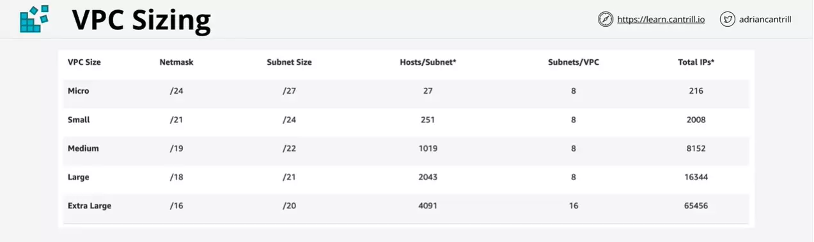
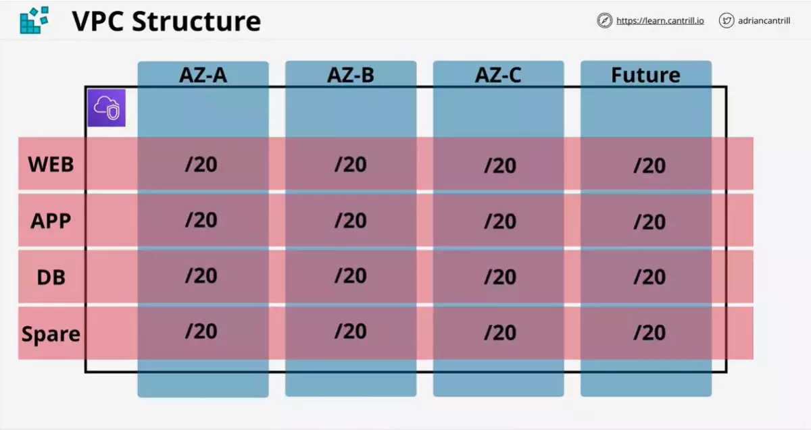
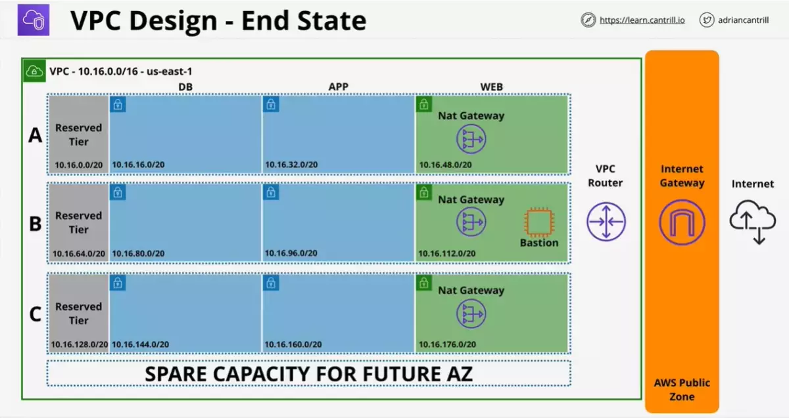
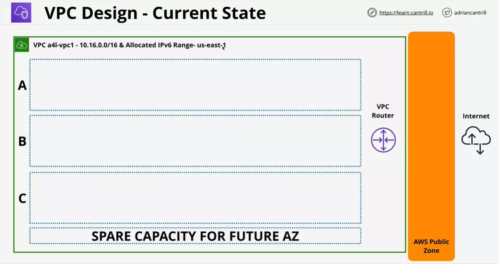
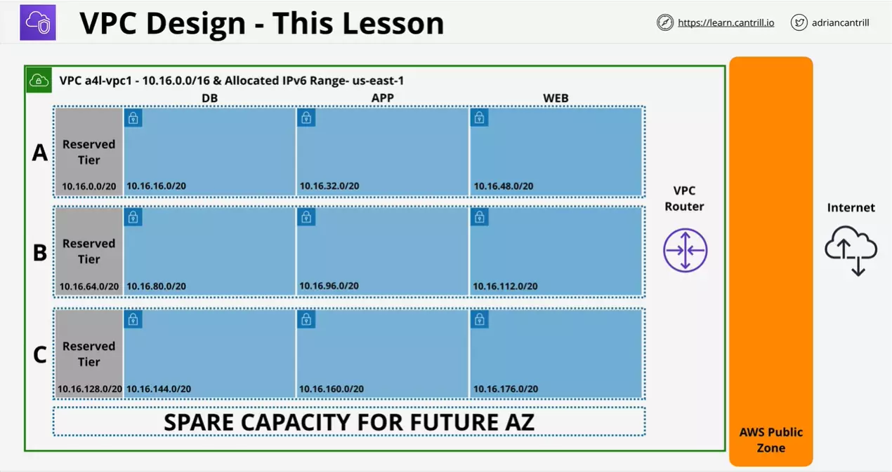
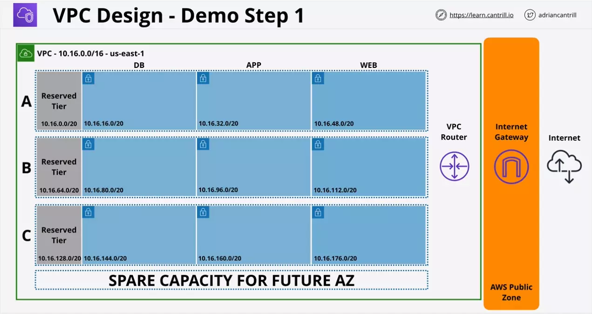
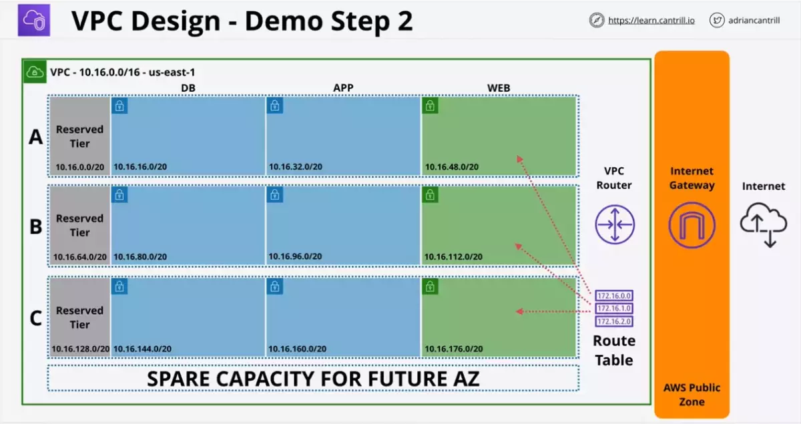
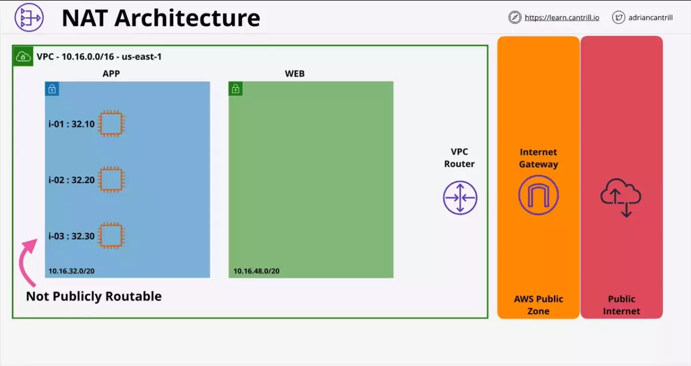

# Virtual Private Cloud (VPC)

Limit on VPC sizing in AWS

- VPC minimum is `/28` i.e. 16 IP
- VPC maximum is `/16` i.e. 65456 IP

VPC Subnet is a subnetwork of a VPC within a particular AZ

- 1 subnet can only be part of 1 AZ
- 1 AZ can have zero or more subnets
- IPv4 CIDR is a subset of VPC CIDR
- One subnet cannot overlap with other subnet
- By default subnet within a VPC can communicate with other subnets in the same VPC

A VPC spans multiple AZ.

- 1 VPC can contain multiple AZ.
- 1 AZ can contain multiple subnets.

---

## Default VPC

- Regions can only have 1 default VPC and many custom VPCs
- Custom VPCs allow flexible network configuration, the default VPC has a fixed scheme
- Some services can behave oddly if the default VPC doesn't exist
- Default VPCs can be recreated

---

## Subnet IP Addressing

A total of 5 IP addresses are reserved. Consider a subnet say **10.16.16.0/20**, in this following will be the reserved IP addresses:

- Network Address (10.16.16.0)
- Network + 1 (10.16.16.1) `VPC Router`
- Network + 2 (10.16.16.2) `Reserved (DNS)`
- Network + 3 (10.16.16.3) `Reserved Future Use`
- Broadcast Address (10.16.31.255) `Last IP in the subnet`

### Pricing

There is no charge for VPC's and Subnets creation???

---

## How network CIDR is sliced

Every time we slice the CIDR by 1, say `/16`, we create two `/17` network.

```

/16 - /17 /17

/17 - /18 /18
/17 - /18 /18

/18 - /19 /19
/18 - /19 /19
/18 - /19 /19
/18 - /19 /19

/19 - /20 /20
/19 - /20 /20
/19 - /20 /20
/19 - /20 /20

/19 - /20 /20
/19 - /20 /20
/19 - /20 /20
/19 - /20 /20
```

So, slicing `/16` network into 16 subnets gives us 16 networks with `/20` CIDR.

---

## Designing a VPC

Consider the following scenario where business has following networks:

- AWS Pilot (10.0.0.0/16) `10.0.0.0 -> 10.0.255.255`
- Azure Pilot (172.31.0.0/16) `172.31.0.0 -> 172.31.255.255`
- Brisbane Office (192.168.10.0/24) `192.168.10.0 -> 192.168.10.255`
- London Office (192.168.15.0/24) `192.168.15.0 -> 192.168.15.255`
- New York (192.168.20.0/24) `192.168.20.0 -> 192.168.20.255`
- Seattle (192.168.25.0/24) `192.168.25.0 -> 192.168.25.255`
- Google Cloud (10.128.0.0/9) `10.128.0.0 -> 10.255.255.255`

Based on the CIDR to get the new network range, add the related from the following:

```
9: x.128.255.255
16: x.x.255.255
24: x.x.x.255
```

Assume we are planning for:

- 2 plus network per region per account
- 5 regions
- 4 accounts

So, 40 ranges in total ideally.

### VPC Sizing Table



Important questions we should be answering before creating subnets is:

- How many subnets will we need
- How many IPs we need in total
- How many IPs per subnet is needed

A subnet is located in one availability zone.

- How many AZ our VPC will use

### VPC Structure

So, we can consider the VPC to consist of 3 VPC at present and account for 1 more for future.

Also, for each tier of the stack we create a subnet. So, considering current 3 tier and leaving one more for future we have need 4 subnets for each AZ.

In total thats 16 subnets, which will be obtained by splitting `/16` network into 16 `/20` subnets. _(256 x 16 = 4096 IPs, Actual available IPs are 4096 - 5 = 4091 IPs)_

- If we had started from prefix `/17` instead we would get 16 subnets of `/21` subnets



---

## DNS

Provided by Route 53

Available on the base IP address of the VPC + 2. If the VPC is 10.0.0.0 then the DNS IP will be 10.0.0.2

Two important settings which should be checked in case of issues. (These are found in the actions panel of a VPC in console)

- enableDnsHostnames
  - Indicates whether instances with public IP addresses in a VPC are given public DNS hostnames.- If this is set to true, instances will get get public DNS hostnames.
- enableDnsSupport
  - indidcates if DNS resolution is enabled or disabled in the VPC
  - If True: instances in the VPC can use the dns ip address. **VPC + 2**
  - If False this is not available

### IPv6 CIDRs

- We dont choose the subnet blocks as we do with IPv4. This is automatically allotted by AWS.
- CIDRs are of `/56`.

---

## VPC Routing and Internet Gateway

### VPC Router

- Runs in all the AZ
- Highly available device available in every VPC.
- Router has a network address `network + 1` in every subnet in the VPC.
- Routes traffic between subnets.
- `Route table` associated with the subnet defines what the Router will do with traffic when data leaves that subnet.
- All the subnets when created are associated with a `main route table`. If we don't associate a `custom route table` with a subnet, it uses the `main route table` of the VPC.
- If we do associate a `custom route table` we create with a subnet, then the main route table is disassociated.
- `A subnet can only have one route table associated at a time`.
- But one route table can be associated by many subnets.

### Route Tables

- Route match starts with matching the destination and then selecting the defined target for the matched route.
- If there are multiple routes matching, then the prefix is given the priority.
- The higher the prefix, the more specific the route, thus higher priority
- The target can either point to AWS gateway or to local.
- When target says **local** that means the VPC can route to the VPC itself.
- Local routes always take priorty and can never be updated.
- All route table has at least one route, the local route. This matches the VPC CIDR range and lets the VPC know that the traffic originating in that range is local.
- Can have a IPv6 route destination defined as well.

| Route Tables  |        |
| ------------- | ------ |
| Destination   | Target |
| 172.31.0.0/16 | Local  |
| 172.31.0.0/20 | eni-id |

### Internet Gateway

- Regional resilient gateway attached to a VPC.
- DO NOT NEED one per AZ.
- `One IGW will cover all AZ's in a region`
- An IGW can be created and can exist without VPC
- `It can only be attached to one VPC at a time`.
- An IGW exists between VPC and AWS public zone
- It is what allows gateway traffic between the VPC and the internet or AWS Public Zones (S3, SQS, SNS, etc.)
- It is a managed gateway and AWS handles the performance.
- A VPC can have no IGW, which makes it private
- Or VPC can have 1 IGW

### Using IGW within VPC

Steps:

1. Create a IGW
2. Attach IGW to VPC
   - IGW can now be used within VPC
   - IGW is now available as a target within route tables
3. Create custom route table
4. Associate route table with the subnet
5. Added default IPv4 and optionally IPv6 routes to the route table with the target being IGW
6. Configure subnet to allocate the IPv4 and optionally IPv6 addresses by default

At this point the subnet is classified as public subnet. Any services within that subnet with public IP addresses can communite with the internet and vice versa.

### How IPv4 addressing works

In this example, an EC2 instance has:

- Private IP address of 10.16.16.20
- Public address of 43.250.192.20

The `IGW creates a record that links the instance's private IP to the public IP`.

- This is why when an EC2 instance is created it `only sees the private IP address`.
- For IPv4 it is not configured in the OS with the public address.

#### Sending packet to internet

- So when a packet leaves the EC2 instance, it has a source's private IP address.
- This packet when received by IGW, it knows that the packet is from an EC2 instance which has a public IP address, based on the record linking private and public IP IGW has stored.
- So IGW updates the source IP address to that of the public IP address mapped earlier.
- Now the packet has a public IP address and becomes routable across internet.

#### Receiving packet from internet

- Packet is sent back with the destination IP address that is the public IP address of EC2 instance
- IGW receives this packet and updates the destination IP address as the private IP address.

---

## Bastion Host / Jumpbox

It is an instance in a public subnet in a VPC.

These are used to allow incoming management connections.

Once connected, we can then go on to access internal only VPC resources.

Used as a management point or as an entry point at a private VPC.

This is an inbound management point. Can be configured to only allow
specific IP addresses or to authenticate with SSH. It can also integrate
with our on premise identification service.

---

## VPC Design

This will be the end result of the VPC design



At the start we will have the following



A VPC has a configuration object called DHCP Option Set applied to it. This is used to allocate IP addresses.

- One DHCP Option Set applies to VPC at one time
- This configuration is then passed on to the subnets

For every subnet we can define IP allocation option

- Auto assign public IPv4 IP in addition to private IP
- Auto assing IPv6 IP

We can use https://www.site24x7.com/tools/ipv4-subnetcalculator.html for subnet range calculations.

- Using the AWS console, we can create all the subnets within a single AZ together
- And we can also create the all the subnets for other AZ's as well

Post subnet creation we will have the following



NOTE: the blue color indicate the private zone of the VPC

We will configure web tier to be public subnets, to make all the subnets be connected to the internet.



- Now for making the subnets public, we need internet gateway attached to the VPC.
- We will create a Route Table for the public subnets under the VPC.
  - Initally Route Table will not be having any `subnet associations`.
  - We will then add the associations to all the web tier subnets.
  - Before the association each subnet will be associated with the `Main` as their current route table.
  - Post association each web tier subnet will be associated with this custom route table.
- Route table content will be as follows:
  - Intially two `local routes`, one for IPv4 and one for IPv6 addresses will be present based on the CIDR of the subnet. These cannot be adjusted or removed.
  - We will add another route to set `default route` for IPv4 and IPv6 `0.0.0.0/0 & ::/0` addresses. This any route not belonging to the VPC, `will be forwarded to the IGW`.
- Each subnet of web tier will then be configured to auto assign a public IP address.



---

## Stateful vs Stateless Firewalls

https://learn.cantrill.io/courses/1101194/lectures/36039667

Stateless firewalls response will be sent on any emphemeral port, as its stateless. So in the firewall config we need to open all the ephemeral ports.

Stateful firewalls for this reason, makes setting firewall easy as the response port will be same as the request port. So, full emphemral port range is not kept open.

---

# Network Access Control List (NACL)

Network Access Control Lists (NACLs) are a type of security filter (like firewalls) which can filter traffic as it enters or leaves a subnet.

- Every subnet has an associated NACL which filters the data as it crosses the boundry of the subnet.
- Only data coming into and out of subnet is affected by NACL
- Connections within a subnet aren't impacted by NACLs
- Cannot be assigned to AWS resources, but only subnets
- Often used with security groups to add explicit DENY bad networks and IPs

Relationship between NACL and subnet is one to many.

```
          |-----> Subnet
          |
1 NACL    |-----> Subnet
          |
          |-----> Subnet
```

- Each subnet can have one NACL (Default or Custom).
- Each NACL can be associated with multiple subnets.

## NACL content

Each NACL contains two sets of rules

- inbound rules (matches traffic ENTERING the subnet)
- outbound rules (matches traffic LEAVING the subnet)

## NACL rules

NACL rules match:

- destination IP or IP range
- destination port
- protocol

And allow or deny based on the match.

NACL rules are processsed:

- in order
- lowest rule number first
- once match occurs rules matching stops
- `*` is an implicit DENY if nothing else matches

## NACLs are stateless

NACLs are stateless. And they treat request and response as different.

- both request and response parts of every communication need individual rules
- 1 INBOUND rule needs to be defined
- 1 OUTBOUND rule needs to be defined

## Scenario

Consider a user making a request to the website hosted by a web tier in our VPC.

- User makes the request using HTTPS (TCP port 443)
- And response will be sent back using one of the emphemal port chosen by the OS on the users laptop.

If we are using NACLs we will need one for the INBOUND and the OUTBOUND

| INBOUND |                  |          |            |           |            |
| ------- | ---------------- | -------- | ---------- | --------- | ---------- |
| Rule #  | Type             | Protocol | Port Range | Source    | Allow/Deny |
| 110     | HTTPS(443)       | TCP (6)  | 443        | 0.0.0.0/0 | ALLOW      |
| \*      | All IPv4 traffic | All      | All        | 0.0.0.0/0 | DENY       |

| OUTBOUND |                  |          |              |           |            |
| -------- | ---------------- | -------- | ------------ | --------- | ---------- |
| Rule #   | Type             | Protocol | Port Range   | Source    | Allow/Deny |
| 110      | Custom TCP       | TCP (6)  | 1024 - 65635 | 0.0.0.0/0 | ALLOW      |
| \*       | All IPv4 traffic | All      | All          | 0.0.0.0/0 | DENY       |

> `1024 - 65635` is the emphemeral port range. Using this range isnt secure but using stateless NACLs this is the only way.

Rule (number) between INBOUND and OUTBOUND tables are not affected by each other.

> If DENY rule matches first, then ALLOW rule will never get processsed

## Default NACL

When a VPC is created its created with a default NACL.

Here is an example of default NACL that is added for a VPC. The following results in allowing all the traffic and the NACL has no effect.

| INBOUND |                  |          |            |           |            |
| ------- | ---------------- | -------- | ---------- | --------- | ---------- |
| Rule #  | Type             | Protocol | Port Range | Source    | Allow/Deny |
| 100     | All IPv4 traffic | All      | All        | 0.0.0.0/0 | ALLOW      |
| \*      | All IPv4 traffic | All      | All        | 0.0.0.0/0 | DENY       |

| OUTBOUND |                  |          |            |           |            |
| -------- | ---------------- | -------- | ---------- | --------- | ---------- |
| Rule #   | Type             | Protocol | Port Range | Source    | Allow/Deny |
| 100      | All IPv4 traffic | All      | All        | 0.0.0.0/0 | ALLOW      |
| \*       | All IPv4 traffic | All      | All        | 0.0.0.0/0 | DENY       |

## Custom NACL

When a custom NACL is created they have only 1 INBOUND rule with implicit `*` DENY and 1 OUTBOUND rule with implicit `*` DENY.

| INBOUND |                  |          |            |           |            |
| ------- | ---------------- | -------- | ---------- | --------- | ---------- |
| Rule #  | Type             | Protocol | Port Range | Source    | Allow/Deny |
| \*      | All IPv4 traffic | All      | All        | 0.0.0.0/0 | DENY       |

| OUTBOUND |                  |          |            |           |            |
| -------- | ---------------- | -------- | ---------- | --------- | ---------- |
| Rule #   | Type             | Protocol | Port Range | Source    | Allow/Deny |
| \*       | All IPv4 traffic | All      | All        | 0.0.0.0/0 | DENY       |

We need to add rules to ALLOW traffic as per need.

---

# VPC Security Groups

Security Groups (SGs) are another security feature of AWS VPC ... only unlike NACLs they are attached to AWS resources, not VPC subnets.

SGs offer a few advantages vs NACLs in that they can recognize AWS resources and filter based on them, they can reference other SGs and also themselves.

But.. SGs are not capable of explicitly blocking traffic - so often require assistance from NACLs

## Consideration

- Security groups are stateful and `detect response traffic automatically`.
- If we allow INBOUND or OUTBOUND request, the response is automatically allowed.

If we explicitly doesnt ALLOW traffic, we are implicitly DENY'ing it.

No explicit DENY is allowed.

- So we cant block specific bad IPs or networks
- For this we use NACL to add explicit DENY

Security Groups are attached to primary Elastic Network Interfaces (ENIs), not to EC2 instances

## Scenario

Consider an public subnet containing an EC2 instance for the Web Tier having an attached primary Elastic Network Interface. User is accessing the instance using HTTPS (TCP/443).

Note that a security group conceptually surrounds an Elastic Network Interface.

A typical security group might have an INBOUND and OUTBOUND rules.

| INBOUND |          |            |           |               |
| ------- | -------- | ---------- | --------- | ------------- |
| Type    | Protocol | Port Range | Source    | Description   |
| HTTPS   | TCP      | 443        | 0.0.0.0/0 | inbound HTTPS |

The above security group applies to the request from port 443 through HTTPS. Since SGs are stateful the corresponding reponse is automatically allowed.

## Logical References

In the above scenario the Web Tier EC2 instance might be connecting to the App Tier EC2 instance.

- To allow this we could use the IP of the instance
- And if we want our application to scale we could add the CIDR range of the subnet
- But instead we will reference the Web Tier's Security Group within the App Tier's Security Group

Web Tier's Security Group might look as follows [Is this correct???].

| INBOUND    |          |            |                         |                      |
| ---------- | -------- | ---------- | ----------------------- | -------------------- |
| Type       | Protocol | Port Range | Source                  | Description          |
| Custom TCP | TCP      | 1337       | sg-0123acbd4567/a4l-web | inbound from a4l-web |

App Tier's Security Group might look as follows.

| INBOUND    |          |            |                         |                      |
| ---------- | -------- | ---------- | ----------------------- | -------------------- |
| Type       | Protocol | Port Range | Source                  | Description          |
| Custom TCP | TCP      | 1337       | sg-45670123acbd/a4l-app | inbound from a4l-web |

Logical referencing scales. So any instances having SG `sg-0123acbd4567/a4l-web` attached to them will be able to connect to any instance having SG `sg-45670123acbd/a4l-app` attached to them using port 1337.

## Self References

Logical references allows self references.

Consider a private subnet with ever changing number of application instances. We could create SG as follows.

| INBOUND     |          |            |                         |                       |
| ----------- | -------- | ---------- | ----------------------- | --------------------- |
| Type        | Protocol | Port Range | Source                  | Description           |
| All Traffic | All      | All        | sg-45670123acbd/a4l-app | free comms between SG |
| Custom TCP  | TCP      | 1337       | sg-0123acbd4567/a4l-web | inbound from a4l-web  |

This allows incoming connections on port 1337 from Web Tier SG.

This also has a self reference'ing rule which allows allows all traffic i.e.

- So any instances having `sg-45670123acbd/a4l-app` SG can receive traffic from other instances sharing the same SG
- This handles IP changes automatically, which is really useful when instances are terminating with auto scaling group.

---

# Network Address Translation (NAT)

Set of different processes that can address IP packets by changing their source or destination addresses.

- Shares similarity with how AWS Internet Gateway updates the packets source IP and destination IP. But this comes under Static NAT.

## IP masquerading (aka NAT)

This hides CIDR block behind one IP. This is many private IPs attached to one public IP.

Under the lack of abundant public IPv4 addresses, gives private CIDR range **outgoing** internet access.

But note that the public IPs cannot connect to these private IP's when NAT is used.

## NAT Architecture



We have an App Tier which has instances with private IPs. They cannot connect to AWS Public Zone or Public Internet.

Now if we want the App Tier instances to connect to the internet, we could do it through public instances on Web Tier.


We instead choose a NAT Gateway to provide private IP based instances access to internet.

So we provision a NAT Gateway in the public subnet, which allows us to use public IP addresses.

- public subnet has a route table attached to it
- the route table provides routing of public IP address to Internet Gateway
- Since NAT gateway is in the pubilc subnet, it can send data out and get a response back

The private instances can also have a route table, which can be different from the public subnet route table.

- we will configure this route table with a default route to point to the NAT gateway
- so any packet not pointing to the IPs within the VPC will be sent to the NAT gateway

## Packet Flow

Consider a packet from instance `i-01` being sent with a destination ip `1.3.3.7`

- the packet is sent to NAT gateway because of the default route in the `private route table` of the App Tier's subnet
- NAT gateway records the packet details (source ip, destination ip, etc) to help it identify the packet related communication in future
- All the information is maintained by NAT Gateway into a `translation table`.
- Post this, NAT Gateway updates the packet's source as the public IP of the NAT Gateway and the destination as `1.3.3.7`.
- As the destination is outside the VPC, the default route is used by the VPC Router, which forwards this packet to Internet Gateway.

> The public IP used by NAT Gateway isnt real one and Internet Gateway translates IP of NAT Gateway to real public IP.

## Considerations

If we need to give a private instance its own public IPv4 address

- then only Internet Gateway is required.

If we want to give private instances access to AWS Public Zone services (such as S3) and Public Internet

- then we need both NAT Gateway (to do many to one translation) and Internet Gateway (translates IP of NAT Gateway to real public IP)

NAT Gateway:

- needs to run from a public subnet
- Uses Elastic IPs (Static IPv4 Public)
- Managed service, scales up to 45 Gbps. Can deploy multiple NATGW to increase bandwidth.

Resilience:

- AZ resilient service (Resilient in that AZ and can recover from hardware failure)
- For a fully region resillient service, we must deploy `one NAT Gateway in each AZ`
- Route Table in each AZ with NAT Gateway as target

IPv6

- NAT Gateway isnt required for IPv6
- NAT Gateway doesnt work with IPv6
- All IPv6 addresses in AWS are publicly routable
- Any instance with IPv6 address can directly communicate with AWS Public Zone or Internet Gateway
- `::/0` route with Internet Gateway will give the instance INBOUND and OUTBOUND connectivity `subject to NACL or Security Groups`
- `::/0` route with Egress-Only Internet Gateway will give the instance OUTBOUND only connectivity `subject to NACL or Security Groups`

> NAT Gateway only use NACL and dont use Security Group

## NAT Gateway vs NAT Instance

NAT Instance is deployed on an EC2 instance

- Its limited by the resources that are allocated to the EC2
- If this fails it wont automatically recover like NAT Gateway which are highly available
- NAT instances which are limited by the bandwidth of the instance type, dont perform as well as NAT Gateway which offers 45 Gbps bandwidth
- NAT Instance is a cost effective alternative to NAT Gateway

## Demo - VPC, NAT, Route Table and SSH

### SSH and SSH Agent Forwarding

This demo shows how to ssh into the public EC2 instance and then ssh into the private EC2 instance using agent forwarding

https://learn.cantrill.io/courses/1101194/lectures/26982643

### VPC, NAT, Route Table

Using the earlier setup tier architecture for multi-AZ as the base

We create a EC2 instance in the public subnet (Web Tier) and EC2 instance within private subnet (App Tier).

- We create the NAT Gateway for each AZ linking it to the public subnet (Web Tier) during the creation
  - Also, allocate elastic IP to the NAT Gateway
- We create the Route Table for each AZ linking them to the VPC
  - Edit each route and link them to NAT Gateway
  - Use **destination** as `0.0.0.0/0` and pick the appropriate NAT gateway as **target**

At this state the subnets are not yet associated with the newly created route tables. So, they will be associated with the main route table.

- We update each route table to add association with all the private subnet

Once done, the SSH from EC2 instance within private subnet will be able to ping to the internet IP address.
