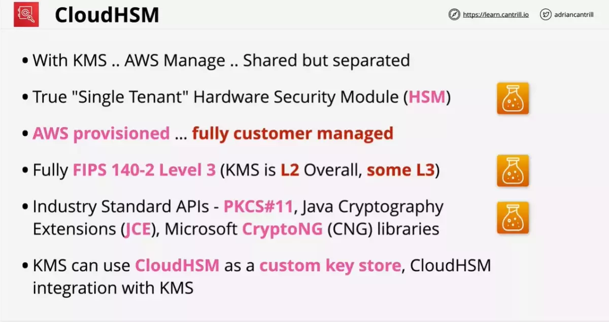
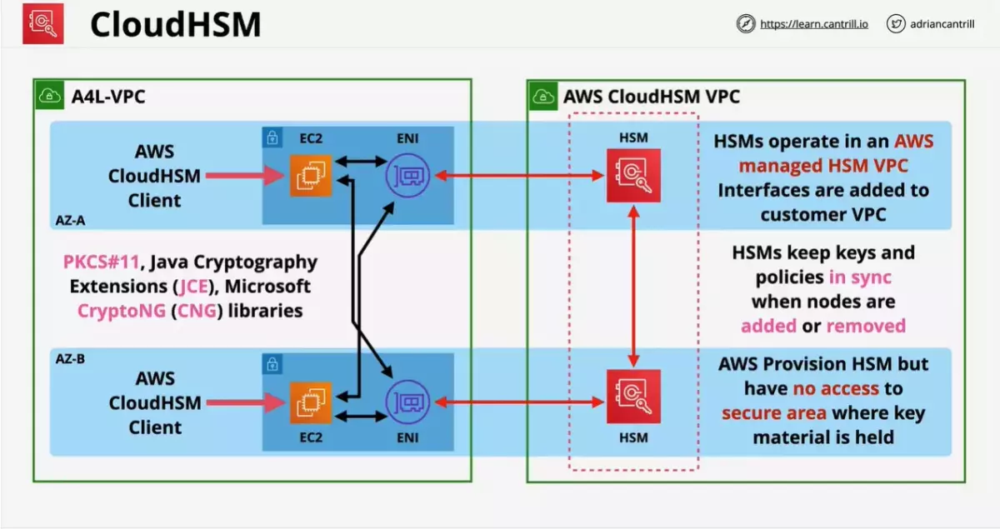
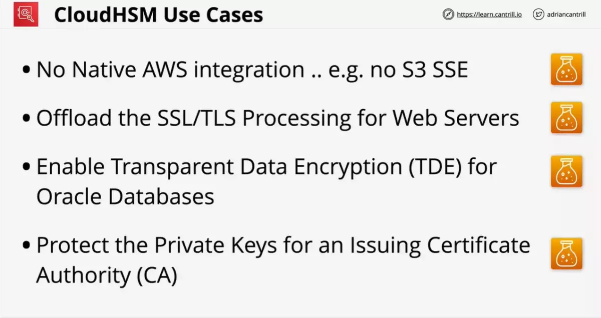

# Cloud HSM







# EC2 plus

### AWS::CloudFormation::Init

**cfn-init** is a helper script installed on EC2 OS.

This is a simple configuration management system.

Procedural (user Data) vs Desired State (cfn-init)

Packages, groups, users, sources, files, commands, services, and ownerships.

This is executed as any other command by passing into the instance with
the user-data.

This is provided with directives via Metadata and AWS::CloudFormation::Init on
a CFN resource

#### cfn-init explained

Starts off with a **cloud formation template**
This has a logical resource within it which is to create an EC2 instance.

This has a specific section called `Metadata:`

This then passes in the information passed in as `UserData`

cfn-init gets variables passed into the userdata by cloud formation

It knows the desired state desired by the user and can work towards a
final stated configuration

This can monitor the userdata and change things as the EC2 data changes.

#### CreationPolicy and Signals

The template has a specific part designated signals

A creation policy is added to a logical resource. It is provided a
timeout value. The resource itself will trigger a signal that cloud formation
can continue

# VPC Peering

Instances in either VPC can communicate with each other as if they are within the same network.

The VPCs can be in different regions (also known as an inter-region VPC peering connection).

This is neither a gateway nor a VPN connection, and does not rely on a separate piece of physical hardware.

## use case

A VPC peering connection helps you to facilitate the transfer of data. For example, if you have more than one AWS account, you can peer the VPCs across those accounts to create a file sharing network. You can also use a VPC peering connection to allow other VPCs to access resources you have in one of your VPCs.

- In case of cross account peering connection, one account creates the peering connection request and other approves the same

# VPC

Can a VPC span across regions?

# AWS Direct Connect

Direct Connect provides Amazon Web Services (AWS) customers with a way to transfer data that does not involve using the public Internet.

Say your company uses multiple Amazon VPCs and is setting up a new office.

- Establish a private connection from your new office’s network to your Amazon VPC using AWS Direct Connect
- This option provides predictable network performance, reduces bandwidth costs, and doesn’t require that customers be responsible for implementing high availability solutions for all VPN endpoints.
- The downside of this option (possible requiring additional telecom and hosting provider relationships) is mitigated in this instance because the office is new and would need to provision a whole new network anyway.

AWS Direct Connect uses dedicated, private network connections between your intranet and Amazon VPC. Use AWS Direct connect:

- If you have an immediate need, have low to modest bandwidth requirements, and can tolerate the inherent variability in Internet-based connectivity.
- A VPC VPN Connection utilizes IPSec to establish encrypted network connectivity between your intranet and Amazon VPC over the Internet.

## Scenario

You are managing your company's data and preparing for a migration to an AWS cloud environment. One of the first steps you are doing is uploading data to Amazon S3 buckets. You are uploading large amounts of data overnight, 3 to 5 TB to an S3 bucket. What steps can you take to decrease the amount of time to perform these uploads?

Using AWS Direct Connect, data that would have previously been transported over the Internet can now be delivered through a private network connection between AWS and your datacenter or corporate network. In many circumstances, private network connections can reduce costs, increase bandwidth, and provide a more consistent network experience than Internet-based connections.

# Misc

- ReceiveMessageWaitTimeSeconds
- [SQS short and long polling](https://docs.aws.amazon.com/AWSSimpleQueueService/latest/SQSDeveloperGuide/sqs-short-and-long-polling.html)
- WAF on API Gateway and on the ALB (protects against common internet attacks, including application layer attacks.)

difference between OAI and using signed cookies/url

eni, security group and nacl relationship

lambda exponential backoff

lambda edge

## Deployment

trace all calls that your Node.js application hosted in elastic beanstalk sends to external HTTP web APIs as well as SQL database queries
Enable the X-Ray daemon by including the xray-daemon.config configuration file in the .ebextensions directory of your source code.

In-place deployment: The application on each instance in the deployment group is stopped, the latest application revision is installed, and the new version of the application is started and validated. You can use a load balancer so that each instance is deregistered during its deployment and then restored to service after the deployment is complete.

- Only deployments that use the EC2/On-Premises compute platform can use in-place deployments.
- AWS Lambda compute platform deployments cannot use an in-place deployment type.

For serverless applications (also referred to as Lambda-based applications), the `Transform` section specifies the version of the AWS Serverless Application Model (AWS SAM) to use. When you specify a transform, you can use AWS SAM syntax to declare resources in your template. The model defines the syntax that you can use and how it is processed. More specifically, the `AWS::Serverless` transform, which is a macro hosted by AWS CloudFormation, takes an entire template written in the AWS Serverless Application Model (AWS SAM) syntax and transforms and expands it into a compliant AWS CloudFormation template.

```yaml
Transform: AWS::Serverless-2016-10-31
Resources:
  MyServerlessFunctionLogicalID:
    Type: AWS::Serverless::Function
    Properties:
      Handler: index.handler
      Runtime: nodejs8.10
      CodeUri: "s3://testBucket/mySourceCode.zip"
```

After attaching the newly created EBS volume to the Linux EC2 instance, Create a file system on this volume.

AWS SAM is an extension of AWS CloudFormation, you get the reliable deployment capabilities of AWS CloudFormation. This architecture allows the developers to locally build, test, and debug serverless applications.

- The CLI provides a Lambda-like execution environment locally. It helps you catch issues upfront by providing parity with the actual Lambda execution environment. To step through and debug your code to understand what the code is doing, you can use AWS SAM with AWS toolkits like the AWS Toolkit for JetBrains, AWS Toolkit for PyCharm, AWS Toolkit for IntelliJ, and AWS Toolkit for Visual Studio Code.

Performing a Canary deployment is incorrect because this type of deployment is primarily used in Lambda and not in Elastic Beanstalk.

If an EBS volume is the root device of an instance, you must stop the instance before you can detach the volume.

You have created a Node.js Lambda function that updates a DynamoDB table and sends an email notification via Amazon SNS. However, upon testing, the function is not working as expected.

- AWS X-Ray can be used. It collects traces. With X-Ray, you can understand how your application and its underlying services are performing to identify and troubleshoot the root cause of performance issues and errors.
- AWS X-Ray works with Amazon EC2, Amazon EC2 Container Service (Amazon ECS), AWS Lambda, and AWS Elastic Beanstalk.

Amazon ECS supports the following task placement strategies:

- binpack – Place tasks based on the least available amount of CPU or memory. This minimizes the number of instances in use.
- random
- spread

S3 is not part of your VPC, unlike your EC2 instances, EBS volumes, ELBs, and other services that typically reside within your private network. An EC2 instance needs to have access to the Internet, via the Internet Gateway or a NAT Instance/Gateway in order to access S3. Alternatively, you can also create a VPC endpoint so your private subnet would be able to connect to S3.


SAM deployment

- sam package
- sam deploy

Cloudfromation deployment

- aws cloudformation package
- aws cloudformation deploy

## Security

For certificates in a Region supported by AWS Certificate Manager (ACM), it is recommended that you use ACM to provision, manage, and deploy your server certificates. In unsupported Regions, you must use **IAM as a certificate manager**.

If you have resources that are running inside AWS, that need programmatic access to various AWS services,then the best practice is to always use IAM roles. However, for applications running outside of an AWS environment, these will need access keys for programmatic access to AWS resources.

TDE automatically encrypts data before it is written to storage, and automatically decrypts data when the data is read from storage.
Amazon RDS supports using Transparent Data Encryption (TDE) to encrypt stored data on your DB instances running Microsoft SQL Server.

Another best practice they recommend is to delete root user access keys.

Take note that SCPs are necessary, but not sufficient, for granting access for the accounts in your organization. You still need to attach IAM policies to users and roles in your organization’s accounts to actually grant permissions to them.

**put-bucket-policy** command can only be used to apply policy at the bucket level, not on objects. You can use S3 Access Control Lists (ACLs) instead to manage permissions of S3 objects.

The content in the 'hooks' section of the AppSpec file varies, depending on the compute platform for your deployment. The 'hooks' section for an EC2/On-Premises deployment contains mappings that link deployment lifecycle event hooks to one or more scripts. The 'hooks' section for a Lambda or an Amazon ECS deployment specifies Lambda validation functions to run during a deployment lifecycle event.


**BeforeInstall** is only applicable for ECS, EC2 or On-Premises compute platforms and not for Lambda deployments.

**Install** deployment lifecycle event is not available for Lambda as well as for ECS deployments.

To upload an object to the S3 bucket which uses SSE-KMS, you have to send a request with an x-amz-server-side-encryption header with the value of aws:kms. When you upload an object, you can specify the KMS key using the x-amz-server-side-encryption-aws-kms-key-id header. If the header is not present in the request, Amazon S3 assumes the default KMS key.

**AWS Secrets Manager** is an AWS service that makes it easier for you to manage secrets. Secrets can be database credentials, passwords, third-party API keys, and even arbitrary text. You can store and control access to these secrets centrally by using the Secrets Manager console, the Secrets Manager command line interface (CLI), or the Secrets Manager API and SDKs.

- Also, you can configure Secrets Manager to automatically rotate the secret for you according to a schedule that you specify.
- Systems Manager Parameter Store doesn’t rotate its parameters.

The consolidated billing feature in AWS Organizations allows you to consolidate payment for multiple AWS accounts.

To avoid security issues, it is of utmost importance to test the impact of service control policies (SCPs) on your IAM policies and resource policies before applying them. The IAM policy simulator evaluates the policies that you choose and determines the effective permissions for each of the actions that you specify.

S3 when using SSE-C requires **x-amz-server-side​-encryption​-customer-algorithm**, **x-amz-server-side-encryption-customer-key** and **x-amz-server-side-encryption-customer-key-MD5** headers on the upload request headers to be passed during upload request.

The bucket will use server-side encryption with Amazon S3-Managed encryption keys (SSE-S3) to encrypt the data using 256-bit Advanced Encryption Standard (AES-256) block cipher. **x-amz-server-side-encryption** must be used during the upload.

SSE-KMS requires **x-amz-server-side-encryption** must be used during the upload. When you upload an object, you can specify the KMS key using the _x-amz-server-side-encryption-aws-kms-key-id_ header. If the header is not present in the request, Amazon S3 assumes the default KMS key.

Encrypt operation is primarily used to encrypt RSA keys, database passwords, or other sensitive information. This operation can also be used to move encrypted data from one AWS region to another however, this is `not recommended if you want to encrypt your data locally`. You have to use the GenerateDataKey operation instead.

Envelope encryption - Encrypt plaintext data with a data key and then encrypt the data key with a top-level plaintext master key.

When a client makes a request to one of your API’s methods, API Gateway calls your **Lambda authorizer**, which takes the caller’s identity as input and returns an IAM policy as output.

There are two types of Lambda authorizers:

– A **token-based Lambda authorizer** (also called a TOKEN authorizer) receives the caller’s identity in a bearer token, such as a JSON Web Token (JWT) or an OAuth token.
– A **request parameter-based Lambda authorizer** (also called a REQUEST authorizer) receives the caller’s identity in a combination of headers, query string parameters, stageVariables, and $context variables.

Container Instance IAM Role only applies if you are using the EC2 launch type. Not with a Fargate launch type.
Service-linked role is a unique type of IAM role that is linked directly to Amazon ECS itself and not on the ECS task.

IAM DB Authentication simply encrypts the network traffic to and from the RDS database using Secure Sockets Layer (SSL). i.e. primarily used to secure data-in-transit rather than data at rest.

## Development

The purpose of resharding in Amazon Kinesis Data Streams is to enable your stream to adapt to changes in the rate of data flow.

- You split shards to increase the capacity (and cost) of your stream.
- You merge shards to reduce the cost (and capacity) of your stream.

You split every shard in the stream—which would double the stream’s capacity. However, this might provide more additional capacity than you actually need and therefore create unnecessary cost.

You could then selectively split the hot shards to increase capacity for the hash keys that target those shards. Similarly, you could merge cold shards to make better use of their unused capacity.

By default, an AWS account’s concurrent execution limit is 1000 which will be shared by all Lambda functions. In this scenario, it is highly likely that the first function has more provisioned concurrency than the other one. It is possible that the concurrency execution limit of the first function is set to a significantly high value (e.g. 900) and the second function is set to use the unreserved account concurrency which may only contain the last 100 units out of the AWS account’s concurrent execution limit of 1000.

Hence, the correct solutions in this scenario are:

– Set the concurrency execution limit of both functions to 450

– Decrease the concurrency execution limit of the first function.

All of the APIs created with Amazon API Gateway expose HTTPS endpoints only.

Amazon API Gateway does not support unencrypted (HTTP) endpoints. By default, Amazon API Gateway assigns an internal domain to the API that automatically uses the Amazon API Gateway certificate. When configuring your APIs to run under a custom domain name, you can provide your own certificate for the domain.

The base URL for REST APIs is in the following format:

> https://{restapi_id}.execute-api.{region}.amazonaws.com/{stage_name}/

DynamoDB partitions are usually throttled when they are accessed by your downstream applications much more frequently than other partitions (that is, a “hot” partition), or when workloads rely on short periods of time with high usage (a “burst” of read or write activity). **To avoid hot partitions and throttling**, you must optimize your table and partition structure.

DynamoDB adaptive capacity automatically boosts throughput capacity to high-traffic partitions. However, each partition is still subject to the hard limit. This means that adaptive capacity can’t solve larger issues with your table or partition design. To avoid hot partitions and throttling, optimize your table and partition structure.

The project dashboard in AWS CodeStar makes it easy to centrally monitor application activity and manage day-to-day development tasks such as recent code commits, builds, and deployments.

- Implement error retries and exponential backoff. This technique uses progressively longer waits between retries for consecutive error responses to help improve an application’s reliability. If you’re using an AWS SDK, this logic is built‑in. If you’re using another SDK, consider implementing it manually.

- You can add a random number to the partition key values to distribute the items among partitions (Sharding Using Random Suffixes), or you can use a number that is calculated based on something that you are querying on (Sharding Using Calculated Suffixes).

Amazon CodeGuru is simply a developer tool that provides intelligent recommendations to improve the quality of your codebase and for identifying an application’s most “expensive” lines of code in terms of resource intensiveness, CPU performance, and code efficiency.

In the cloud, resources are elastic, meaning they can instantly grow or shrink to match the requirements of a specific application.

There are two basic types of elasticity:

1. Time-based
2. Volume-based

Time-based elasticity means turning off resources when they are not being used, such as a development environment that is needed only during business hours. Volume-based elasticity means matching scale to the intensity of demand, whether that’s compute cores, storage sizes, or throughput.

You can also use a combination of ELB and Auto Scaling to maximize the elasticity of your architecture. Beyond Auto Scaling for Amazon EC2, you can use Application Auto Scaling to automatically scale resources for other AWS services, including:

- Amazon ECS
- Amazon EC2 Spot Fleets
- Amazon DynamoDB

You can use Lambda functions to change CloudFront requests and responses at the following points:

– After CloudFront receives a request from a viewer (viewer request)
– Before CloudFront forwards the request to the origin (origin request)
– After CloudFront receives the response from the origin (origin response)
– Before CloudFront forwards the response to the viewer (viewer response)

You can use Lambda@Edge to allow your Lambda functions to customize the content that CloudFront delivers and **to execute the authentication process in AWS locations closer to the users**. In addition, you can set up an origin failover by creating an origin group with two origins with one as the primary origin and the other as the second origin, which CloudFront automatically switches to when the primary origin fails.

You can use the API Gateway Import API feature to import a REST API from an external definition file (on-premise) into API Gateway. Currently, the Import API feature supports OpenAPI v2.0 and OpenAPI v3.0 definition files.

Placement strategy sample:

```json
"placementStrategy": [
  {
    "field": "attribute:ecs.availability-zone",
    "type": "spread"
  }
]
```

When using the spread strategy, you must also indicate a field parameter. It is used to indicate the bins that you are considering. The accepted values are instanceID, host, or a custom attribute key:value pairs such as attribute:ecs.availability-zone to balance tasks across zones.

If you choose Canary10Percent10Minutes then 10 percent of your customer traffic is immediately shifted to your new version. After 10 minutes, all traffic is shifted to the new version. However, if your pre-hook/post-hook tests fail, or if a CloudWatch alarm is triggered, CodeDeploy rolls back your deployment.

The following table outlines other traffic-shifting options that are available:

- **Canary**
- **Linear**
- **All-at-once**

Hence, the CodeDeployDefault.LambdaCanary10Percent5Minutes option is correct because 10 percent of your customer traffic is immediately shifted to your new version. After 5 minutes, all traffic is shifted to the new version. This means that the entire deployment time will only take 5 minutes

In ECS, port mappings are specified as part of the container definition which can be configured in the task definition.


